# SCORING MODEL


### Objetif du projet :
Pour accorder un crédit à la consommation, l’entreprise calcule la probabilité qu’un client le rembourse, ou non. Elle souhaite donc développer un algorithme de scoring pour aider à décider si un prêt peut être accordé à un client.

Les chargés de relation client seront les utilisateurs du modèle de scoring. Puisqu’ils s’adressent aux clients, ils ont besoin que notre modèle soit **facilement interprétable**. Les chargés de relation souhaitent, en plus, disposer d’une mesure de **l’importance des variables** qui ont poussé le modèle à donner cette probabilité à un client.


Nous allons suivre les étapes suivantes :

- Nettoyage des données
- EDA
- Choix de variables et création de nouvelles variables
- Choix de modèles de classification
- Essaye d'interprétabilité du modèle


# 1. Garbage In Garbage Out


```python
# numpy and pandas for data manipulation
import numpy as np
import pandas as pd 


# pandas display settings 
pd.set_option('display.max_columns',None)
pd.set_option('display.max_rows', None)

# sklearn preprocessing for dealing with categorical variables
from sklearn.preprocessing import LabelEncoder

# File system manangement
import os

# Suppress warnings 
import warnings
warnings.filterwarnings('ignore')

# matplotlib and seaborn for plotting
import matplotlib.pyplot as plt
import seaborn as sns
```


```python
from utils import utils_prep as prep
from utils import utils_eng as eng
```


```python

```


```python
app_train_raw=prep.readCsvFileFromDir("data/",'application_train.csv')
```


```python
app_train_raw.head(3)
```


<div>
<style scoped>
    .dataframe tbody tr th:only-of-type {
        vertical-align: middle;
    }

    .dataframe tbody tr th {
        vertical-align: top;
    }

    .dataframe thead th {
        text-align: right;
    }
</style>
<table border="1" class="dataframe">
  <thead>
    <tr style="text-align: right;">
      <th></th>
      <th>SK_ID_CURR</th>
      <th>TARGET</th>
      <th>NAME_CONTRACT_TYPE</th>
      <th>CODE_GENDER</th>
      <th>FLAG_OWN_CAR</th>
      <th>FLAG_OWN_REALTY</th>
      <th>CNT_CHILDREN</th>
      <th>AMT_INCOME_TOTAL</th>
      <th>AMT_CREDIT</th>
      <th>AMT_ANNUITY</th>
      <th>AMT_GOODS_PRICE</th>
      <th>NAME_TYPE_SUITE</th>
      <th>NAME_INCOME_TYPE</th>
      <th>NAME_EDUCATION_TYPE</th>
      <th>NAME_FAMILY_STATUS</th>
      <th>NAME_HOUSING_TYPE</th>
      <th>REGION_POPULATION_RELATIVE</th>
      <th>DAYS_BIRTH</th>
      <th>DAYS_EMPLOYED</th>
      <th>DAYS_REGISTRATION</th>
      <th>DAYS_ID_PUBLISH</th>
      <th>OWN_CAR_AGE</th>
      <th>FLAG_MOBIL</th>
      <th>FLAG_EMP_PHONE</th>
      <th>FLAG_WORK_PHONE</th>
      <th>FLAG_CONT_MOBILE</th>
      <th>FLAG_PHONE</th>
      <th>FLAG_EMAIL</th>
      <th>OCCUPATION_TYPE</th>
      <th>CNT_FAM_MEMBERS</th>
      <th>REGION_RATING_CLIENT</th>
      <th>REGION_RATING_CLIENT_W_CITY</th>
      <th>WEEKDAY_APPR_PROCESS_START</th>
      <th>HOUR_APPR_PROCESS_START</th>
      <th>REG_REGION_NOT_LIVE_REGION</th>
      <th>REG_REGION_NOT_WORK_REGION</th>
      <th>LIVE_REGION_NOT_WORK_REGION</th>
      <th>REG_CITY_NOT_LIVE_CITY</th>
      <th>REG_CITY_NOT_WORK_CITY</th>
      <th>LIVE_CITY_NOT_WORK_CITY</th>
      <th>ORGANIZATION_TYPE</th>
      <th>EXT_SOURCE_1</th>
      <th>EXT_SOURCE_2</th>
      <th>EXT_SOURCE_3</th>
      <th>APARTMENTS_AVG</th>
      <th>BASEMENTAREA_AVG</th>
      <th>YEARS_BEGINEXPLUATATION_AVG</th>
      <th>YEARS_BUILD_AVG</th>
      <th>COMMONAREA_AVG</th>
      <th>ELEVATORS_AVG</th>
      <th>ENTRANCES_AVG</th>
      <th>FLOORSMAX_AVG</th>
      <th>FLOORSMIN_AVG</th>
      <th>LANDAREA_AVG</th>
      <th>LIVINGAPARTMENTS_AVG</th>
      <th>LIVINGAREA_AVG</th>
      <th>NONLIVINGAPARTMENTS_AVG</th>
      <th>NONLIVINGAREA_AVG</th>
      <th>APARTMENTS_MODE</th>
      <th>BASEMENTAREA_MODE</th>
      <th>YEARS_BEGINEXPLUATATION_MODE</th>
      <th>YEARS_BUILD_MODE</th>
      <th>COMMONAREA_MODE</th>
      <th>ELEVATORS_MODE</th>
      <th>ENTRANCES_MODE</th>
      <th>FLOORSMAX_MODE</th>
      <th>FLOORSMIN_MODE</th>
      <th>LANDAREA_MODE</th>
      <th>LIVINGAPARTMENTS_MODE</th>
      <th>LIVINGAREA_MODE</th>
      <th>NONLIVINGAPARTMENTS_MODE</th>
      <th>NONLIVINGAREA_MODE</th>
      <th>APARTMENTS_MEDI</th>
      <th>BASEMENTAREA_MEDI</th>
      <th>YEARS_BEGINEXPLUATATION_MEDI</th>
      <th>YEARS_BUILD_MEDI</th>
      <th>COMMONAREA_MEDI</th>
      <th>ELEVATORS_MEDI</th>
      <th>ENTRANCES_MEDI</th>
      <th>FLOORSMAX_MEDI</th>
      <th>FLOORSMIN_MEDI</th>
      <th>LANDAREA_MEDI</th>
      <th>LIVINGAPARTMENTS_MEDI</th>
      <th>LIVINGAREA_MEDI</th>
      <th>NONLIVINGAPARTMENTS_MEDI</th>
      <th>NONLIVINGAREA_MEDI</th>
      <th>FONDKAPREMONT_MODE</th>
      <th>HOUSETYPE_MODE</th>
      <th>TOTALAREA_MODE</th>
      <th>WALLSMATERIAL_MODE</th>
      <th>EMERGENCYSTATE_MODE</th>
      <th>OBS_30_CNT_SOCIAL_CIRCLE</th>
      <th>DEF_30_CNT_SOCIAL_CIRCLE</th>
      <th>OBS_60_CNT_SOCIAL_CIRCLE</th>
      <th>DEF_60_CNT_SOCIAL_CIRCLE</th>
      <th>DAYS_LAST_PHONE_CHANGE</th>
      <th>FLAG_DOCUMENT_2</th>
      <th>FLAG_DOCUMENT_3</th>
      <th>FLAG_DOCUMENT_4</th>
      <th>FLAG_DOCUMENT_5</th>
      <th>FLAG_DOCUMENT_6</th>
      <th>FLAG_DOCUMENT_7</th>
      <th>FLAG_DOCUMENT_8</th>
      <th>FLAG_DOCUMENT_9</th>
      <th>FLAG_DOCUMENT_10</th>
      <th>FLAG_DOCUMENT_11</th>
      <th>FLAG_DOCUMENT_12</th>
      <th>FLAG_DOCUMENT_13</th>
      <th>FLAG_DOCUMENT_14</th>
      <th>FLAG_DOCUMENT_15</th>
      <th>FLAG_DOCUMENT_16</th>
      <th>FLAG_DOCUMENT_17</th>
      <th>FLAG_DOCUMENT_18</th>
      <th>FLAG_DOCUMENT_19</th>
      <th>FLAG_DOCUMENT_20</th>
      <th>FLAG_DOCUMENT_21</th>
      <th>AMT_REQ_CREDIT_BUREAU_HOUR</th>
      <th>AMT_REQ_CREDIT_BUREAU_DAY</th>
      <th>AMT_REQ_CREDIT_BUREAU_WEEK</th>
      <th>AMT_REQ_CREDIT_BUREAU_MON</th>
      <th>AMT_REQ_CREDIT_BUREAU_QRT</th>
      <th>AMT_REQ_CREDIT_BUREAU_YEAR</th>
    </tr>
  </thead>
  <tbody>
    <tr>
      <th>0</th>
      <td>100002</td>
      <td>1</td>
      <td>Cash loans</td>
      <td>M</td>
      <td>N</td>
      <td>Y</td>
      <td>0</td>
      <td>202500.0</td>
      <td>406597.5</td>
      <td>24700.5</td>
      <td>351000.0</td>
      <td>Unaccompanied</td>
      <td>Working</td>
      <td>Secondary / secondary special</td>
      <td>Single / not married</td>
      <td>House / apartment</td>
      <td>0.018801</td>
      <td>-9461</td>
      <td>-637</td>
      <td>-3648.0</td>
      <td>-2120</td>
      <td>NaN</td>
      <td>1</td>
      <td>1</td>
      <td>0</td>
      <td>1</td>
      <td>1</td>
      <td>0</td>
      <td>Laborers</td>
      <td>1.0</td>
      <td>2</td>
      <td>2</td>
      <td>WEDNESDAY</td>
      <td>10</td>
      <td>0</td>
      <td>0</td>
      <td>0</td>
      <td>0</td>
      <td>0</td>
      <td>0</td>
      <td>Business Entity Type 3</td>
      <td>0.083037</td>
      <td>0.262949</td>
      <td>0.139376</td>
      <td>0.0247</td>
      <td>0.0369</td>
      <td>0.9722</td>
      <td>0.6192</td>
      <td>0.0143</td>
      <td>0.00</td>
      <td>0.0690</td>
      <td>0.0833</td>
      <td>0.1250</td>
      <td>0.0369</td>
      <td>0.0202</td>
      <td>0.0190</td>
      <td>0.0000</td>
      <td>0.0000</td>
      <td>0.0252</td>
      <td>0.0383</td>
      <td>0.9722</td>
      <td>0.6341</td>
      <td>0.0144</td>
      <td>0.0000</td>
      <td>0.0690</td>
      <td>0.0833</td>
      <td>0.1250</td>
      <td>0.0377</td>
      <td>0.022</td>
      <td>0.0198</td>
      <td>0.0</td>
      <td>0.0</td>
      <td>0.0250</td>
      <td>0.0369</td>
      <td>0.9722</td>
      <td>0.6243</td>
      <td>0.0144</td>
      <td>0.00</td>
      <td>0.0690</td>
      <td>0.0833</td>
      <td>0.1250</td>
      <td>0.0375</td>
      <td>0.0205</td>
      <td>0.0193</td>
      <td>0.0000</td>
      <td>0.00</td>
      <td>reg oper account</td>
      <td>block of flats</td>
      <td>0.0149</td>
      <td>Stone, brick</td>
      <td>No</td>
      <td>2.0</td>
      <td>2.0</td>
      <td>2.0</td>
      <td>2.0</td>
      <td>-1134.0</td>
      <td>0</td>
      <td>1</td>
      <td>0</td>
      <td>0</td>
      <td>0</td>
      <td>0</td>
      <td>0</td>
      <td>0</td>
      <td>0</td>
      <td>0</td>
      <td>0</td>
      <td>0</td>
      <td>0</td>
      <td>0</td>
      <td>0</td>
      <td>0</td>
      <td>0</td>
      <td>0</td>
      <td>0</td>
      <td>0</td>
      <td>0.0</td>
      <td>0.0</td>
      <td>0.0</td>
      <td>0.0</td>
      <td>0.0</td>
      <td>1.0</td>
    </tr>
    <tr>
      <th>1</th>
      <td>100003</td>
      <td>0</td>
      <td>Cash loans</td>
      <td>F</td>
      <td>N</td>
      <td>N</td>
      <td>0</td>
      <td>270000.0</td>
      <td>1293502.5</td>
      <td>35698.5</td>
      <td>1129500.0</td>
      <td>Family</td>
      <td>State servant</td>
      <td>Higher education</td>
      <td>Married</td>
      <td>House / apartment</td>
      <td>0.003541</td>
      <td>-16765</td>
      <td>-1188</td>
      <td>-1186.0</td>
      <td>-291</td>
      <td>NaN</td>
      <td>1</td>
      <td>1</td>
      <td>0</td>
      <td>1</td>
      <td>1</td>
      <td>0</td>
      <td>Core staff</td>
      <td>2.0</td>
      <td>1</td>
      <td>1</td>
      <td>MONDAY</td>
      <td>11</td>
      <td>0</td>
      <td>0</td>
      <td>0</td>
      <td>0</td>
      <td>0</td>
      <td>0</td>
      <td>School</td>
      <td>0.311267</td>
      <td>0.622246</td>
      <td>NaN</td>
      <td>0.0959</td>
      <td>0.0529</td>
      <td>0.9851</td>
      <td>0.7960</td>
      <td>0.0605</td>
      <td>0.08</td>
      <td>0.0345</td>
      <td>0.2917</td>
      <td>0.3333</td>
      <td>0.0130</td>
      <td>0.0773</td>
      <td>0.0549</td>
      <td>0.0039</td>
      <td>0.0098</td>
      <td>0.0924</td>
      <td>0.0538</td>
      <td>0.9851</td>
      <td>0.8040</td>
      <td>0.0497</td>
      <td>0.0806</td>
      <td>0.0345</td>
      <td>0.2917</td>
      <td>0.3333</td>
      <td>0.0128</td>
      <td>0.079</td>
      <td>0.0554</td>
      <td>0.0</td>
      <td>0.0</td>
      <td>0.0968</td>
      <td>0.0529</td>
      <td>0.9851</td>
      <td>0.7987</td>
      <td>0.0608</td>
      <td>0.08</td>
      <td>0.0345</td>
      <td>0.2917</td>
      <td>0.3333</td>
      <td>0.0132</td>
      <td>0.0787</td>
      <td>0.0558</td>
      <td>0.0039</td>
      <td>0.01</td>
      <td>reg oper account</td>
      <td>block of flats</td>
      <td>0.0714</td>
      <td>Block</td>
      <td>No</td>
      <td>1.0</td>
      <td>0.0</td>
      <td>1.0</td>
      <td>0.0</td>
      <td>-828.0</td>
      <td>0</td>
      <td>1</td>
      <td>0</td>
      <td>0</td>
      <td>0</td>
      <td>0</td>
      <td>0</td>
      <td>0</td>
      <td>0</td>
      <td>0</td>
      <td>0</td>
      <td>0</td>
      <td>0</td>
      <td>0</td>
      <td>0</td>
      <td>0</td>
      <td>0</td>
      <td>0</td>
      <td>0</td>
      <td>0</td>
      <td>0.0</td>
      <td>0.0</td>
      <td>0.0</td>
      <td>0.0</td>
      <td>0.0</td>
      <td>0.0</td>
    </tr>
    <tr>
      <th>2</th>
      <td>100004</td>
      <td>0</td>
      <td>Revolving loans</td>
      <td>M</td>
      <td>Y</td>
      <td>Y</td>
      <td>0</td>
      <td>67500.0</td>
      <td>135000.0</td>
      <td>6750.0</td>
      <td>135000.0</td>
      <td>Unaccompanied</td>
      <td>Working</td>
      <td>Secondary / secondary special</td>
      <td>Single / not married</td>
      <td>House / apartment</td>
      <td>0.010032</td>
      <td>-19046</td>
      <td>-225</td>
      <td>-4260.0</td>
      <td>-2531</td>
      <td>26.0</td>
      <td>1</td>
      <td>1</td>
      <td>1</td>
      <td>1</td>
      <td>1</td>
      <td>0</td>
      <td>Laborers</td>
      <td>1.0</td>
      <td>2</td>
      <td>2</td>
      <td>MONDAY</td>
      <td>9</td>
      <td>0</td>
      <td>0</td>
      <td>0</td>
      <td>0</td>
      <td>0</td>
      <td>0</td>
      <td>Government</td>
      <td>NaN</td>
      <td>0.555912</td>
      <td>0.729567</td>
      <td>NaN</td>
      <td>NaN</td>
      <td>NaN</td>
      <td>NaN</td>
      <td>NaN</td>
      <td>NaN</td>
      <td>NaN</td>
      <td>NaN</td>
      <td>NaN</td>
      <td>NaN</td>
      <td>NaN</td>
      <td>NaN</td>
      <td>NaN</td>
      <td>NaN</td>
      <td>NaN</td>
      <td>NaN</td>
      <td>NaN</td>
      <td>NaN</td>
      <td>NaN</td>
      <td>NaN</td>
      <td>NaN</td>
      <td>NaN</td>
      <td>NaN</td>
      <td>NaN</td>
      <td>NaN</td>
      <td>NaN</td>
      <td>NaN</td>
      <td>NaN</td>
      <td>NaN</td>
      <td>NaN</td>
      <td>NaN</td>
      <td>NaN</td>
      <td>NaN</td>
      <td>NaN</td>
      <td>NaN</td>
      <td>NaN</td>
      <td>NaN</td>
      <td>NaN</td>
      <td>NaN</td>
      <td>NaN</td>
      <td>NaN</td>
      <td>NaN</td>
      <td>NaN</td>
      <td>NaN</td>
      <td>NaN</td>
      <td>NaN</td>
      <td>NaN</td>
      <td>0.0</td>
      <td>0.0</td>
      <td>0.0</td>
      <td>0.0</td>
      <td>-815.0</td>
      <td>0</td>
      <td>0</td>
      <td>0</td>
      <td>0</td>
      <td>0</td>
      <td>0</td>
      <td>0</td>
      <td>0</td>
      <td>0</td>
      <td>0</td>
      <td>0</td>
      <td>0</td>
      <td>0</td>
      <td>0</td>
      <td>0</td>
      <td>0</td>
      <td>0</td>
      <td>0</td>
      <td>0</td>
      <td>0</td>
      <td>0.0</td>
      <td>0.0</td>
      <td>0.0</td>
      <td>0.0</td>
      <td>0.0</td>
      <td>0.0</td>
    </tr>
  </tbody>
</table>
</div>


```python
prep.firstStats(app_train_raw)
```


<div>
<style scoped>
    .dataframe tbody tr th:only-of-type {
        vertical-align: middle;
    }

    .dataframe tbody tr th {
        vertical-align: top;
    }

    .dataframe thead th {
        text-align: right;
    }
</style>
<table border="1" class="dataframe">
  <thead>
    <tr style="text-align: right;">
      <th></th>
      <th>stats</th>
    </tr>
  </thead>
  <tbody>
    <tr>
      <th>nbRows</th>
      <td>307511</td>
    </tr>
    <tr>
      <th>nbColumns</th>
      <td>122</td>
    </tr>
    <tr>
      <th>float64</th>
      <td>65</td>
    </tr>
    <tr>
      <th>int64</th>
      <td>41</td>
    </tr>
    <tr>
      <th>object</th>
      <td>16</td>
    </tr>
  </tbody>
</table>
</div>


```python
prep.missingValues(app_train_raw.select_dtypes('object'))
```


<div>
<style scoped>
    .dataframe tbody tr th:only-of-type {
        vertical-align: middle;
    }

    .dataframe tbody tr th {
        vertical-align: top;
    }

    .dataframe thead th {
        text-align: right;
    }
</style>
<table border="1" class="dataframe">
  <thead>
    <tr style="text-align: right;">
      <th></th>
      <th>Missing Values</th>
      <th>% of Total Values</th>
    </tr>
  </thead>
  <tbody>
    <tr>
      <th>FONDKAPREMONT_MODE</th>
      <td>210295</td>
      <td>68.4</td>
    </tr>
    <tr>
      <th>WALLSMATERIAL_MODE</th>
      <td>156341</td>
      <td>50.8</td>
    </tr>
    <tr>
      <th>HOUSETYPE_MODE</th>
      <td>154297</td>
      <td>50.2</td>
    </tr>
    <tr>
      <th>EMERGENCYSTATE_MODE</th>
      <td>145755</td>
      <td>47.4</td>
    </tr>
    <tr>
      <th>OCCUPATION_TYPE</th>
      <td>96391</td>
      <td>31.3</td>
    </tr>
    <tr>
      <th>NAME_TYPE_SUITE</th>
      <td>1292</td>
      <td>0.4</td>
    </tr>
    <tr>
      <th>NAME_CONTRACT_TYPE</th>
      <td>0</td>
      <td>0.0</td>
    </tr>
    <tr>
      <th>CODE_GENDER</th>
      <td>0</td>
      <td>0.0</td>
    </tr>
    <tr>
      <th>FLAG_OWN_CAR</th>
      <td>0</td>
      <td>0.0</td>
    </tr>
    <tr>
      <th>FLAG_OWN_REALTY</th>
      <td>0</td>
      <td>0.0</td>
    </tr>
    <tr>
      <th>NAME_INCOME_TYPE</th>
      <td>0</td>
      <td>0.0</td>
    </tr>
    <tr>
      <th>NAME_EDUCATION_TYPE</th>
      <td>0</td>
      <td>0.0</td>
    </tr>
    <tr>
      <th>NAME_FAMILY_STATUS</th>
      <td>0</td>
      <td>0.0</td>
    </tr>
    <tr>
      <th>NAME_HOUSING_TYPE</th>
      <td>0</td>
      <td>0.0</td>
    </tr>
    <tr>
      <th>WEEKDAY_APPR_PROCESS_START</th>
      <td>0</td>
      <td>0.0</td>
    </tr>
    <tr>
      <th>ORGANIZATION_TYPE</th>
      <td>0</td>
      <td>0.0</td>
    </tr>
  </tbody>
</table>
</div>


```python
prep.missingValues(app_train_raw.select_dtypes(['int64', 'float64']))
```


<div>
<style scoped>
    .dataframe tbody tr th:only-of-type {
        vertical-align: middle;
    }

    .dataframe tbody tr th {
        vertical-align: top;
    }

    .dataframe thead th {
        text-align: right;
    }
</style>
<table border="1" class="dataframe">
  <thead>
    <tr style="text-align: right;">
      <th></th>
      <th>Missing Values</th>
      <th>% of Total Values</th>
    </tr>
  </thead>
  <tbody>
    <tr>
      <th>COMMONAREA_MODE</th>
      <td>214865</td>
      <td>69.9</td>
    </tr>
    <tr>
      <th>COMMONAREA_AVG</th>
      <td>214865</td>
      <td>69.9</td>
    </tr>
    <tr>
      <th>COMMONAREA_MEDI</th>
      <td>214865</td>
      <td>69.9</td>
    </tr>
    <tr>
      <th>NONLIVINGAPARTMENTS_AVG</th>
      <td>213514</td>
      <td>69.4</td>
    </tr>
    <tr>
      <th>NONLIVINGAPARTMENTS_MODE</th>
      <td>213514</td>
      <td>69.4</td>
    </tr>
    <tr>
      <th>NONLIVINGAPARTMENTS_MEDI</th>
      <td>213514</td>
      <td>69.4</td>
    </tr>
    <tr>
      <th>LIVINGAPARTMENTS_MODE</th>
      <td>210199</td>
      <td>68.4</td>
    </tr>
    <tr>
      <th>LIVINGAPARTMENTS_AVG</th>
      <td>210199</td>
      <td>68.4</td>
    </tr>
    <tr>
      <th>LIVINGAPARTMENTS_MEDI</th>
      <td>210199</td>
      <td>68.4</td>
    </tr>
    <tr>
      <th>FLOORSMIN_MEDI</th>
      <td>208642</td>
      <td>67.8</td>
    </tr>
    <tr>
      <th>FLOORSMIN_MODE</th>
      <td>208642</td>
      <td>67.8</td>
    </tr>
    <tr>
      <th>FLOORSMIN_AVG</th>
      <td>208642</td>
      <td>67.8</td>
    </tr>
    <tr>
      <th>YEARS_BUILD_MEDI</th>
      <td>204488</td>
      <td>66.5</td>
    </tr>
    <tr>
      <th>YEARS_BUILD_MODE</th>
      <td>204488</td>
      <td>66.5</td>
    </tr>
    <tr>
      <th>YEARS_BUILD_AVG</th>
      <td>204488</td>
      <td>66.5</td>
    </tr>
    <tr>
      <th>OWN_CAR_AGE</th>
      <td>202929</td>
      <td>66.0</td>
    </tr>
    <tr>
      <th>LANDAREA_AVG</th>
      <td>182590</td>
      <td>59.4</td>
    </tr>
    <tr>
      <th>LANDAREA_MEDI</th>
      <td>182590</td>
      <td>59.4</td>
    </tr>
    <tr>
      <th>LANDAREA_MODE</th>
      <td>182590</td>
      <td>59.4</td>
    </tr>
    <tr>
      <th>BASEMENTAREA_MEDI</th>
      <td>179943</td>
      <td>58.5</td>
    </tr>
    <tr>
      <th>BASEMENTAREA_AVG</th>
      <td>179943</td>
      <td>58.5</td>
    </tr>
    <tr>
      <th>BASEMENTAREA_MODE</th>
      <td>179943</td>
      <td>58.5</td>
    </tr>
    <tr>
      <th>EXT_SOURCE_1</th>
      <td>173378</td>
      <td>56.4</td>
    </tr>
    <tr>
      <th>NONLIVINGAREA_MODE</th>
      <td>169682</td>
      <td>55.2</td>
    </tr>
    <tr>
      <th>NONLIVINGAREA_MEDI</th>
      <td>169682</td>
      <td>55.2</td>
    </tr>
    <tr>
      <th>NONLIVINGAREA_AVG</th>
      <td>169682</td>
      <td>55.2</td>
    </tr>
    <tr>
      <th>ELEVATORS_MEDI</th>
      <td>163891</td>
      <td>53.3</td>
    </tr>
    <tr>
      <th>ELEVATORS_AVG</th>
      <td>163891</td>
      <td>53.3</td>
    </tr>
    <tr>
      <th>ELEVATORS_MODE</th>
      <td>163891</td>
      <td>53.3</td>
    </tr>
    <tr>
      <th>APARTMENTS_MEDI</th>
      <td>156061</td>
      <td>50.7</td>
    </tr>
    <tr>
      <th>APARTMENTS_MODE</th>
      <td>156061</td>
      <td>50.7</td>
    </tr>
    <tr>
      <th>APARTMENTS_AVG</th>
      <td>156061</td>
      <td>50.7</td>
    </tr>
    <tr>
      <th>ENTRANCES_MEDI</th>
      <td>154828</td>
      <td>50.3</td>
    </tr>
    <tr>
      <th>ENTRANCES_MODE</th>
      <td>154828</td>
      <td>50.3</td>
    </tr>
    <tr>
      <th>ENTRANCES_AVG</th>
      <td>154828</td>
      <td>50.3</td>
    </tr>
    <tr>
      <th>LIVINGAREA_AVG</th>
      <td>154350</td>
      <td>50.2</td>
    </tr>
    <tr>
      <th>LIVINGAREA_MODE</th>
      <td>154350</td>
      <td>50.2</td>
    </tr>
    <tr>
      <th>LIVINGAREA_MEDI</th>
      <td>154350</td>
      <td>50.2</td>
    </tr>
    <tr>
      <th>FLOORSMAX_AVG</th>
      <td>153020</td>
      <td>49.8</td>
    </tr>
    <tr>
      <th>FLOORSMAX_MEDI</th>
      <td>153020</td>
      <td>49.8</td>
    </tr>
    <tr>
      <th>FLOORSMAX_MODE</th>
      <td>153020</td>
      <td>49.8</td>
    </tr>
    <tr>
      <th>YEARS_BEGINEXPLUATATION_AVG</th>
      <td>150007</td>
      <td>48.8</td>
    </tr>
    <tr>
      <th>YEARS_BEGINEXPLUATATION_MEDI</th>
      <td>150007</td>
      <td>48.8</td>
    </tr>
    <tr>
      <th>YEARS_BEGINEXPLUATATION_MODE</th>
      <td>150007</td>
      <td>48.8</td>
    </tr>
    <tr>
      <th>TOTALAREA_MODE</th>
      <td>148431</td>
      <td>48.3</td>
    </tr>
    <tr>
      <th>EXT_SOURCE_3</th>
      <td>60965</td>
      <td>19.8</td>
    </tr>
    <tr>
      <th>AMT_REQ_CREDIT_BUREAU_HOUR</th>
      <td>41519</td>
      <td>13.5</td>
    </tr>
    <tr>
      <th>AMT_REQ_CREDIT_BUREAU_DAY</th>
      <td>41519</td>
      <td>13.5</td>
    </tr>
    <tr>
      <th>AMT_REQ_CREDIT_BUREAU_WEEK</th>
      <td>41519</td>
      <td>13.5</td>
    </tr>
    <tr>
      <th>AMT_REQ_CREDIT_BUREAU_MON</th>
      <td>41519</td>
      <td>13.5</td>
    </tr>
    <tr>
      <th>AMT_REQ_CREDIT_BUREAU_QRT</th>
      <td>41519</td>
      <td>13.5</td>
    </tr>
    <tr>
      <th>AMT_REQ_CREDIT_BUREAU_YEAR</th>
      <td>41519</td>
      <td>13.5</td>
    </tr>
    <tr>
      <th>DEF_60_CNT_SOCIAL_CIRCLE</th>
      <td>1021</td>
      <td>0.3</td>
    </tr>
    <tr>
      <th>OBS_60_CNT_SOCIAL_CIRCLE</th>
      <td>1021</td>
      <td>0.3</td>
    </tr>
    <tr>
      <th>DEF_30_CNT_SOCIAL_CIRCLE</th>
      <td>1021</td>
      <td>0.3</td>
    </tr>
    <tr>
      <th>OBS_30_CNT_SOCIAL_CIRCLE</th>
      <td>1021</td>
      <td>0.3</td>
    </tr>
    <tr>
      <th>EXT_SOURCE_2</th>
      <td>660</td>
      <td>0.2</td>
    </tr>
    <tr>
      <th>AMT_GOODS_PRICE</th>
      <td>278</td>
      <td>0.1</td>
    </tr>
    <tr>
      <th>AMT_ANNUITY</th>
      <td>12</td>
      <td>0.0</td>
    </tr>
    <tr>
      <th>CNT_FAM_MEMBERS</th>
      <td>2</td>
      <td>0.0</td>
    </tr>
    <tr>
      <th>DAYS_LAST_PHONE_CHANGE</th>
      <td>1</td>
      <td>0.0</td>
    </tr>
    <tr>
      <th>REGION_RATING_CLIENT_W_CITY</th>
      <td>0</td>
      <td>0.0</td>
    </tr>
    <tr>
      <th>FLAG_DOCUMENT_6</th>
      <td>0</td>
      <td>0.0</td>
    </tr>
    <tr>
      <th>FLAG_DOCUMENT_8</th>
      <td>0</td>
      <td>0.0</td>
    </tr>
    <tr>
      <th>FLAG_DOCUMENT_9</th>
      <td>0</td>
      <td>0.0</td>
    </tr>
    <tr>
      <th>FLAG_DOCUMENT_10</th>
      <td>0</td>
      <td>0.0</td>
    </tr>
    <tr>
      <th>FLAG_DOCUMENT_11</th>
      <td>0</td>
      <td>0.0</td>
    </tr>
    <tr>
      <th>FLAG_DOCUMENT_12</th>
      <td>0</td>
      <td>0.0</td>
    </tr>
    <tr>
      <th>FLAG_DOCUMENT_13</th>
      <td>0</td>
      <td>0.0</td>
    </tr>
    <tr>
      <th>FLAG_DOCUMENT_14</th>
      <td>0</td>
      <td>0.0</td>
    </tr>
    <tr>
      <th>FLAG_DOCUMENT_15</th>
      <td>0</td>
      <td>0.0</td>
    </tr>
    <tr>
      <th>FLAG_DOCUMENT_16</th>
      <td>0</td>
      <td>0.0</td>
    </tr>
    <tr>
      <th>FLAG_DOCUMENT_17</th>
      <td>0</td>
      <td>0.0</td>
    </tr>
    <tr>
      <th>FLAG_DOCUMENT_18</th>
      <td>0</td>
      <td>0.0</td>
    </tr>
    <tr>
      <th>FLAG_DOCUMENT_19</th>
      <td>0</td>
      <td>0.0</td>
    </tr>
    <tr>
      <th>FLAG_DOCUMENT_20</th>
      <td>0</td>
      <td>0.0</td>
    </tr>
    <tr>
      <th>FLAG_DOCUMENT_21</th>
      <td>0</td>
      <td>0.0</td>
    </tr>
    <tr>
      <th>REG_CITY_NOT_WORK_CITY</th>
      <td>0</td>
      <td>0.0</td>
    </tr>
    <tr>
      <th>LIVE_CITY_NOT_WORK_CITY</th>
      <td>0</td>
      <td>0.0</td>
    </tr>
    <tr>
      <th>AMT_CREDIT</th>
      <td>0</td>
      <td>0.0</td>
    </tr>
    <tr>
      <th>AMT_INCOME_TOTAL</th>
      <td>0</td>
      <td>0.0</td>
    </tr>
    <tr>
      <th>CNT_CHILDREN</th>
      <td>0</td>
      <td>0.0</td>
    </tr>
    <tr>
      <th>FLAG_DOCUMENT_7</th>
      <td>0</td>
      <td>0.0</td>
    </tr>
    <tr>
      <th>FLAG_DOCUMENT_5</th>
      <td>0</td>
      <td>0.0</td>
    </tr>
    <tr>
      <th>REGION_RATING_CLIENT</th>
      <td>0</td>
      <td>0.0</td>
    </tr>
    <tr>
      <th>FLAG_DOCUMENT_4</th>
      <td>0</td>
      <td>0.0</td>
    </tr>
    <tr>
      <th>HOUR_APPR_PROCESS_START</th>
      <td>0</td>
      <td>0.0</td>
    </tr>
    <tr>
      <th>FLAG_EMAIL</th>
      <td>0</td>
      <td>0.0</td>
    </tr>
    <tr>
      <th>FLAG_PHONE</th>
      <td>0</td>
      <td>0.0</td>
    </tr>
    <tr>
      <th>FLAG_CONT_MOBILE</th>
      <td>0</td>
      <td>0.0</td>
    </tr>
    <tr>
      <th>FLAG_WORK_PHONE</th>
      <td>0</td>
      <td>0.0</td>
    </tr>
    <tr>
      <th>FLAG_EMP_PHONE</th>
      <td>0</td>
      <td>0.0</td>
    </tr>
    <tr>
      <th>FLAG_MOBIL</th>
      <td>0</td>
      <td>0.0</td>
    </tr>
    <tr>
      <th>DAYS_ID_PUBLISH</th>
      <td>0</td>
      <td>0.0</td>
    </tr>
    <tr>
      <th>DAYS_REGISTRATION</th>
      <td>0</td>
      <td>0.0</td>
    </tr>
    <tr>
      <th>DAYS_EMPLOYED</th>
      <td>0</td>
      <td>0.0</td>
    </tr>
    <tr>
      <th>DAYS_BIRTH</th>
      <td>0</td>
      <td>0.0</td>
    </tr>
    <tr>
      <th>REGION_POPULATION_RELATIVE</th>
      <td>0</td>
      <td>0.0</td>
    </tr>
    <tr>
      <th>REG_REGION_NOT_LIVE_REGION</th>
      <td>0</td>
      <td>0.0</td>
    </tr>
    <tr>
      <th>REG_REGION_NOT_WORK_REGION</th>
      <td>0</td>
      <td>0.0</td>
    </tr>
    <tr>
      <th>LIVE_REGION_NOT_WORK_REGION</th>
      <td>0</td>
      <td>0.0</td>
    </tr>
    <tr>
      <th>REG_CITY_NOT_LIVE_CITY</th>
      <td>0</td>
      <td>0.0</td>
    </tr>
    <tr>
      <th>TARGET</th>
      <td>0</td>
      <td>0.0</td>
    </tr>
    <tr>
      <th>FLAG_DOCUMENT_2</th>
      <td>0</td>
      <td>0.0</td>
    </tr>
    <tr>
      <th>FLAG_DOCUMENT_3</th>
      <td>0</td>
      <td>0.0</td>
    </tr>
    <tr>
      <th>SK_ID_CURR</th>
      <td>0</td>
      <td>0.0</td>
    </tr>
  </tbody>
</table>
</div>


```python

```


```python
app_train=prep.manageMissingData(app_train_raw)
```


```python
#prep.manageMissingData(app_train)
# imputation well done
```


```python
app_train.head(3)
```


<div>
<style scoped>
    .dataframe tbody tr th:only-of-type {
        vertical-align: middle;
    }

    .dataframe tbody tr th {
        vertical-align: top;
    }

    .dataframe thead th {
        text-align: right;
    }
</style>
<table border="1" class="dataframe">
  <thead>
    <tr style="text-align: right;">
      <th></th>
      <th>key_0</th>
      <th>SK_ID_CURR</th>
      <th>TARGET</th>
      <th>CNT_CHILDREN</th>
      <th>AMT_INCOME_TOTAL</th>
      <th>AMT_CREDIT</th>
      <th>AMT_ANNUITY</th>
      <th>AMT_GOODS_PRICE</th>
      <th>REGION_POPULATION_RELATIVE</th>
      <th>DAYS_BIRTH</th>
      <th>DAYS_EMPLOYED</th>
      <th>DAYS_REGISTRATION</th>
      <th>DAYS_ID_PUBLISH</th>
      <th>OWN_CAR_AGE</th>
      <th>FLAG_MOBIL</th>
      <th>FLAG_EMP_PHONE</th>
      <th>FLAG_WORK_PHONE</th>
      <th>FLAG_CONT_MOBILE</th>
      <th>FLAG_PHONE</th>
      <th>FLAG_EMAIL</th>
      <th>CNT_FAM_MEMBERS</th>
      <th>REGION_RATING_CLIENT</th>
      <th>REGION_RATING_CLIENT_W_CITY</th>
      <th>HOUR_APPR_PROCESS_START</th>
      <th>REG_REGION_NOT_LIVE_REGION</th>
      <th>REG_REGION_NOT_WORK_REGION</th>
      <th>LIVE_REGION_NOT_WORK_REGION</th>
      <th>REG_CITY_NOT_LIVE_CITY</th>
      <th>REG_CITY_NOT_WORK_CITY</th>
      <th>LIVE_CITY_NOT_WORK_CITY</th>
      <th>EXT_SOURCE_1</th>
      <th>EXT_SOURCE_2</th>
      <th>EXT_SOURCE_3</th>
      <th>APARTMENTS_AVG</th>
      <th>BASEMENTAREA_AVG</th>
      <th>YEARS_BEGINEXPLUATATION_AVG</th>
      <th>YEARS_BUILD_AVG</th>
      <th>COMMONAREA_AVG</th>
      <th>ELEVATORS_AVG</th>
      <th>ENTRANCES_AVG</th>
      <th>FLOORSMAX_AVG</th>
      <th>FLOORSMIN_AVG</th>
      <th>LANDAREA_AVG</th>
      <th>LIVINGAPARTMENTS_AVG</th>
      <th>LIVINGAREA_AVG</th>
      <th>NONLIVINGAPARTMENTS_AVG</th>
      <th>NONLIVINGAREA_AVG</th>
      <th>APARTMENTS_MODE</th>
      <th>BASEMENTAREA_MODE</th>
      <th>YEARS_BEGINEXPLUATATION_MODE</th>
      <th>YEARS_BUILD_MODE</th>
      <th>COMMONAREA_MODE</th>
      <th>ELEVATORS_MODE</th>
      <th>ENTRANCES_MODE</th>
      <th>FLOORSMAX_MODE</th>
      <th>FLOORSMIN_MODE</th>
      <th>LANDAREA_MODE</th>
      <th>LIVINGAPARTMENTS_MODE</th>
      <th>LIVINGAREA_MODE</th>
      <th>NONLIVINGAPARTMENTS_MODE</th>
      <th>NONLIVINGAREA_MODE</th>
      <th>APARTMENTS_MEDI</th>
      <th>BASEMENTAREA_MEDI</th>
      <th>YEARS_BEGINEXPLUATATION_MEDI</th>
      <th>YEARS_BUILD_MEDI</th>
      <th>COMMONAREA_MEDI</th>
      <th>ELEVATORS_MEDI</th>
      <th>ENTRANCES_MEDI</th>
      <th>FLOORSMAX_MEDI</th>
      <th>FLOORSMIN_MEDI</th>
      <th>LANDAREA_MEDI</th>
      <th>LIVINGAPARTMENTS_MEDI</th>
      <th>LIVINGAREA_MEDI</th>
      <th>NONLIVINGAPARTMENTS_MEDI</th>
      <th>NONLIVINGAREA_MEDI</th>
      <th>TOTALAREA_MODE</th>
      <th>OBS_30_CNT_SOCIAL_CIRCLE</th>
      <th>DEF_30_CNT_SOCIAL_CIRCLE</th>
      <th>OBS_60_CNT_SOCIAL_CIRCLE</th>
      <th>DEF_60_CNT_SOCIAL_CIRCLE</th>
      <th>DAYS_LAST_PHONE_CHANGE</th>
      <th>FLAG_DOCUMENT_2</th>
      <th>FLAG_DOCUMENT_3</th>
      <th>FLAG_DOCUMENT_4</th>
      <th>FLAG_DOCUMENT_5</th>
      <th>FLAG_DOCUMENT_6</th>
      <th>FLAG_DOCUMENT_7</th>
      <th>FLAG_DOCUMENT_8</th>
      <th>FLAG_DOCUMENT_9</th>
      <th>FLAG_DOCUMENT_10</th>
      <th>FLAG_DOCUMENT_11</th>
      <th>FLAG_DOCUMENT_12</th>
      <th>FLAG_DOCUMENT_13</th>
      <th>FLAG_DOCUMENT_14</th>
      <th>FLAG_DOCUMENT_15</th>
      <th>FLAG_DOCUMENT_16</th>
      <th>FLAG_DOCUMENT_17</th>
      <th>FLAG_DOCUMENT_18</th>
      <th>FLAG_DOCUMENT_19</th>
      <th>FLAG_DOCUMENT_20</th>
      <th>FLAG_DOCUMENT_21</th>
      <th>AMT_REQ_CREDIT_BUREAU_HOUR</th>
      <th>AMT_REQ_CREDIT_BUREAU_DAY</th>
      <th>AMT_REQ_CREDIT_BUREAU_WEEK</th>
      <th>AMT_REQ_CREDIT_BUREAU_MON</th>
      <th>AMT_REQ_CREDIT_BUREAU_QRT</th>
      <th>AMT_REQ_CREDIT_BUREAU_YEAR</th>
      <th>NAME_CONTRACT_TYPE</th>
      <th>CODE_GENDER</th>
      <th>FLAG_OWN_CAR</th>
      <th>FLAG_OWN_REALTY</th>
      <th>NAME_TYPE_SUITE</th>
      <th>NAME_INCOME_TYPE</th>
      <th>NAME_EDUCATION_TYPE</th>
      <th>NAME_FAMILY_STATUS</th>
      <th>NAME_HOUSING_TYPE</th>
      <th>OCCUPATION_TYPE</th>
      <th>WEEKDAY_APPR_PROCESS_START</th>
      <th>ORGANIZATION_TYPE</th>
      <th>FONDKAPREMONT_MODE</th>
      <th>HOUSETYPE_MODE</th>
      <th>WALLSMATERIAL_MODE</th>
      <th>EMERGENCYSTATE_MODE</th>
    </tr>
  </thead>
  <tbody>
    <tr>
      <th>0</th>
      <td>0</td>
      <td>100002</td>
      <td>1</td>
      <td>0</td>
      <td>202500.0</td>
      <td>406597.5</td>
      <td>24700.5</td>
      <td>351000.0</td>
      <td>0.018801</td>
      <td>-9461</td>
      <td>-637</td>
      <td>-3648.0</td>
      <td>-2120</td>
      <td>12.061091</td>
      <td>1</td>
      <td>1</td>
      <td>0</td>
      <td>1</td>
      <td>1</td>
      <td>0</td>
      <td>1.0</td>
      <td>2</td>
      <td>2</td>
      <td>10</td>
      <td>0</td>
      <td>0</td>
      <td>0</td>
      <td>0</td>
      <td>0</td>
      <td>0</td>
      <td>0.083037</td>
      <td>0.262949</td>
      <td>0.139376</td>
      <td>0.02470</td>
      <td>0.036900</td>
      <td>0.972200</td>
      <td>0.619200</td>
      <td>0.014300</td>
      <td>0.000000</td>
      <td>0.069000</td>
      <td>0.083300</td>
      <td>0.125000</td>
      <td>0.036900</td>
      <td>0.020200</td>
      <td>0.019000</td>
      <td>0.000000</td>
      <td>0.000000</td>
      <td>0.025200</td>
      <td>0.038300</td>
      <td>0.972200</td>
      <td>0.634100</td>
      <td>0.014400</td>
      <td>0.00000</td>
      <td>0.069000</td>
      <td>0.083300</td>
      <td>0.125000</td>
      <td>0.037700</td>
      <td>0.022000</td>
      <td>0.019800</td>
      <td>0.000000</td>
      <td>0.000000</td>
      <td>0.02500</td>
      <td>0.036900</td>
      <td>0.972200</td>
      <td>0.624300</td>
      <td>0.014400</td>
      <td>0.000000</td>
      <td>0.069000</td>
      <td>0.083300</td>
      <td>0.125000</td>
      <td>0.037500</td>
      <td>0.020500</td>
      <td>0.019300</td>
      <td>0.000000</td>
      <td>0.000000</td>
      <td>0.014900</td>
      <td>2.0</td>
      <td>2.0</td>
      <td>2.0</td>
      <td>2.0</td>
      <td>-1134.0</td>
      <td>0</td>
      <td>1</td>
      <td>0</td>
      <td>0</td>
      <td>0</td>
      <td>0</td>
      <td>0</td>
      <td>0</td>
      <td>0</td>
      <td>0</td>
      <td>0</td>
      <td>0</td>
      <td>0</td>
      <td>0</td>
      <td>0</td>
      <td>0</td>
      <td>0</td>
      <td>0</td>
      <td>0</td>
      <td>0</td>
      <td>0.0</td>
      <td>0.0</td>
      <td>0.0</td>
      <td>0.0</td>
      <td>0.0</td>
      <td>1.0</td>
      <td>Cash loans</td>
      <td>M</td>
      <td>N</td>
      <td>Y</td>
      <td>Unaccompanied</td>
      <td>Working</td>
      <td>Secondary / secondary special</td>
      <td>Single / not married</td>
      <td>House / apartment</td>
      <td>Laborers</td>
      <td>WEDNESDAY</td>
      <td>Business Entity Type 3</td>
      <td>reg oper account</td>
      <td>block of flats</td>
      <td>Stone, brick</td>
      <td>No</td>
    </tr>
    <tr>
      <th>1</th>
      <td>1</td>
      <td>100003</td>
      <td>0</td>
      <td>0</td>
      <td>270000.0</td>
      <td>1293502.5</td>
      <td>35698.5</td>
      <td>1129500.0</td>
      <td>0.003541</td>
      <td>-16765</td>
      <td>-1188</td>
      <td>-1186.0</td>
      <td>-291</td>
      <td>12.061091</td>
      <td>1</td>
      <td>1</td>
      <td>0</td>
      <td>1</td>
      <td>1</td>
      <td>0</td>
      <td>2.0</td>
      <td>1</td>
      <td>1</td>
      <td>11</td>
      <td>0</td>
      <td>0</td>
      <td>0</td>
      <td>0</td>
      <td>0</td>
      <td>0</td>
      <td>0.311267</td>
      <td>0.622246</td>
      <td>0.510853</td>
      <td>0.09590</td>
      <td>0.052900</td>
      <td>0.985100</td>
      <td>0.796000</td>
      <td>0.060500</td>
      <td>0.080000</td>
      <td>0.034500</td>
      <td>0.291700</td>
      <td>0.333300</td>
      <td>0.013000</td>
      <td>0.077300</td>
      <td>0.054900</td>
      <td>0.003900</td>
      <td>0.009800</td>
      <td>0.092400</td>
      <td>0.053800</td>
      <td>0.985100</td>
      <td>0.804000</td>
      <td>0.049700</td>
      <td>0.08060</td>
      <td>0.034500</td>
      <td>0.291700</td>
      <td>0.333300</td>
      <td>0.012800</td>
      <td>0.079000</td>
      <td>0.055400</td>
      <td>0.000000</td>
      <td>0.000000</td>
      <td>0.09680</td>
      <td>0.052900</td>
      <td>0.985100</td>
      <td>0.798700</td>
      <td>0.060800</td>
      <td>0.080000</td>
      <td>0.034500</td>
      <td>0.291700</td>
      <td>0.333300</td>
      <td>0.013200</td>
      <td>0.078700</td>
      <td>0.055800</td>
      <td>0.003900</td>
      <td>0.010000</td>
      <td>0.071400</td>
      <td>1.0</td>
      <td>0.0</td>
      <td>1.0</td>
      <td>0.0</td>
      <td>-828.0</td>
      <td>0</td>
      <td>1</td>
      <td>0</td>
      <td>0</td>
      <td>0</td>
      <td>0</td>
      <td>0</td>
      <td>0</td>
      <td>0</td>
      <td>0</td>
      <td>0</td>
      <td>0</td>
      <td>0</td>
      <td>0</td>
      <td>0</td>
      <td>0</td>
      <td>0</td>
      <td>0</td>
      <td>0</td>
      <td>0</td>
      <td>0.0</td>
      <td>0.0</td>
      <td>0.0</td>
      <td>0.0</td>
      <td>0.0</td>
      <td>0.0</td>
      <td>Cash loans</td>
      <td>F</td>
      <td>N</td>
      <td>N</td>
      <td>Family</td>
      <td>State servant</td>
      <td>Higher education</td>
      <td>Married</td>
      <td>House / apartment</td>
      <td>Core staff</td>
      <td>MONDAY</td>
      <td>School</td>
      <td>reg oper account</td>
      <td>block of flats</td>
      <td>Block</td>
      <td>No</td>
    </tr>
    <tr>
      <th>2</th>
      <td>2</td>
      <td>100004</td>
      <td>0</td>
      <td>0</td>
      <td>67500.0</td>
      <td>135000.0</td>
      <td>6750.0</td>
      <td>135000.0</td>
      <td>0.010032</td>
      <td>-19046</td>
      <td>-225</td>
      <td>-4260.0</td>
      <td>-2531</td>
      <td>26.000000</td>
      <td>1</td>
      <td>1</td>
      <td>1</td>
      <td>1</td>
      <td>1</td>
      <td>0</td>
      <td>1.0</td>
      <td>2</td>
      <td>2</td>
      <td>9</td>
      <td>0</td>
      <td>0</td>
      <td>0</td>
      <td>0</td>
      <td>0</td>
      <td>0</td>
      <td>0.502130</td>
      <td>0.555912</td>
      <td>0.729567</td>
      <td>0.11744</td>
      <td>0.088442</td>
      <td>0.977735</td>
      <td>0.752471</td>
      <td>0.044621</td>
      <td>0.078942</td>
      <td>0.149725</td>
      <td>0.226282</td>
      <td>0.231894</td>
      <td>0.066333</td>
      <td>0.100775</td>
      <td>0.107399</td>
      <td>0.008809</td>
      <td>0.028358</td>
      <td>0.114231</td>
      <td>0.087543</td>
      <td>0.977065</td>
      <td>0.759637</td>
      <td>0.042553</td>
      <td>0.07449</td>
      <td>0.145193</td>
      <td>0.222315</td>
      <td>0.228058</td>
      <td>0.064958</td>
      <td>0.105645</td>
      <td>0.105975</td>
      <td>0.008076</td>
      <td>0.027022</td>
      <td>0.11785</td>
      <td>0.087955</td>
      <td>0.977752</td>
      <td>0.755746</td>
      <td>0.044595</td>
      <td>0.078078</td>
      <td>0.149213</td>
      <td>0.225897</td>
      <td>0.231625</td>
      <td>0.067169</td>
      <td>0.101954</td>
      <td>0.108607</td>
      <td>0.008651</td>
      <td>0.028236</td>
      <td>0.102547</td>
      <td>0.0</td>
      <td>0.0</td>
      <td>0.0</td>
      <td>0.0</td>
      <td>-815.0</td>
      <td>0</td>
      <td>0</td>
      <td>0</td>
      <td>0</td>
      <td>0</td>
      <td>0</td>
      <td>0</td>
      <td>0</td>
      <td>0</td>
      <td>0</td>
      <td>0</td>
      <td>0</td>
      <td>0</td>
      <td>0</td>
      <td>0</td>
      <td>0</td>
      <td>0</td>
      <td>0</td>
      <td>0</td>
      <td>0</td>
      <td>0.0</td>
      <td>0.0</td>
      <td>0.0</td>
      <td>0.0</td>
      <td>0.0</td>
      <td>0.0</td>
      <td>Revolving loans</td>
      <td>M</td>
      <td>Y</td>
      <td>Y</td>
      <td>Unaccompanied</td>
      <td>Working</td>
      <td>Secondary / secondary special</td>
      <td>Single / not married</td>
      <td>House / apartment</td>
      <td>Laborers</td>
      <td>MONDAY</td>
      <td>Government</td>
      <td>Unknown</td>
      <td>Unknown</td>
      <td>Unknown</td>
      <td>Unknown</td>
    </tr>
  </tbody>
</table>
</div>


```python
prep.firstStats(app_train)
```


<div>
<style scoped>
    .dataframe tbody tr th:only-of-type {
        vertical-align: middle;
    }

    .dataframe tbody tr th {
        vertical-align: top;
    }

    .dataframe thead th {
        text-align: right;
    }
</style>
<table border="1" class="dataframe">
  <thead>
    <tr style="text-align: right;">
      <th></th>
      <th>stats</th>
    </tr>
  </thead>
  <tbody>
    <tr>
      <th>nbRows</th>
      <td>307511</td>
    </tr>
    <tr>
      <th>nbColumns</th>
      <td>123</td>
    </tr>
    <tr>
      <th>float64</th>
      <td>65</td>
    </tr>
    <tr>
      <th>int64</th>
      <td>42</td>
    </tr>
    <tr>
      <th>object</th>
      <td>16</td>
    </tr>
  </tbody>
</table>
</div>


```python
#app_train=prep.readCsvFileFromDir("data/",'app_train_clean.csv')
```


```python
#app_train['SK_ID_CURR']=app_train.key_0
app_train.drop(columns=['key_0'], inplace=True)
app_train.set_index('SK_ID_CURR', inplace=True)
```


```python
app_train.CODE_GENDER.value_counts()
```


    F      202448
    M      105059
    XNA         4
    Name: CODE_GENDER, dtype: int64


```python
app_train.NAME_FAMILY_STATUS.value_counts()
```


    Married                 196432
    Single / not married     45444
    Civil marriage           29775
    Separated                19770
    Widow                    16088
    Unknown                      2
    Name: NAME_FAMILY_STATUS, dtype: int64


```python

```


```python
app_train.drop(app_train[app_train['CODE_GENDER']=='XNA'].index, inplace=True)
app_train.drop(app_train[app_train['NAME_FAMILY_STATUS']=='Unknown'].index, inplace=True)
```


```python
app_train.head(3)
```


<div>
<style scoped>
    .dataframe tbody tr th:only-of-type {
        vertical-align: middle;
    }

    .dataframe tbody tr th {
        vertical-align: top;
    }

    .dataframe thead th {
        text-align: right;
    }
</style>
<table border="1" class="dataframe">
  <thead>
    <tr style="text-align: right;">
      <th></th>
      <th>TARGET</th>
      <th>CNT_CHILDREN</th>
      <th>AMT_INCOME_TOTAL</th>
      <th>AMT_CREDIT</th>
      <th>AMT_ANNUITY</th>
      <th>AMT_GOODS_PRICE</th>
      <th>REGION_POPULATION_RELATIVE</th>
      <th>DAYS_BIRTH</th>
      <th>DAYS_EMPLOYED</th>
      <th>DAYS_REGISTRATION</th>
      <th>DAYS_ID_PUBLISH</th>
      <th>OWN_CAR_AGE</th>
      <th>FLAG_MOBIL</th>
      <th>FLAG_EMP_PHONE</th>
      <th>FLAG_WORK_PHONE</th>
      <th>FLAG_CONT_MOBILE</th>
      <th>FLAG_PHONE</th>
      <th>FLAG_EMAIL</th>
      <th>CNT_FAM_MEMBERS</th>
      <th>REGION_RATING_CLIENT</th>
      <th>REGION_RATING_CLIENT_W_CITY</th>
      <th>HOUR_APPR_PROCESS_START</th>
      <th>REG_REGION_NOT_LIVE_REGION</th>
      <th>REG_REGION_NOT_WORK_REGION</th>
      <th>LIVE_REGION_NOT_WORK_REGION</th>
      <th>REG_CITY_NOT_LIVE_CITY</th>
      <th>REG_CITY_NOT_WORK_CITY</th>
      <th>LIVE_CITY_NOT_WORK_CITY</th>
      <th>EXT_SOURCE_1</th>
      <th>EXT_SOURCE_2</th>
      <th>EXT_SOURCE_3</th>
      <th>APARTMENTS_AVG</th>
      <th>BASEMENTAREA_AVG</th>
      <th>YEARS_BEGINEXPLUATATION_AVG</th>
      <th>YEARS_BUILD_AVG</th>
      <th>COMMONAREA_AVG</th>
      <th>ELEVATORS_AVG</th>
      <th>ENTRANCES_AVG</th>
      <th>FLOORSMAX_AVG</th>
      <th>FLOORSMIN_AVG</th>
      <th>LANDAREA_AVG</th>
      <th>LIVINGAPARTMENTS_AVG</th>
      <th>LIVINGAREA_AVG</th>
      <th>NONLIVINGAPARTMENTS_AVG</th>
      <th>NONLIVINGAREA_AVG</th>
      <th>APARTMENTS_MODE</th>
      <th>BASEMENTAREA_MODE</th>
      <th>YEARS_BEGINEXPLUATATION_MODE</th>
      <th>YEARS_BUILD_MODE</th>
      <th>COMMONAREA_MODE</th>
      <th>ELEVATORS_MODE</th>
      <th>ENTRANCES_MODE</th>
      <th>FLOORSMAX_MODE</th>
      <th>FLOORSMIN_MODE</th>
      <th>LANDAREA_MODE</th>
      <th>LIVINGAPARTMENTS_MODE</th>
      <th>LIVINGAREA_MODE</th>
      <th>NONLIVINGAPARTMENTS_MODE</th>
      <th>NONLIVINGAREA_MODE</th>
      <th>APARTMENTS_MEDI</th>
      <th>BASEMENTAREA_MEDI</th>
      <th>YEARS_BEGINEXPLUATATION_MEDI</th>
      <th>YEARS_BUILD_MEDI</th>
      <th>COMMONAREA_MEDI</th>
      <th>ELEVATORS_MEDI</th>
      <th>ENTRANCES_MEDI</th>
      <th>FLOORSMAX_MEDI</th>
      <th>FLOORSMIN_MEDI</th>
      <th>LANDAREA_MEDI</th>
      <th>LIVINGAPARTMENTS_MEDI</th>
      <th>LIVINGAREA_MEDI</th>
      <th>NONLIVINGAPARTMENTS_MEDI</th>
      <th>NONLIVINGAREA_MEDI</th>
      <th>TOTALAREA_MODE</th>
      <th>OBS_30_CNT_SOCIAL_CIRCLE</th>
      <th>DEF_30_CNT_SOCIAL_CIRCLE</th>
      <th>OBS_60_CNT_SOCIAL_CIRCLE</th>
      <th>DEF_60_CNT_SOCIAL_CIRCLE</th>
      <th>DAYS_LAST_PHONE_CHANGE</th>
      <th>FLAG_DOCUMENT_2</th>
      <th>FLAG_DOCUMENT_3</th>
      <th>FLAG_DOCUMENT_4</th>
      <th>FLAG_DOCUMENT_5</th>
      <th>FLAG_DOCUMENT_6</th>
      <th>FLAG_DOCUMENT_7</th>
      <th>FLAG_DOCUMENT_8</th>
      <th>FLAG_DOCUMENT_9</th>
      <th>FLAG_DOCUMENT_10</th>
      <th>FLAG_DOCUMENT_11</th>
      <th>FLAG_DOCUMENT_12</th>
      <th>FLAG_DOCUMENT_13</th>
      <th>FLAG_DOCUMENT_14</th>
      <th>FLAG_DOCUMENT_15</th>
      <th>FLAG_DOCUMENT_16</th>
      <th>FLAG_DOCUMENT_17</th>
      <th>FLAG_DOCUMENT_18</th>
      <th>FLAG_DOCUMENT_19</th>
      <th>FLAG_DOCUMENT_20</th>
      <th>FLAG_DOCUMENT_21</th>
      <th>AMT_REQ_CREDIT_BUREAU_HOUR</th>
      <th>AMT_REQ_CREDIT_BUREAU_DAY</th>
      <th>AMT_REQ_CREDIT_BUREAU_WEEK</th>
      <th>AMT_REQ_CREDIT_BUREAU_MON</th>
      <th>AMT_REQ_CREDIT_BUREAU_QRT</th>
      <th>AMT_REQ_CREDIT_BUREAU_YEAR</th>
      <th>NAME_CONTRACT_TYPE</th>
      <th>CODE_GENDER</th>
      <th>FLAG_OWN_CAR</th>
      <th>FLAG_OWN_REALTY</th>
      <th>NAME_TYPE_SUITE</th>
      <th>NAME_INCOME_TYPE</th>
      <th>NAME_EDUCATION_TYPE</th>
      <th>NAME_FAMILY_STATUS</th>
      <th>NAME_HOUSING_TYPE</th>
      <th>OCCUPATION_TYPE</th>
      <th>WEEKDAY_APPR_PROCESS_START</th>
      <th>ORGANIZATION_TYPE</th>
      <th>FONDKAPREMONT_MODE</th>
      <th>HOUSETYPE_MODE</th>
      <th>WALLSMATERIAL_MODE</th>
      <th>EMERGENCYSTATE_MODE</th>
    </tr>
    <tr>
      <th>SK_ID_CURR</th>
      <th></th>
      <th></th>
      <th></th>
      <th></th>
      <th></th>
      <th></th>
      <th></th>
      <th></th>
      <th></th>
      <th></th>
      <th></th>
      <th></th>
      <th></th>
      <th></th>
      <th></th>
      <th></th>
      <th></th>
      <th></th>
      <th></th>
      <th></th>
      <th></th>
      <th></th>
      <th></th>
      <th></th>
      <th></th>
      <th></th>
      <th></th>
      <th></th>
      <th></th>
      <th></th>
      <th></th>
      <th></th>
      <th></th>
      <th></th>
      <th></th>
      <th></th>
      <th></th>
      <th></th>
      <th></th>
      <th></th>
      <th></th>
      <th></th>
      <th></th>
      <th></th>
      <th></th>
      <th></th>
      <th></th>
      <th></th>
      <th></th>
      <th></th>
      <th></th>
      <th></th>
      <th></th>
      <th></th>
      <th></th>
      <th></th>
      <th></th>
      <th></th>
      <th></th>
      <th></th>
      <th></th>
      <th></th>
      <th></th>
      <th></th>
      <th></th>
      <th></th>
      <th></th>
      <th></th>
      <th></th>
      <th></th>
      <th></th>
      <th></th>
      <th></th>
      <th></th>
      <th></th>
      <th></th>
      <th></th>
      <th></th>
      <th></th>
      <th></th>
      <th></th>
      <th></th>
      <th></th>
      <th></th>
      <th></th>
      <th></th>
      <th></th>
      <th></th>
      <th></th>
      <th></th>
      <th></th>
      <th></th>
      <th></th>
      <th></th>
      <th></th>
      <th></th>
      <th></th>
      <th></th>
      <th></th>
      <th></th>
      <th></th>
      <th></th>
      <th></th>
      <th></th>
      <th></th>
      <th></th>
      <th></th>
      <th></th>
      <th></th>
      <th></th>
      <th></th>
      <th></th>
      <th></th>
      <th></th>
      <th></th>
      <th></th>
      <th></th>
      <th></th>
      <th></th>
      <th></th>
      <th></th>
    </tr>
  </thead>
  <tbody>
    <tr>
      <th>100002</th>
      <td>1</td>
      <td>0</td>
      <td>202500.0</td>
      <td>406597.5</td>
      <td>24700.5</td>
      <td>351000.0</td>
      <td>0.018801</td>
      <td>-9461</td>
      <td>-637</td>
      <td>-3648.0</td>
      <td>-2120</td>
      <td>12.061091</td>
      <td>1</td>
      <td>1</td>
      <td>0</td>
      <td>1</td>
      <td>1</td>
      <td>0</td>
      <td>1.0</td>
      <td>2</td>
      <td>2</td>
      <td>10</td>
      <td>0</td>
      <td>0</td>
      <td>0</td>
      <td>0</td>
      <td>0</td>
      <td>0</td>
      <td>0.083037</td>
      <td>0.262949</td>
      <td>0.139376</td>
      <td>0.02470</td>
      <td>0.036900</td>
      <td>0.972200</td>
      <td>0.619200</td>
      <td>0.014300</td>
      <td>0.000000</td>
      <td>0.069000</td>
      <td>0.083300</td>
      <td>0.125000</td>
      <td>0.036900</td>
      <td>0.020200</td>
      <td>0.019000</td>
      <td>0.000000</td>
      <td>0.000000</td>
      <td>0.025200</td>
      <td>0.038300</td>
      <td>0.972200</td>
      <td>0.634100</td>
      <td>0.014400</td>
      <td>0.00000</td>
      <td>0.069000</td>
      <td>0.083300</td>
      <td>0.125000</td>
      <td>0.037700</td>
      <td>0.022000</td>
      <td>0.019800</td>
      <td>0.000000</td>
      <td>0.000000</td>
      <td>0.02500</td>
      <td>0.036900</td>
      <td>0.972200</td>
      <td>0.624300</td>
      <td>0.014400</td>
      <td>0.000000</td>
      <td>0.069000</td>
      <td>0.083300</td>
      <td>0.125000</td>
      <td>0.037500</td>
      <td>0.020500</td>
      <td>0.019300</td>
      <td>0.000000</td>
      <td>0.000000</td>
      <td>0.014900</td>
      <td>2.0</td>
      <td>2.0</td>
      <td>2.0</td>
      <td>2.0</td>
      <td>-1134.0</td>
      <td>0</td>
      <td>1</td>
      <td>0</td>
      <td>0</td>
      <td>0</td>
      <td>0</td>
      <td>0</td>
      <td>0</td>
      <td>0</td>
      <td>0</td>
      <td>0</td>
      <td>0</td>
      <td>0</td>
      <td>0</td>
      <td>0</td>
      <td>0</td>
      <td>0</td>
      <td>0</td>
      <td>0</td>
      <td>0</td>
      <td>0.0</td>
      <td>0.0</td>
      <td>0.0</td>
      <td>0.0</td>
      <td>0.0</td>
      <td>1.0</td>
      <td>Cash loans</td>
      <td>M</td>
      <td>N</td>
      <td>Y</td>
      <td>Unaccompanied</td>
      <td>Working</td>
      <td>Secondary / secondary special</td>
      <td>Single / not married</td>
      <td>House / apartment</td>
      <td>Laborers</td>
      <td>WEDNESDAY</td>
      <td>Business Entity Type 3</td>
      <td>reg oper account</td>
      <td>block of flats</td>
      <td>Stone, brick</td>
      <td>No</td>
    </tr>
    <tr>
      <th>100003</th>
      <td>0</td>
      <td>0</td>
      <td>270000.0</td>
      <td>1293502.5</td>
      <td>35698.5</td>
      <td>1129500.0</td>
      <td>0.003541</td>
      <td>-16765</td>
      <td>-1188</td>
      <td>-1186.0</td>
      <td>-291</td>
      <td>12.061091</td>
      <td>1</td>
      <td>1</td>
      <td>0</td>
      <td>1</td>
      <td>1</td>
      <td>0</td>
      <td>2.0</td>
      <td>1</td>
      <td>1</td>
      <td>11</td>
      <td>0</td>
      <td>0</td>
      <td>0</td>
      <td>0</td>
      <td>0</td>
      <td>0</td>
      <td>0.311267</td>
      <td>0.622246</td>
      <td>0.510853</td>
      <td>0.09590</td>
      <td>0.052900</td>
      <td>0.985100</td>
      <td>0.796000</td>
      <td>0.060500</td>
      <td>0.080000</td>
      <td>0.034500</td>
      <td>0.291700</td>
      <td>0.333300</td>
      <td>0.013000</td>
      <td>0.077300</td>
      <td>0.054900</td>
      <td>0.003900</td>
      <td>0.009800</td>
      <td>0.092400</td>
      <td>0.053800</td>
      <td>0.985100</td>
      <td>0.804000</td>
      <td>0.049700</td>
      <td>0.08060</td>
      <td>0.034500</td>
      <td>0.291700</td>
      <td>0.333300</td>
      <td>0.012800</td>
      <td>0.079000</td>
      <td>0.055400</td>
      <td>0.000000</td>
      <td>0.000000</td>
      <td>0.09680</td>
      <td>0.052900</td>
      <td>0.985100</td>
      <td>0.798700</td>
      <td>0.060800</td>
      <td>0.080000</td>
      <td>0.034500</td>
      <td>0.291700</td>
      <td>0.333300</td>
      <td>0.013200</td>
      <td>0.078700</td>
      <td>0.055800</td>
      <td>0.003900</td>
      <td>0.010000</td>
      <td>0.071400</td>
      <td>1.0</td>
      <td>0.0</td>
      <td>1.0</td>
      <td>0.0</td>
      <td>-828.0</td>
      <td>0</td>
      <td>1</td>
      <td>0</td>
      <td>0</td>
      <td>0</td>
      <td>0</td>
      <td>0</td>
      <td>0</td>
      <td>0</td>
      <td>0</td>
      <td>0</td>
      <td>0</td>
      <td>0</td>
      <td>0</td>
      <td>0</td>
      <td>0</td>
      <td>0</td>
      <td>0</td>
      <td>0</td>
      <td>0</td>
      <td>0.0</td>
      <td>0.0</td>
      <td>0.0</td>
      <td>0.0</td>
      <td>0.0</td>
      <td>0.0</td>
      <td>Cash loans</td>
      <td>F</td>
      <td>N</td>
      <td>N</td>
      <td>Family</td>
      <td>State servant</td>
      <td>Higher education</td>
      <td>Married</td>
      <td>House / apartment</td>
      <td>Core staff</td>
      <td>MONDAY</td>
      <td>School</td>
      <td>reg oper account</td>
      <td>block of flats</td>
      <td>Block</td>
      <td>No</td>
    </tr>
    <tr>
      <th>100004</th>
      <td>0</td>
      <td>0</td>
      <td>67500.0</td>
      <td>135000.0</td>
      <td>6750.0</td>
      <td>135000.0</td>
      <td>0.010032</td>
      <td>-19046</td>
      <td>-225</td>
      <td>-4260.0</td>
      <td>-2531</td>
      <td>26.000000</td>
      <td>1</td>
      <td>1</td>
      <td>1</td>
      <td>1</td>
      <td>1</td>
      <td>0</td>
      <td>1.0</td>
      <td>2</td>
      <td>2</td>
      <td>9</td>
      <td>0</td>
      <td>0</td>
      <td>0</td>
      <td>0</td>
      <td>0</td>
      <td>0</td>
      <td>0.502130</td>
      <td>0.555912</td>
      <td>0.729567</td>
      <td>0.11744</td>
      <td>0.088442</td>
      <td>0.977735</td>
      <td>0.752471</td>
      <td>0.044621</td>
      <td>0.078942</td>
      <td>0.149725</td>
      <td>0.226282</td>
      <td>0.231894</td>
      <td>0.066333</td>
      <td>0.100775</td>
      <td>0.107399</td>
      <td>0.008809</td>
      <td>0.028358</td>
      <td>0.114231</td>
      <td>0.087543</td>
      <td>0.977065</td>
      <td>0.759637</td>
      <td>0.042553</td>
      <td>0.07449</td>
      <td>0.145193</td>
      <td>0.222315</td>
      <td>0.228058</td>
      <td>0.064958</td>
      <td>0.105645</td>
      <td>0.105975</td>
      <td>0.008076</td>
      <td>0.027022</td>
      <td>0.11785</td>
      <td>0.087955</td>
      <td>0.977752</td>
      <td>0.755746</td>
      <td>0.044595</td>
      <td>0.078078</td>
      <td>0.149213</td>
      <td>0.225897</td>
      <td>0.231625</td>
      <td>0.067169</td>
      <td>0.101954</td>
      <td>0.108607</td>
      <td>0.008651</td>
      <td>0.028236</td>
      <td>0.102547</td>
      <td>0.0</td>
      <td>0.0</td>
      <td>0.0</td>
      <td>0.0</td>
      <td>-815.0</td>
      <td>0</td>
      <td>0</td>
      <td>0</td>
      <td>0</td>
      <td>0</td>
      <td>0</td>
      <td>0</td>
      <td>0</td>
      <td>0</td>
      <td>0</td>
      <td>0</td>
      <td>0</td>
      <td>0</td>
      <td>0</td>
      <td>0</td>
      <td>0</td>
      <td>0</td>
      <td>0</td>
      <td>0</td>
      <td>0</td>
      <td>0.0</td>
      <td>0.0</td>
      <td>0.0</td>
      <td>0.0</td>
      <td>0.0</td>
      <td>0.0</td>
      <td>Revolving loans</td>
      <td>M</td>
      <td>Y</td>
      <td>Y</td>
      <td>Unaccompanied</td>
      <td>Working</td>
      <td>Secondary / secondary special</td>
      <td>Single / not married</td>
      <td>House / apartment</td>
      <td>Laborers</td>
      <td>MONDAY</td>
      <td>Government</td>
      <td>Unknown</td>
      <td>Unknown</td>
      <td>Unknown</td>
      <td>Unknown</td>
    </tr>
  </tbody>
</table>
</div>


```python
prep.firstStats(app_train)
```


<div>
<style scoped>
    .dataframe tbody tr th:only-of-type {
        vertical-align: middle;
    }

    .dataframe tbody tr th {
        vertical-align: top;
    }

    .dataframe thead th {
        text-align: right;
    }
</style>
<table border="1" class="dataframe">
  <thead>
    <tr style="text-align: right;">
      <th></th>
      <th>stats</th>
    </tr>
  </thead>
  <tbody>
    <tr>
      <th>nbRows</th>
      <td>307505</td>
    </tr>
    <tr>
      <th>nbColumns</th>
      <td>121</td>
    </tr>
    <tr>
      <th>float64</th>
      <td>65</td>
    </tr>
    <tr>
      <th>int64</th>
      <td>40</td>
    </tr>
    <tr>
      <th>object</th>
      <td>16</td>
    </tr>
  </tbody>
</table>
</div>


```python
app_train.TARGET.value_counts(normalize=True)*100
```


    0    91.926961
    1     8.073039
    Name: TARGET, dtype: float64


The training data is unbalanced. One of the outcome represent more than 91% of the cases. Since we have enough data ( examples or number of rows), we are going to some undersampling later on. 

We choose to do the analysis with the whole data and then do the imbalancing  process just before the training and model selection.


We realize that we should balance the data before starting any analysis. If not the analysis will be biased


```python
app_train_clean=app_train.copy()
```


```python
app_train=app_train[app_train.TARGET==1].append(app_train[app_train.TARGET==0].iloc[:24825]).sample(frac=1)
```


```python
app_train.head(5)
```


<div>
<style scoped>
    .dataframe tbody tr th:only-of-type {
        vertical-align: middle;
    }

    .dataframe tbody tr th {
        vertical-align: top;
    }

    .dataframe thead th {
        text-align: right;
    }
</style>
<table border="1" class="dataframe">
  <thead>
    <tr style="text-align: right;">
      <th></th>
      <th>TARGET</th>
      <th>CNT_CHILDREN</th>
      <th>AMT_INCOME_TOTAL</th>
      <th>AMT_CREDIT</th>
      <th>AMT_ANNUITY</th>
      <th>AMT_GOODS_PRICE</th>
      <th>REGION_POPULATION_RELATIVE</th>
      <th>DAYS_BIRTH</th>
      <th>DAYS_EMPLOYED</th>
      <th>DAYS_REGISTRATION</th>
      <th>DAYS_ID_PUBLISH</th>
      <th>OWN_CAR_AGE</th>
      <th>FLAG_MOBIL</th>
      <th>FLAG_EMP_PHONE</th>
      <th>FLAG_WORK_PHONE</th>
      <th>FLAG_CONT_MOBILE</th>
      <th>FLAG_PHONE</th>
      <th>FLAG_EMAIL</th>
      <th>CNT_FAM_MEMBERS</th>
      <th>REGION_RATING_CLIENT</th>
      <th>REGION_RATING_CLIENT_W_CITY</th>
      <th>HOUR_APPR_PROCESS_START</th>
      <th>REG_REGION_NOT_LIVE_REGION</th>
      <th>REG_REGION_NOT_WORK_REGION</th>
      <th>LIVE_REGION_NOT_WORK_REGION</th>
      <th>REG_CITY_NOT_LIVE_CITY</th>
      <th>REG_CITY_NOT_WORK_CITY</th>
      <th>LIVE_CITY_NOT_WORK_CITY</th>
      <th>EXT_SOURCE_1</th>
      <th>EXT_SOURCE_2</th>
      <th>EXT_SOURCE_3</th>
      <th>APARTMENTS_AVG</th>
      <th>BASEMENTAREA_AVG</th>
      <th>YEARS_BEGINEXPLUATATION_AVG</th>
      <th>YEARS_BUILD_AVG</th>
      <th>COMMONAREA_AVG</th>
      <th>ELEVATORS_AVG</th>
      <th>ENTRANCES_AVG</th>
      <th>FLOORSMAX_AVG</th>
      <th>FLOORSMIN_AVG</th>
      <th>LANDAREA_AVG</th>
      <th>LIVINGAPARTMENTS_AVG</th>
      <th>LIVINGAREA_AVG</th>
      <th>NONLIVINGAPARTMENTS_AVG</th>
      <th>NONLIVINGAREA_AVG</th>
      <th>APARTMENTS_MODE</th>
      <th>BASEMENTAREA_MODE</th>
      <th>YEARS_BEGINEXPLUATATION_MODE</th>
      <th>YEARS_BUILD_MODE</th>
      <th>COMMONAREA_MODE</th>
      <th>ELEVATORS_MODE</th>
      <th>ENTRANCES_MODE</th>
      <th>FLOORSMAX_MODE</th>
      <th>FLOORSMIN_MODE</th>
      <th>LANDAREA_MODE</th>
      <th>LIVINGAPARTMENTS_MODE</th>
      <th>LIVINGAREA_MODE</th>
      <th>NONLIVINGAPARTMENTS_MODE</th>
      <th>NONLIVINGAREA_MODE</th>
      <th>APARTMENTS_MEDI</th>
      <th>BASEMENTAREA_MEDI</th>
      <th>YEARS_BEGINEXPLUATATION_MEDI</th>
      <th>YEARS_BUILD_MEDI</th>
      <th>COMMONAREA_MEDI</th>
      <th>ELEVATORS_MEDI</th>
      <th>ENTRANCES_MEDI</th>
      <th>FLOORSMAX_MEDI</th>
      <th>FLOORSMIN_MEDI</th>
      <th>LANDAREA_MEDI</th>
      <th>LIVINGAPARTMENTS_MEDI</th>
      <th>LIVINGAREA_MEDI</th>
      <th>NONLIVINGAPARTMENTS_MEDI</th>
      <th>NONLIVINGAREA_MEDI</th>
      <th>TOTALAREA_MODE</th>
      <th>OBS_30_CNT_SOCIAL_CIRCLE</th>
      <th>DEF_30_CNT_SOCIAL_CIRCLE</th>
      <th>OBS_60_CNT_SOCIAL_CIRCLE</th>
      <th>DEF_60_CNT_SOCIAL_CIRCLE</th>
      <th>DAYS_LAST_PHONE_CHANGE</th>
      <th>FLAG_DOCUMENT_2</th>
      <th>FLAG_DOCUMENT_3</th>
      <th>FLAG_DOCUMENT_4</th>
      <th>FLAG_DOCUMENT_5</th>
      <th>FLAG_DOCUMENT_6</th>
      <th>FLAG_DOCUMENT_7</th>
      <th>FLAG_DOCUMENT_8</th>
      <th>FLAG_DOCUMENT_9</th>
      <th>FLAG_DOCUMENT_10</th>
      <th>FLAG_DOCUMENT_11</th>
      <th>FLAG_DOCUMENT_12</th>
      <th>FLAG_DOCUMENT_13</th>
      <th>FLAG_DOCUMENT_14</th>
      <th>FLAG_DOCUMENT_15</th>
      <th>FLAG_DOCUMENT_16</th>
      <th>FLAG_DOCUMENT_17</th>
      <th>FLAG_DOCUMENT_18</th>
      <th>FLAG_DOCUMENT_19</th>
      <th>FLAG_DOCUMENT_20</th>
      <th>FLAG_DOCUMENT_21</th>
      <th>AMT_REQ_CREDIT_BUREAU_HOUR</th>
      <th>AMT_REQ_CREDIT_BUREAU_DAY</th>
      <th>AMT_REQ_CREDIT_BUREAU_WEEK</th>
      <th>AMT_REQ_CREDIT_BUREAU_MON</th>
      <th>AMT_REQ_CREDIT_BUREAU_QRT</th>
      <th>AMT_REQ_CREDIT_BUREAU_YEAR</th>
      <th>NAME_CONTRACT_TYPE</th>
      <th>CODE_GENDER</th>
      <th>FLAG_OWN_CAR</th>
      <th>FLAG_OWN_REALTY</th>
      <th>NAME_TYPE_SUITE</th>
      <th>NAME_INCOME_TYPE</th>
      <th>NAME_EDUCATION_TYPE</th>
      <th>NAME_FAMILY_STATUS</th>
      <th>NAME_HOUSING_TYPE</th>
      <th>OCCUPATION_TYPE</th>
      <th>WEEKDAY_APPR_PROCESS_START</th>
      <th>ORGANIZATION_TYPE</th>
      <th>FONDKAPREMONT_MODE</th>
      <th>HOUSETYPE_MODE</th>
      <th>WALLSMATERIAL_MODE</th>
      <th>EMERGENCYSTATE_MODE</th>
    </tr>
    <tr>
      <th>SK_ID_CURR</th>
      <th></th>
      <th></th>
      <th></th>
      <th></th>
      <th></th>
      <th></th>
      <th></th>
      <th></th>
      <th></th>
      <th></th>
      <th></th>
      <th></th>
      <th></th>
      <th></th>
      <th></th>
      <th></th>
      <th></th>
      <th></th>
      <th></th>
      <th></th>
      <th></th>
      <th></th>
      <th></th>
      <th></th>
      <th></th>
      <th></th>
      <th></th>
      <th></th>
      <th></th>
      <th></th>
      <th></th>
      <th></th>
      <th></th>
      <th></th>
      <th></th>
      <th></th>
      <th></th>
      <th></th>
      <th></th>
      <th></th>
      <th></th>
      <th></th>
      <th></th>
      <th></th>
      <th></th>
      <th></th>
      <th></th>
      <th></th>
      <th></th>
      <th></th>
      <th></th>
      <th></th>
      <th></th>
      <th></th>
      <th></th>
      <th></th>
      <th></th>
      <th></th>
      <th></th>
      <th></th>
      <th></th>
      <th></th>
      <th></th>
      <th></th>
      <th></th>
      <th></th>
      <th></th>
      <th></th>
      <th></th>
      <th></th>
      <th></th>
      <th></th>
      <th></th>
      <th></th>
      <th></th>
      <th></th>
      <th></th>
      <th></th>
      <th></th>
      <th></th>
      <th></th>
      <th></th>
      <th></th>
      <th></th>
      <th></th>
      <th></th>
      <th></th>
      <th></th>
      <th></th>
      <th></th>
      <th></th>
      <th></th>
      <th></th>
      <th></th>
      <th></th>
      <th></th>
      <th></th>
      <th></th>
      <th></th>
      <th></th>
      <th></th>
      <th></th>
      <th></th>
      <th></th>
      <th></th>
      <th></th>
      <th></th>
      <th></th>
      <th></th>
      <th></th>
      <th></th>
      <th></th>
      <th></th>
      <th></th>
      <th></th>
      <th></th>
      <th></th>
      <th></th>
      <th></th>
      <th></th>
      <th></th>
    </tr>
  </thead>
  <tbody>
    <tr>
      <th>419983</th>
      <td>1</td>
      <td>1</td>
      <td>135000.0</td>
      <td>1056636.0</td>
      <td>34083.0</td>
      <td>882000.0</td>
      <td>0.018029</td>
      <td>-15077</td>
      <td>-1936</td>
      <td>-4088.0</td>
      <td>-1653</td>
      <td>22.000000</td>
      <td>1</td>
      <td>1</td>
      <td>0</td>
      <td>1</td>
      <td>0</td>
      <td>0</td>
      <td>3.0</td>
      <td>3</td>
      <td>3</td>
      <td>13</td>
      <td>0</td>
      <td>0</td>
      <td>0</td>
      <td>1</td>
      <td>1</td>
      <td>1</td>
      <td>0.50213</td>
      <td>0.579979</td>
      <td>0.510853</td>
      <td>0.11744</td>
      <td>0.088442</td>
      <td>0.977735</td>
      <td>0.752471</td>
      <td>0.044621</td>
      <td>0.078942</td>
      <td>0.149725</td>
      <td>0.226282</td>
      <td>0.231894</td>
      <td>0.066333</td>
      <td>0.100775</td>
      <td>0.107399</td>
      <td>0.008809</td>
      <td>0.028358</td>
      <td>0.114231</td>
      <td>0.087543</td>
      <td>0.977065</td>
      <td>0.759637</td>
      <td>0.042553</td>
      <td>0.07449</td>
      <td>0.145193</td>
      <td>0.222315</td>
      <td>0.228058</td>
      <td>0.064958</td>
      <td>0.105645</td>
      <td>0.105975</td>
      <td>0.008076</td>
      <td>0.027022</td>
      <td>0.11785</td>
      <td>0.087955</td>
      <td>0.977752</td>
      <td>0.755746</td>
      <td>0.044595</td>
      <td>0.078078</td>
      <td>0.149213</td>
      <td>0.225897</td>
      <td>0.231625</td>
      <td>0.067169</td>
      <td>0.101954</td>
      <td>0.108607</td>
      <td>0.008651</td>
      <td>0.028236</td>
      <td>0.102547</td>
      <td>0.0</td>
      <td>0.0</td>
      <td>0.0</td>
      <td>0.0</td>
      <td>-1376.0</td>
      <td>0</td>
      <td>1</td>
      <td>0</td>
      <td>0</td>
      <td>0</td>
      <td>0</td>
      <td>0</td>
      <td>0</td>
      <td>0</td>
      <td>0</td>
      <td>0</td>
      <td>0</td>
      <td>0</td>
      <td>0</td>
      <td>0</td>
      <td>0</td>
      <td>0</td>
      <td>0</td>
      <td>0</td>
      <td>0</td>
      <td>0.0</td>
      <td>0.0</td>
      <td>0.0</td>
      <td>0.0</td>
      <td>0.0</td>
      <td>3.0</td>
      <td>Cash loans</td>
      <td>M</td>
      <td>Y</td>
      <td>Y</td>
      <td>Unaccompanied</td>
      <td>Working</td>
      <td>Secondary / secondary special</td>
      <td>Married</td>
      <td>Rented apartment</td>
      <td>Drivers</td>
      <td>TUESDAY</td>
      <td>Self-employed</td>
      <td>Unknown</td>
      <td>Unknown</td>
      <td>Unknown</td>
      <td>Unknown</td>
    </tr>
    <tr>
      <th>367724</th>
      <td>1</td>
      <td>0</td>
      <td>99000.0</td>
      <td>225000.0</td>
      <td>13594.5</td>
      <td>225000.0</td>
      <td>0.018850</td>
      <td>-17698</td>
      <td>-2723</td>
      <td>-1263.0</td>
      <td>-1248</td>
      <td>12.061091</td>
      <td>1</td>
      <td>1</td>
      <td>0</td>
      <td>1</td>
      <td>0</td>
      <td>0</td>
      <td>2.0</td>
      <td>2</td>
      <td>2</td>
      <td>14</td>
      <td>0</td>
      <td>0</td>
      <td>0</td>
      <td>0</td>
      <td>0</td>
      <td>0</td>
      <td>0.50213</td>
      <td>0.676639</td>
      <td>0.522697</td>
      <td>0.11744</td>
      <td>0.088442</td>
      <td>0.977735</td>
      <td>0.752471</td>
      <td>0.044621</td>
      <td>0.078942</td>
      <td>0.149725</td>
      <td>0.226282</td>
      <td>0.231894</td>
      <td>0.066333</td>
      <td>0.100775</td>
      <td>0.107399</td>
      <td>0.008809</td>
      <td>0.028358</td>
      <td>0.114231</td>
      <td>0.087543</td>
      <td>0.977065</td>
      <td>0.759637</td>
      <td>0.042553</td>
      <td>0.07449</td>
      <td>0.145193</td>
      <td>0.222315</td>
      <td>0.228058</td>
      <td>0.064958</td>
      <td>0.105645</td>
      <td>0.105975</td>
      <td>0.008076</td>
      <td>0.027022</td>
      <td>0.11785</td>
      <td>0.087955</td>
      <td>0.977752</td>
      <td>0.755746</td>
      <td>0.044595</td>
      <td>0.078078</td>
      <td>0.149213</td>
      <td>0.225897</td>
      <td>0.231625</td>
      <td>0.067169</td>
      <td>0.101954</td>
      <td>0.108607</td>
      <td>0.008651</td>
      <td>0.028236</td>
      <td>0.102547</td>
      <td>0.0</td>
      <td>0.0</td>
      <td>0.0</td>
      <td>0.0</td>
      <td>-1086.0</td>
      <td>0</td>
      <td>1</td>
      <td>0</td>
      <td>0</td>
      <td>0</td>
      <td>0</td>
      <td>0</td>
      <td>0</td>
      <td>0</td>
      <td>0</td>
      <td>0</td>
      <td>0</td>
      <td>0</td>
      <td>0</td>
      <td>0</td>
      <td>0</td>
      <td>0</td>
      <td>0</td>
      <td>0</td>
      <td>0</td>
      <td>0.0</td>
      <td>0.0</td>
      <td>0.0</td>
      <td>0.0</td>
      <td>0.0</td>
      <td>5.0</td>
      <td>Cash loans</td>
      <td>F</td>
      <td>N</td>
      <td>N</td>
      <td>Unaccompanied</td>
      <td>Working</td>
      <td>Secondary / secondary special</td>
      <td>Married</td>
      <td>House / apartment</td>
      <td>Sales staff</td>
      <td>FRIDAY</td>
      <td>Business Entity Type 3</td>
      <td>Unknown</td>
      <td>Unknown</td>
      <td>Unknown</td>
      <td>Unknown</td>
    </tr>
    <tr>
      <th>121748</th>
      <td>1</td>
      <td>0</td>
      <td>171000.0</td>
      <td>675000.0</td>
      <td>32602.5</td>
      <td>675000.0</td>
      <td>0.026392</td>
      <td>-20569</td>
      <td>365243</td>
      <td>-316.0</td>
      <td>-3970</td>
      <td>12.061091</td>
      <td>1</td>
      <td>0</td>
      <td>0</td>
      <td>1</td>
      <td>0</td>
      <td>0</td>
      <td>1.0</td>
      <td>2</td>
      <td>2</td>
      <td>10</td>
      <td>0</td>
      <td>0</td>
      <td>0</td>
      <td>0</td>
      <td>0</td>
      <td>0</td>
      <td>0.50213</td>
      <td>0.339910</td>
      <td>0.408359</td>
      <td>0.11744</td>
      <td>0.088442</td>
      <td>0.977735</td>
      <td>0.752471</td>
      <td>0.044621</td>
      <td>0.078942</td>
      <td>0.149725</td>
      <td>0.226282</td>
      <td>0.231894</td>
      <td>0.066333</td>
      <td>0.100775</td>
      <td>0.107399</td>
      <td>0.008809</td>
      <td>0.028358</td>
      <td>0.114231</td>
      <td>0.087543</td>
      <td>0.977065</td>
      <td>0.759637</td>
      <td>0.042553</td>
      <td>0.07449</td>
      <td>0.145193</td>
      <td>0.222315</td>
      <td>0.228058</td>
      <td>0.064958</td>
      <td>0.105645</td>
      <td>0.105975</td>
      <td>0.008076</td>
      <td>0.027022</td>
      <td>0.11785</td>
      <td>0.087955</td>
      <td>0.977752</td>
      <td>0.755746</td>
      <td>0.044595</td>
      <td>0.078078</td>
      <td>0.149213</td>
      <td>0.225897</td>
      <td>0.231625</td>
      <td>0.067169</td>
      <td>0.101954</td>
      <td>0.108607</td>
      <td>0.008651</td>
      <td>0.028236</td>
      <td>0.102547</td>
      <td>0.0</td>
      <td>0.0</td>
      <td>0.0</td>
      <td>0.0</td>
      <td>-215.0</td>
      <td>0</td>
      <td>1</td>
      <td>0</td>
      <td>0</td>
      <td>0</td>
      <td>0</td>
      <td>0</td>
      <td>0</td>
      <td>0</td>
      <td>0</td>
      <td>0</td>
      <td>0</td>
      <td>0</td>
      <td>0</td>
      <td>0</td>
      <td>0</td>
      <td>0</td>
      <td>0</td>
      <td>0</td>
      <td>0</td>
      <td>0.0</td>
      <td>0.0</td>
      <td>0.0</td>
      <td>0.0</td>
      <td>0.0</td>
      <td>0.0</td>
      <td>Cash loans</td>
      <td>F</td>
      <td>N</td>
      <td>Y</td>
      <td>Unaccompanied</td>
      <td>Pensioner</td>
      <td>Secondary / secondary special</td>
      <td>Single / not married</td>
      <td>House / apartment</td>
      <td>Unknown</td>
      <td>FRIDAY</td>
      <td>XNA</td>
      <td>Unknown</td>
      <td>Unknown</td>
      <td>Unknown</td>
      <td>Unknown</td>
    </tr>
    <tr>
      <th>101765</th>
      <td>0</td>
      <td>0</td>
      <td>180000.0</td>
      <td>225000.0</td>
      <td>6187.5</td>
      <td>225000.0</td>
      <td>0.025164</td>
      <td>-20149</td>
      <td>-214</td>
      <td>-4737.0</td>
      <td>-3542</td>
      <td>18.000000</td>
      <td>1</td>
      <td>1</td>
      <td>0</td>
      <td>1</td>
      <td>0</td>
      <td>0</td>
      <td>1.0</td>
      <td>2</td>
      <td>2</td>
      <td>9</td>
      <td>0</td>
      <td>0</td>
      <td>0</td>
      <td>0</td>
      <td>0</td>
      <td>0</td>
      <td>0.50213</td>
      <td>0.044790</td>
      <td>0.510853</td>
      <td>0.08250</td>
      <td>0.020300</td>
      <td>0.976200</td>
      <td>0.673600</td>
      <td>0.013500</td>
      <td>0.000000</td>
      <td>0.137900</td>
      <td>0.166700</td>
      <td>0.208300</td>
      <td>0.000000</td>
      <td>0.066400</td>
      <td>0.065800</td>
      <td>0.003900</td>
      <td>0.028100</td>
      <td>0.084000</td>
      <td>0.021100</td>
      <td>0.976200</td>
      <td>0.686400</td>
      <td>0.013600</td>
      <td>0.00000</td>
      <td>0.137900</td>
      <td>0.166700</td>
      <td>0.208300</td>
      <td>0.000000</td>
      <td>0.072500</td>
      <td>0.068600</td>
      <td>0.003900</td>
      <td>0.029700</td>
      <td>0.08330</td>
      <td>0.020300</td>
      <td>0.976200</td>
      <td>0.678000</td>
      <td>0.013600</td>
      <td>0.000000</td>
      <td>0.137900</td>
      <td>0.166700</td>
      <td>0.208300</td>
      <td>0.000000</td>
      <td>0.067600</td>
      <td>0.067000</td>
      <td>0.003900</td>
      <td>0.028700</td>
      <td>0.065300</td>
      <td>4.0</td>
      <td>0.0</td>
      <td>4.0</td>
      <td>0.0</td>
      <td>0.0</td>
      <td>0</td>
      <td>0</td>
      <td>0</td>
      <td>0</td>
      <td>0</td>
      <td>0</td>
      <td>1</td>
      <td>0</td>
      <td>0</td>
      <td>0</td>
      <td>0</td>
      <td>0</td>
      <td>0</td>
      <td>0</td>
      <td>1</td>
      <td>0</td>
      <td>0</td>
      <td>0</td>
      <td>0</td>
      <td>0</td>
      <td>0.0</td>
      <td>0.0</td>
      <td>0.0</td>
      <td>0.0</td>
      <td>0.0</td>
      <td>4.0</td>
      <td>Cash loans</td>
      <td>M</td>
      <td>Y</td>
      <td>Y</td>
      <td>Unaccompanied</td>
      <td>Commercial associate</td>
      <td>Higher education</td>
      <td>Single / not married</td>
      <td>House / apartment</td>
      <td>Core staff</td>
      <td>WEDNESDAY</td>
      <td>Self-employed</td>
      <td>reg oper account</td>
      <td>block of flats</td>
      <td>Panel</td>
      <td>No</td>
    </tr>
    <tr>
      <th>115321</th>
      <td>0</td>
      <td>0</td>
      <td>112500.0</td>
      <td>450000.0</td>
      <td>23562.0</td>
      <td>450000.0</td>
      <td>0.010556</td>
      <td>-20603</td>
      <td>365243</td>
      <td>-1987.0</td>
      <td>-3620</td>
      <td>36.000000</td>
      <td>1</td>
      <td>0</td>
      <td>0</td>
      <td>1</td>
      <td>0</td>
      <td>0</td>
      <td>2.0</td>
      <td>3</td>
      <td>3</td>
      <td>9</td>
      <td>0</td>
      <td>0</td>
      <td>0</td>
      <td>0</td>
      <td>0</td>
      <td>0</td>
      <td>0.50213</td>
      <td>0.190860</td>
      <td>0.283712</td>
      <td>0.11744</td>
      <td>0.088442</td>
      <td>0.977735</td>
      <td>0.752471</td>
      <td>0.044621</td>
      <td>0.078942</td>
      <td>0.149725</td>
      <td>0.226282</td>
      <td>0.231894</td>
      <td>0.066333</td>
      <td>0.100775</td>
      <td>0.107399</td>
      <td>0.008809</td>
      <td>0.028358</td>
      <td>0.114231</td>
      <td>0.087543</td>
      <td>0.977065</td>
      <td>0.759637</td>
      <td>0.042553</td>
      <td>0.07449</td>
      <td>0.145193</td>
      <td>0.222315</td>
      <td>0.228058</td>
      <td>0.064958</td>
      <td>0.105645</td>
      <td>0.105975</td>
      <td>0.008076</td>
      <td>0.027022</td>
      <td>0.11785</td>
      <td>0.087955</td>
      <td>0.977752</td>
      <td>0.755746</td>
      <td>0.044595</td>
      <td>0.078078</td>
      <td>0.149213</td>
      <td>0.225897</td>
      <td>0.231625</td>
      <td>0.067169</td>
      <td>0.101954</td>
      <td>0.108607</td>
      <td>0.008651</td>
      <td>0.028236</td>
      <td>0.102547</td>
      <td>1.0</td>
      <td>1.0</td>
      <td>1.0</td>
      <td>1.0</td>
      <td>-220.0</td>
      <td>0</td>
      <td>1</td>
      <td>0</td>
      <td>0</td>
      <td>0</td>
      <td>0</td>
      <td>0</td>
      <td>0</td>
      <td>0</td>
      <td>0</td>
      <td>0</td>
      <td>0</td>
      <td>0</td>
      <td>0</td>
      <td>0</td>
      <td>0</td>
      <td>0</td>
      <td>0</td>
      <td>0</td>
      <td>0</td>
      <td>0.0</td>
      <td>0.0</td>
      <td>0.0</td>
      <td>0.0</td>
      <td>0.0</td>
      <td>0.0</td>
      <td>Cash loans</td>
      <td>M</td>
      <td>Y</td>
      <td>Y</td>
      <td>Unaccompanied</td>
      <td>Pensioner</td>
      <td>Secondary / secondary special</td>
      <td>Civil marriage</td>
      <td>House / apartment</td>
      <td>Unknown</td>
      <td>THURSDAY</td>
      <td>XNA</td>
      <td>Unknown</td>
      <td>Unknown</td>
      <td>Unknown</td>
      <td>Unknown</td>
    </tr>
  </tbody>
</table>
</div>


```python
prep.firstStats(app_train)
```


<div>
<style scoped>
    .dataframe tbody tr th:only-of-type {
        vertical-align: middle;
    }

    .dataframe tbody tr th {
        vertical-align: top;
    }

    .dataframe thead th {
        text-align: right;
    }
</style>
<table border="1" class="dataframe">
  <thead>
    <tr style="text-align: right;">
      <th></th>
      <th>stats</th>
    </tr>
  </thead>
  <tbody>
    <tr>
      <th>nbRows</th>
      <td>49650</td>
    </tr>
    <tr>
      <th>nbColumns</th>
      <td>121</td>
    </tr>
    <tr>
      <th>float64</th>
      <td>65</td>
    </tr>
    <tr>
      <th>int64</th>
      <td>40</td>
    </tr>
    <tr>
      <th>object</th>
      <td>16</td>
    </tr>
  </tbody>
</table>
</div>


```python
# What is going to be the process?

# take a variable -> check for correlation, decription, distribution with respect to the target,
```

# 2. EDA

To understand what is inside the data and how variables are interconnected, we are going to lauch a correlation search process that return a list of correlated variables for each varible in the dataset.


```python
df_ql=app_train.select_dtypes(['object'])
df_qn=app_train.select_dtypes(['float64', 'int64'])
```


```python

```


```python

for x in df_qn.columns:
    print(eng.corrByVarList(df_qn, x))
```

    
    Variables that are very correlated with TARGET
    []
    
    Variables that are very correlated with CNT_CHILDREN
    ['CNT_FAM_MEMBERS']
    
    Variables that are very correlated with AMT_INCOME_TOTAL
    []
    
    Variables that are very correlated with AMT_CREDIT
    ['AMT_GOODS_PRICE', 'AMT_ANNUITY']
    
    Variables that are very correlated with AMT_ANNUITY
    ['AMT_GOODS_PRICE', 'AMT_CREDIT']
    
    Variables that are very correlated with AMT_GOODS_PRICE
    ['AMT_CREDIT', 'AMT_ANNUITY']
    
    Variables that are very correlated with REGION_POPULATION_RELATIVE
    ['REGION_RATING_CLIENT', 'REGION_RATING_CLIENT_W_CITY']
    
    Variables that are very correlated with DAYS_BIRTH
    ['FLAG_EMP_PHONE', 'DAYS_REGISTRATION', 'EXT_SOURCE_1', 'FLAG_DOCUMENT_6', 'DAYS_EMPLOYED']
    
    Variables that are very correlated with DAYS_EMPLOYED
    ['FLAG_DOCUMENT_6', 'DAYS_BIRTH', 'FLAG_EMP_PHONE']
    
    Variables that are very correlated with DAYS_REGISTRATION
    ['DAYS_BIRTH']
    
    Variables that are very correlated with DAYS_ID_PUBLISH
    []
    
    Variables that are very correlated with OWN_CAR_AGE
    []
    
    Variables that are very correlated with FLAG_MOBIL
    []
    
    Variables that are very correlated with FLAG_EMP_PHONE
    ['DAYS_BIRTH', 'FLAG_DOCUMENT_6', 'DAYS_EMPLOYED']
    
    Variables that are very correlated with FLAG_WORK_PHONE
    []
    
    Variables that are very correlated with FLAG_CONT_MOBILE
    []
    
    Variables that are very correlated with FLAG_PHONE
    []
    
    Variables that are very correlated with FLAG_EMAIL
    []
    
    Variables that are very correlated with CNT_FAM_MEMBERS
    ['CNT_CHILDREN']
    
    Variables that are very correlated with REGION_RATING_CLIENT
    ['REGION_RATING_CLIENT_W_CITY', 'REGION_POPULATION_RELATIVE']
    
    Variables that are very correlated with REGION_RATING_CLIENT_W_CITY
    ['REGION_RATING_CLIENT', 'REGION_POPULATION_RELATIVE']
    
    Variables that are very correlated with HOUR_APPR_PROCESS_START
    []
    
    Variables that are very correlated with REG_REGION_NOT_LIVE_REGION
    ['REG_REGION_NOT_WORK_REGION', 'REG_CITY_NOT_LIVE_CITY']
    
    Variables that are very correlated with REG_REGION_NOT_WORK_REGION
    ['LIVE_REGION_NOT_WORK_REGION', 'REG_REGION_NOT_LIVE_REGION']
    
    Variables that are very correlated with LIVE_REGION_NOT_WORK_REGION
    ['REG_REGION_NOT_WORK_REGION']
    
    Variables that are very correlated with REG_CITY_NOT_LIVE_CITY
    ['REG_CITY_NOT_WORK_CITY', 'REG_REGION_NOT_LIVE_REGION']
    
    Variables that are very correlated with REG_CITY_NOT_WORK_CITY
    ['LIVE_CITY_NOT_WORK_CITY', 'REG_CITY_NOT_LIVE_CITY']
    
    Variables that are very correlated with LIVE_CITY_NOT_WORK_CITY
    ['REG_CITY_NOT_WORK_CITY']
    
    Variables that are very correlated with EXT_SOURCE_1
    ['DAYS_BIRTH']
    
    Variables that are very correlated with EXT_SOURCE_2
    []
    
    Variables that are very correlated with EXT_SOURCE_3
    []
    
    Variables that are very correlated with APARTMENTS_AVG
    ['APARTMENTS_MEDI', 'APARTMENTS_MODE', 'LIVINGAREA_AVG', 'LIVINGAREA_MEDI', 'TOTALAREA_MODE', 'LIVINGAREA_MODE', 'ELEVATORS_AVG', 'ELEVATORS_MEDI', 'ELEVATORS_MODE', 'LIVINGAPARTMENTS_AVG', 'LIVINGAPARTMENTS_MEDI', 'LIVINGAPARTMENTS_MODE', 'FLOORSMAX_AVG', 'BASEMENTAREA_MEDI', 'BASEMENTAREA_AVG', 'FLOORSMAX_MEDI', 'FLOORSMAX_MODE', 'BASEMENTAREA_MODE', 'ENTRANCES_AVG', 'ENTRANCES_MEDI', 'ENTRANCES_MODE', 'LANDAREA_MEDI', 'LANDAREA_AVG', 'LANDAREA_MODE', 'COMMONAREA_MEDI', 'COMMONAREA_AVG', 'COMMONAREA_MODE', 'FLOORSMIN_AVG', 'FLOORSMIN_MEDI', 'FLOORSMIN_MODE']
    
    Variables that are very correlated with BASEMENTAREA_AVG
    ['BASEMENTAREA_MEDI', 'BASEMENTAREA_MODE', 'LIVINGAREA_AVG', 'LIVINGAREA_MEDI', 'LIVINGAREA_MODE', 'APARTMENTS_AVG', 'APARTMENTS_MEDI', 'TOTALAREA_MODE', 'APARTMENTS_MODE', 'ENTRANCES_AVG', 'ENTRANCES_MEDI', 'ENTRANCES_MODE', 'LIVINGAPARTMENTS_MODE', 'LIVINGAPARTMENTS_AVG', 'LIVINGAPARTMENTS_MEDI', 'ELEVATORS_AVG', 'ELEVATORS_MEDI', 'ELEVATORS_MODE', 'LANDAREA_MEDI', 'LANDAREA_AVG', 'LANDAREA_MODE', 'COMMONAREA_MEDI', 'COMMONAREA_AVG', 'COMMONAREA_MODE', 'FLOORSMAX_AVG', 'FLOORSMAX_MODE', 'FLOORSMAX_MEDI']
    
    Variables that are very correlated with YEARS_BEGINEXPLUATATION_AVG
    ['YEARS_BEGINEXPLUATATION_MEDI', 'YEARS_BEGINEXPLUATATION_MODE']
    
    Variables that are very correlated with YEARS_BUILD_AVG
    ['YEARS_BUILD_MEDI', 'YEARS_BUILD_MODE', 'FLOORSMAX_AVG', 'FLOORSMAX_MEDI', 'FLOORSMAX_MODE', 'FLOORSMIN_MEDI', 'FLOORSMIN_AVG', 'FLOORSMIN_MODE', 'LIVINGAPARTMENTS_AVG', 'LIVINGAPARTMENTS_MEDI', 'LIVINGAPARTMENTS_MODE', 'TOTALAREA_MODE', 'LIVINGAREA_MEDI', 'LIVINGAREA_AVG']
    
    Variables that are very correlated with COMMONAREA_AVG
    ['COMMONAREA_MEDI', 'COMMONAREA_MODE', 'LIVINGAPARTMENTS_AVG', 'LIVINGAPARTMENTS_MEDI', 'LIVINGAPARTMENTS_MODE', 'TOTALAREA_MODE', 'LIVINGAREA_AVG', 'LIVINGAREA_MEDI', 'APARTMENTS_AVG', 'APARTMENTS_MEDI', 'ELEVATORS_AVG', 'ELEVATORS_MEDI', 'LIVINGAREA_MODE', 'ELEVATORS_MODE', 'APARTMENTS_MODE', 'BASEMENTAREA_AVG', 'BASEMENTAREA_MEDI', 'BASEMENTAREA_MODE', 'FLOORSMAX_AVG', 'FLOORSMAX_MEDI', 'FLOORSMAX_MODE']
    
    Variables that are very correlated with ELEVATORS_AVG
    ['ELEVATORS_MEDI', 'ELEVATORS_MODE', 'LIVINGAREA_AVG', 'LIVINGAREA_MEDI', 'TOTALAREA_MODE', 'LIVINGAREA_MODE', 'APARTMENTS_AVG', 'APARTMENTS_MEDI', 'APARTMENTS_MODE', 'FLOORSMAX_AVG', 'FLOORSMAX_MEDI', 'LIVINGAPARTMENTS_AVG', 'LIVINGAPARTMENTS_MEDI', 'FLOORSMAX_MODE', 'LIVINGAPARTMENTS_MODE', 'BASEMENTAREA_AVG', 'BASEMENTAREA_MEDI', 'BASEMENTAREA_MODE', 'FLOORSMIN_AVG', 'FLOORSMIN_MEDI', 'FLOORSMIN_MODE', 'COMMONAREA_MEDI', 'COMMONAREA_AVG', 'COMMONAREA_MODE', 'ENTRANCES_AVG', 'ENTRANCES_MEDI', 'LANDAREA_MEDI', 'LANDAREA_AVG', 'ENTRANCES_MODE', 'LANDAREA_MODE']
    
    Variables that are very correlated with ENTRANCES_AVG
    ['ENTRANCES_MEDI', 'ENTRANCES_MODE', 'LIVINGAREA_MODE', 'LIVINGAREA_MEDI', 'LIVINGAREA_AVG', 'BASEMENTAREA_MODE', 'BASEMENTAREA_MEDI', 'APARTMENTS_MEDI', 'BASEMENTAREA_AVG', 'APARTMENTS_AVG', 'APARTMENTS_MODE', 'TOTALAREA_MODE', 'LANDAREA_MEDI', 'LANDAREA_MODE', 'LANDAREA_AVG', 'LIVINGAPARTMENTS_MODE', 'LIVINGAPARTMENTS_MEDI', 'LIVINGAPARTMENTS_AVG', 'ELEVATORS_MEDI', 'ELEVATORS_AVG', 'ELEVATORS_MODE']
    
    Variables that are very correlated with FLOORSMAX_AVG
    ['FLOORSMAX_MEDI', 'FLOORSMAX_MODE', 'ELEVATORS_AVG', 'ELEVATORS_MEDI', 'ELEVATORS_MODE', 'TOTALAREA_MODE', 'LIVINGAREA_AVG', 'LIVINGAREA_MEDI', 'APARTMENTS_AVG', 'APARTMENTS_MEDI', 'LIVINGAREA_MODE', 'FLOORSMIN_AVG', 'FLOORSMIN_MEDI', 'APARTMENTS_MODE', 'FLOORSMIN_MODE', 'LIVINGAPARTMENTS_AVG', 'LIVINGAPARTMENTS_MEDI', 'LIVINGAPARTMENTS_MODE', 'YEARS_BUILD_AVG', 'YEARS_BUILD_MEDI', 'YEARS_BUILD_MODE', 'COMMONAREA_AVG', 'COMMONAREA_MEDI', 'BASEMENTAREA_AVG', 'BASEMENTAREA_MEDI']
    
    Variables that are very correlated with FLOORSMIN_AVG
    ['FLOORSMIN_MEDI', 'FLOORSMIN_MODE', 'FLOORSMAX_AVG', 'FLOORSMAX_MEDI', 'FLOORSMAX_MODE', 'ELEVATORS_AVG', 'ELEVATORS_MEDI', 'ELEVATORS_MODE', 'LIVINGAPARTMENTS_AVG', 'LIVINGAPARTMENTS_MEDI', 'LIVINGAPARTMENTS_MODE', 'LIVINGAREA_AVG', 'LIVINGAREA_MEDI', 'TOTALAREA_MODE', 'APARTMENTS_AVG', 'LIVINGAREA_MODE', 'APARTMENTS_MEDI', 'YEARS_BUILD_AVG', 'YEARS_BUILD_MEDI', 'APARTMENTS_MODE', 'YEARS_BUILD_MODE']
    
    Variables that are very correlated with LANDAREA_AVG
    ['LANDAREA_MEDI', 'LANDAREA_MODE', 'LIVINGAREA_AVG', 'LIVINGAREA_MEDI', 'LIVINGAREA_MODE', 'APARTMENTS_MEDI', 'APARTMENTS_AVG', 'APARTMENTS_MODE', 'TOTALAREA_MODE', 'ENTRANCES_AVG', 'ENTRANCES_MEDI', 'ENTRANCES_MODE', 'BASEMENTAREA_MODE', 'BASEMENTAREA_MEDI', 'BASEMENTAREA_AVG', 'ELEVATORS_AVG', 'ELEVATORS_MEDI', 'ELEVATORS_MODE', 'LIVINGAPARTMENTS_MODE', 'LIVINGAPARTMENTS_MEDI', 'LIVINGAPARTMENTS_AVG']
    
    Variables that are very correlated with LIVINGAPARTMENTS_AVG
    ['LIVINGAPARTMENTS_MEDI', 'LIVINGAPARTMENTS_MODE', 'APARTMENTS_AVG', 'APARTMENTS_MEDI', 'APARTMENTS_MODE', 'LIVINGAREA_AVG', 'LIVINGAREA_MEDI', 'LIVINGAREA_MODE', 'TOTALAREA_MODE', 'ELEVATORS_AVG', 'ELEVATORS_MEDI', 'ELEVATORS_MODE', 'BASEMENTAREA_MEDI', 'BASEMENTAREA_AVG', 'BASEMENTAREA_MODE', 'COMMONAREA_MEDI', 'COMMONAREA_AVG', 'COMMONAREA_MODE', 'FLOORSMAX_AVG', 'FLOORSMAX_MEDI', 'FLOORSMAX_MODE', 'ENTRANCES_AVG', 'ENTRANCES_MEDI', 'FLOORSMIN_AVG', 'FLOORSMIN_MEDI', 'FLOORSMIN_MODE', 'ENTRANCES_MODE', 'LANDAREA_MEDI', 'LANDAREA_AVG', 'LANDAREA_MODE', 'YEARS_BUILD_AVG', 'YEARS_BUILD_MEDI', 'YEARS_BUILD_MODE']
    
    Variables that are very correlated with LIVINGAREA_AVG
    ['LIVINGAREA_MEDI', 'LIVINGAREA_MODE', 'TOTALAREA_MODE', 'APARTMENTS_AVG', 'APARTMENTS_MEDI', 'APARTMENTS_MODE', 'ELEVATORS_AVG', 'ELEVATORS_MEDI', 'ELEVATORS_MODE', 'LIVINGAPARTMENTS_AVG', 'LIVINGAPARTMENTS_MEDI', 'LIVINGAPARTMENTS_MODE', 'BASEMENTAREA_MEDI', 'BASEMENTAREA_AVG', 'FLOORSMAX_AVG', 'FLOORSMAX_MEDI', 'BASEMENTAREA_MODE', 'FLOORSMAX_MODE', 'ENTRANCES_AVG', 'ENTRANCES_MEDI', 'ENTRANCES_MODE', 'LANDAREA_MEDI', 'LANDAREA_AVG', 'LANDAREA_MODE', 'COMMONAREA_MEDI', 'COMMONAREA_AVG', 'COMMONAREA_MODE', 'FLOORSMIN_AVG', 'FLOORSMIN_MEDI', 'FLOORSMIN_MODE', 'YEARS_BUILD_AVG', 'YEARS_BUILD_MEDI']
    
    Variables that are very correlated with NONLIVINGAPARTMENTS_AVG
    ['NONLIVINGAPARTMENTS_MEDI', 'NONLIVINGAPARTMENTS_MODE']
    
    Variables that are very correlated with NONLIVINGAREA_AVG
    ['NONLIVINGAREA_MEDI', 'NONLIVINGAREA_MODE', 'TOTALAREA_MODE']
    
    Variables that are very correlated with APARTMENTS_MODE
    ['APARTMENTS_MEDI', 'APARTMENTS_AVG', 'LIVINGAREA_MODE', 'LIVINGAREA_MEDI', 'LIVINGAREA_AVG', 'TOTALAREA_MODE', 'ELEVATORS_MODE', 'ELEVATORS_MEDI', 'ELEVATORS_AVG', 'LIVINGAPARTMENTS_MODE', 'LIVINGAPARTMENTS_MEDI', 'LIVINGAPARTMENTS_AVG', 'BASEMENTAREA_MODE', 'BASEMENTAREA_MEDI', 'BASEMENTAREA_AVG', 'ENTRANCES_MODE', 'FLOORSMAX_MODE', 'ENTRANCES_MEDI', 'ENTRANCES_AVG', 'FLOORSMAX_AVG', 'FLOORSMAX_MEDI', 'LANDAREA_MODE', 'LANDAREA_MEDI', 'LANDAREA_AVG', 'COMMONAREA_MODE', 'COMMONAREA_MEDI', 'COMMONAREA_AVG', 'FLOORSMIN_MODE', 'FLOORSMIN_AVG', 'FLOORSMIN_MEDI']
    
    Variables that are very correlated with BASEMENTAREA_MODE
    ['BASEMENTAREA_MEDI', 'BASEMENTAREA_AVG', 'LIVINGAREA_MODE', 'LIVINGAREA_AVG', 'LIVINGAREA_MEDI', 'APARTMENTS_MODE', 'APARTMENTS_MEDI', 'ENTRANCES_MODE', 'APARTMENTS_AVG', 'ENTRANCES_AVG', 'ENTRANCES_MEDI', 'TOTALAREA_MODE', 'LIVINGAPARTMENTS_MODE', 'ELEVATORS_MODE', 'LIVINGAPARTMENTS_MEDI', 'LIVINGAPARTMENTS_AVG', 'ELEVATORS_AVG', 'ELEVATORS_MEDI', 'LANDAREA_MODE', 'LANDAREA_MEDI', 'LANDAREA_AVG', 'COMMONAREA_MODE', 'COMMONAREA_MEDI', 'COMMONAREA_AVG']
    
    Variables that are very correlated with YEARS_BEGINEXPLUATATION_MODE
    ['YEARS_BEGINEXPLUATATION_AVG', 'YEARS_BEGINEXPLUATATION_MEDI']
    
    Variables that are very correlated with YEARS_BUILD_MODE
    ['YEARS_BUILD_MEDI', 'YEARS_BUILD_AVG', 'FLOORSMAX_MODE', 'FLOORSMAX_MEDI', 'FLOORSMAX_AVG', 'FLOORSMIN_MODE', 'FLOORSMIN_MEDI', 'FLOORSMIN_AVG', 'LIVINGAPARTMENTS_MODE', 'LIVINGAPARTMENTS_MEDI', 'LIVINGAPARTMENTS_AVG', 'TOTALAREA_MODE', 'LIVINGAREA_MEDI']
    
    Variables that are very correlated with COMMONAREA_MODE
    ['COMMONAREA_MEDI', 'COMMONAREA_AVG', 'LIVINGAPARTMENTS_MODE', 'LIVINGAPARTMENTS_MEDI', 'LIVINGAPARTMENTS_AVG', 'TOTALAREA_MODE', 'LIVINGAREA_MEDI', 'LIVINGAREA_MODE', 'LIVINGAREA_AVG', 'APARTMENTS_MEDI', 'APARTMENTS_AVG', 'APARTMENTS_MODE', 'ELEVATORS_MEDI', 'ELEVATORS_AVG', 'ELEVATORS_MODE', 'BASEMENTAREA_MODE', 'BASEMENTAREA_MEDI', 'BASEMENTAREA_AVG']
    
    Variables that are very correlated with ELEVATORS_MODE
    ['ELEVATORS_MEDI', 'ELEVATORS_AVG', 'LIVINGAREA_MEDI', 'LIVINGAREA_MODE', 'LIVINGAREA_AVG', 'TOTALAREA_MODE', 'APARTMENTS_MEDI', 'APARTMENTS_MODE', 'APARTMENTS_AVG', 'LIVINGAPARTMENTS_MODE', 'LIVINGAPARTMENTS_MEDI', 'FLOORSMAX_MODE', 'LIVINGAPARTMENTS_AVG', 'FLOORSMAX_AVG', 'FLOORSMAX_MEDI', 'BASEMENTAREA_MEDI', 'BASEMENTAREA_AVG', 'BASEMENTAREA_MODE', 'FLOORSMIN_AVG', 'FLOORSMIN_MEDI', 'FLOORSMIN_MODE', 'COMMONAREA_MODE', 'COMMONAREA_MEDI', 'COMMONAREA_AVG', 'ENTRANCES_MEDI', 'ENTRANCES_MODE', 'ENTRANCES_AVG', 'LANDAREA_MEDI', 'LANDAREA_MODE', 'LANDAREA_AVG']
    
    Variables that are very correlated with ENTRANCES_MODE
    ['ENTRANCES_MEDI', 'ENTRANCES_AVG', 'LIVINGAREA_MODE', 'BASEMENTAREA_MODE', 'APARTMENTS_MODE', 'LIVINGAREA_MEDI', 'LIVINGAREA_AVG', 'BASEMENTAREA_MEDI', 'BASEMENTAREA_AVG', 'APARTMENTS_MEDI', 'APARTMENTS_AVG', 'TOTALAREA_MODE', 'LANDAREA_MODE', 'LANDAREA_MEDI', 'LANDAREA_AVG', 'LIVINGAPARTMENTS_MODE', 'LIVINGAPARTMENTS_MEDI', 'LIVINGAPARTMENTS_AVG', 'ELEVATORS_MODE', 'ELEVATORS_MEDI', 'ELEVATORS_AVG']
    
    Variables that are very correlated with FLOORSMAX_MODE
    ['FLOORSMAX_MEDI', 'FLOORSMAX_AVG', 'ELEVATORS_AVG', 'ELEVATORS_MEDI', 'ELEVATORS_MODE', 'TOTALAREA_MODE', 'LIVINGAREA_AVG', 'LIVINGAREA_MEDI', 'APARTMENTS_AVG', 'APARTMENTS_MEDI', 'LIVINGAREA_MODE', 'APARTMENTS_MODE', 'FLOORSMIN_MEDI', 'FLOORSMIN_AVG', 'FLOORSMIN_MODE', 'LIVINGAPARTMENTS_AVG', 'LIVINGAPARTMENTS_MEDI', 'LIVINGAPARTMENTS_MODE', 'YEARS_BUILD_MEDI', 'YEARS_BUILD_MODE', 'YEARS_BUILD_AVG', 'BASEMENTAREA_AVG', 'BASEMENTAREA_MEDI', 'COMMONAREA_MEDI', 'COMMONAREA_AVG']
    
    Variables that are very correlated with FLOORSMIN_MODE
    ['FLOORSMIN_MEDI', 'FLOORSMIN_AVG', 'FLOORSMAX_MODE', 'FLOORSMAX_MEDI', 'FLOORSMAX_AVG', 'ELEVATORS_MEDI', 'ELEVATORS_AVG', 'ELEVATORS_MODE', 'LIVINGAPARTMENTS_AVG', 'LIVINGAPARTMENTS_MODE', 'LIVINGAPARTMENTS_MEDI', 'LIVINGAREA_MEDI', 'LIVINGAREA_AVG', 'LIVINGAREA_MODE', 'TOTALAREA_MODE', 'APARTMENTS_AVG', 'APARTMENTS_MEDI', 'APARTMENTS_MODE', 'YEARS_BUILD_MODE', 'YEARS_BUILD_MEDI', 'YEARS_BUILD_AVG']
    
    Variables that are very correlated with LANDAREA_MODE
    ['LANDAREA_MEDI', 'LANDAREA_AVG', 'LIVINGAREA_MODE', 'APARTMENTS_MODE', 'ENTRANCES_MODE', 'LIVINGAREA_AVG', 'LIVINGAREA_MEDI', 'ENTRANCES_MEDI', 'ENTRANCES_AVG', 'APARTMENTS_MEDI', 'APARTMENTS_AVG', 'TOTALAREA_MODE', 'BASEMENTAREA_MODE', 'BASEMENTAREA_MEDI', 'BASEMENTAREA_AVG', 'ELEVATORS_MODE', 'LIVINGAPARTMENTS_MODE', 'ELEVATORS_MEDI', 'ELEVATORS_AVG', 'LIVINGAPARTMENTS_MEDI', 'LIVINGAPARTMENTS_AVG']
    
    Variables that are very correlated with LIVINGAPARTMENTS_MODE
    ['LIVINGAPARTMENTS_MEDI', 'LIVINGAPARTMENTS_AVG', 'APARTMENTS_MODE', 'APARTMENTS_AVG', 'APARTMENTS_MEDI', 'LIVINGAREA_MODE', 'LIVINGAREA_MEDI', 'LIVINGAREA_AVG', 'TOTALAREA_MODE', 'ELEVATORS_MODE', 'ELEVATORS_MEDI', 'ELEVATORS_AVG', 'BASEMENTAREA_MEDI', 'BASEMENTAREA_MODE', 'BASEMENTAREA_AVG', 'COMMONAREA_MODE', 'COMMONAREA_MEDI', 'COMMONAREA_AVG', 'FLOORSMAX_MODE', 'FLOORSMAX_AVG', 'FLOORSMAX_MEDI', 'ENTRANCES_AVG', 'ENTRANCES_MEDI', 'ENTRANCES_MODE', 'FLOORSMIN_MODE', 'FLOORSMIN_AVG', 'FLOORSMIN_MEDI', 'LANDAREA_MEDI', 'LANDAREA_MODE', 'LANDAREA_AVG', 'YEARS_BUILD_MODE', 'YEARS_BUILD_AVG', 'YEARS_BUILD_MEDI']
    
    Variables that are very correlated with LIVINGAREA_MODE
    ['LIVINGAREA_MEDI', 'LIVINGAREA_AVG', 'TOTALAREA_MODE', 'APARTMENTS_MODE', 'APARTMENTS_MEDI', 'APARTMENTS_AVG', 'ELEVATORS_MODE', 'ELEVATORS_MEDI', 'ELEVATORS_AVG', 'LIVINGAPARTMENTS_MODE', 'LIVINGAPARTMENTS_MEDI', 'LIVINGAPARTMENTS_AVG', 'BASEMENTAREA_MODE', 'BASEMENTAREA_MEDI', 'BASEMENTAREA_AVG', 'ENTRANCES_MODE', 'ENTRANCES_AVG', 'ENTRANCES_MEDI', 'FLOORSMAX_MODE', 'FLOORSMAX_AVG', 'FLOORSMAX_MEDI', 'LANDAREA_MODE', 'LANDAREA_MEDI', 'LANDAREA_AVG', 'COMMONAREA_MODE', 'COMMONAREA_MEDI', 'COMMONAREA_AVG', 'FLOORSMIN_MODE', 'FLOORSMIN_AVG', 'FLOORSMIN_MEDI']
    
    Variables that are very correlated with NONLIVINGAPARTMENTS_MODE
    ['NONLIVINGAPARTMENTS_MEDI', 'NONLIVINGAPARTMENTS_AVG']
    
    Variables that are very correlated with NONLIVINGAREA_MODE
    ['NONLIVINGAREA_MEDI', 'NONLIVINGAREA_AVG', 'TOTALAREA_MODE']
    
    Variables that are very correlated with APARTMENTS_MEDI
    ['APARTMENTS_AVG', 'APARTMENTS_MODE', 'LIVINGAREA_MEDI', 'LIVINGAREA_AVG', 'LIVINGAREA_MODE', 'TOTALAREA_MODE', 'ELEVATORS_MEDI', 'ELEVATORS_AVG', 'ELEVATORS_MODE', 'LIVINGAPARTMENTS_MEDI', 'LIVINGAPARTMENTS_MODE', 'LIVINGAPARTMENTS_AVG', 'BASEMENTAREA_MEDI', 'BASEMENTAREA_AVG', 'FLOORSMAX_AVG', 'FLOORSMAX_MEDI', 'FLOORSMAX_MODE', 'BASEMENTAREA_MODE', 'ENTRANCES_MEDI', 'ENTRANCES_AVG', 'ENTRANCES_MODE', 'LANDAREA_MEDI', 'LANDAREA_AVG', 'LANDAREA_MODE', 'COMMONAREA_MEDI', 'COMMONAREA_AVG', 'COMMONAREA_MODE', 'FLOORSMIN_AVG', 'FLOORSMIN_MEDI', 'FLOORSMIN_MODE']
    
    Variables that are very correlated with BASEMENTAREA_MEDI
    ['BASEMENTAREA_AVG', 'BASEMENTAREA_MODE', 'LIVINGAREA_AVG', 'LIVINGAREA_MEDI', 'LIVINGAREA_MODE', 'APARTMENTS_MEDI', 'APARTMENTS_AVG', 'TOTALAREA_MODE', 'APARTMENTS_MODE', 'ENTRANCES_AVG', 'ENTRANCES_MEDI', 'ENTRANCES_MODE', 'LIVINGAPARTMENTS_MODE', 'LIVINGAPARTMENTS_MEDI', 'LIVINGAPARTMENTS_AVG', 'ELEVATORS_AVG', 'ELEVATORS_MEDI', 'ELEVATORS_MODE', 'LANDAREA_MEDI', 'LANDAREA_AVG', 'LANDAREA_MODE', 'COMMONAREA_MEDI', 'COMMONAREA_AVG', 'COMMONAREA_MODE', 'FLOORSMAX_AVG', 'FLOORSMAX_MODE', 'FLOORSMAX_MEDI']
    
    Variables that are very correlated with YEARS_BEGINEXPLUATATION_MEDI
    ['YEARS_BEGINEXPLUATATION_AVG', 'YEARS_BEGINEXPLUATATION_MODE']
    
    Variables that are very correlated with YEARS_BUILD_MEDI
    ['YEARS_BUILD_AVG', 'YEARS_BUILD_MODE', 'FLOORSMAX_MEDI', 'FLOORSMAX_AVG', 'FLOORSMAX_MODE', 'FLOORSMIN_MEDI', 'FLOORSMIN_AVG', 'FLOORSMIN_MODE', 'LIVINGAPARTMENTS_MEDI', 'LIVINGAPARTMENTS_AVG', 'LIVINGAPARTMENTS_MODE', 'TOTALAREA_MODE', 'LIVINGAREA_MEDI', 'LIVINGAREA_AVG']
    
    Variables that are very correlated with COMMONAREA_MEDI
    ['COMMONAREA_AVG', 'COMMONAREA_MODE', 'LIVINGAPARTMENTS_MEDI', 'LIVINGAPARTMENTS_MODE', 'LIVINGAPARTMENTS_AVG', 'TOTALAREA_MODE', 'LIVINGAREA_MEDI', 'LIVINGAREA_AVG', 'APARTMENTS_MEDI', 'APARTMENTS_AVG', 'ELEVATORS_MEDI', 'ELEVATORS_AVG', 'LIVINGAREA_MODE', 'APARTMENTS_MODE', 'ELEVATORS_MODE', 'BASEMENTAREA_AVG', 'BASEMENTAREA_MEDI', 'BASEMENTAREA_MODE', 'FLOORSMAX_AVG', 'FLOORSMAX_MEDI', 'FLOORSMAX_MODE']
    
    Variables that are very correlated with ELEVATORS_MEDI
    ['ELEVATORS_AVG', 'ELEVATORS_MODE', 'LIVINGAREA_MEDI', 'LIVINGAREA_AVG', 'LIVINGAREA_MODE', 'TOTALAREA_MODE', 'APARTMENTS_MEDI', 'APARTMENTS_AVG', 'APARTMENTS_MODE', 'LIVINGAPARTMENTS_MEDI', 'FLOORSMAX_AVG', 'LIVINGAPARTMENTS_AVG', 'FLOORSMAX_MEDI', 'FLOORSMAX_MODE', 'LIVINGAPARTMENTS_MODE', 'BASEMENTAREA_MEDI', 'BASEMENTAREA_AVG', 'BASEMENTAREA_MODE', 'FLOORSMIN_MEDI', 'FLOORSMIN_AVG', 'FLOORSMIN_MODE', 'COMMONAREA_MEDI', 'COMMONAREA_AVG', 'COMMONAREA_MODE', 'ENTRANCES_MEDI', 'ENTRANCES_AVG', 'LANDAREA_MEDI', 'LANDAREA_AVG', 'ENTRANCES_MODE', 'LANDAREA_MODE']
    
    Variables that are very correlated with ENTRANCES_MEDI
    ['ENTRANCES_AVG', 'ENTRANCES_MODE', 'LIVINGAREA_MODE', 'LIVINGAREA_MEDI', 'LIVINGAREA_AVG', 'BASEMENTAREA_MODE', 'APARTMENTS_MEDI', 'BASEMENTAREA_MEDI', 'APARTMENTS_MODE', 'APARTMENTS_AVG', 'BASEMENTAREA_AVG', 'TOTALAREA_MODE', 'LANDAREA_MEDI', 'LANDAREA_MODE', 'LANDAREA_AVG', 'LIVINGAPARTMENTS_MODE', 'LIVINGAPARTMENTS_MEDI', 'LIVINGAPARTMENTS_AVG', 'ELEVATORS_MEDI', 'ELEVATORS_MODE', 'ELEVATORS_AVG']
    
    Variables that are very correlated with FLOORSMAX_MEDI
    ['FLOORSMAX_AVG', 'FLOORSMAX_MODE', 'ELEVATORS_AVG', 'ELEVATORS_MEDI', 'ELEVATORS_MODE', 'TOTALAREA_MODE', 'LIVINGAREA_AVG', 'LIVINGAREA_MEDI', 'APARTMENTS_AVG', 'APARTMENTS_MEDI', 'LIVINGAREA_MODE', 'FLOORSMIN_MEDI', 'FLOORSMIN_AVG', 'APARTMENTS_MODE', 'FLOORSMIN_MODE', 'LIVINGAPARTMENTS_AVG', 'LIVINGAPARTMENTS_MEDI', 'LIVINGAPARTMENTS_MODE', 'YEARS_BUILD_MEDI', 'YEARS_BUILD_AVG', 'YEARS_BUILD_MODE', 'COMMONAREA_MEDI', 'COMMONAREA_AVG', 'BASEMENTAREA_AVG', 'BASEMENTAREA_MEDI']
    
    Variables that are very correlated with FLOORSMIN_MEDI
    ['FLOORSMIN_AVG', 'FLOORSMIN_MODE', 'FLOORSMAX_MEDI', 'FLOORSMAX_AVG', 'FLOORSMAX_MODE', 'ELEVATORS_MEDI', 'ELEVATORS_AVG', 'ELEVATORS_MODE', 'LIVINGAPARTMENTS_AVG', 'LIVINGAPARTMENTS_MEDI', 'LIVINGAPARTMENTS_MODE', 'LIVINGAREA_MEDI', 'LIVINGAREA_AVG', 'TOTALAREA_MODE', 'APARTMENTS_AVG', 'APARTMENTS_MEDI', 'LIVINGAREA_MODE', 'YEARS_BUILD_MEDI', 'YEARS_BUILD_AVG', 'APARTMENTS_MODE', 'YEARS_BUILD_MODE']
    
    Variables that are very correlated with LANDAREA_MEDI
    ['LANDAREA_AVG', 'LANDAREA_MODE', 'LIVINGAREA_MODE', 'LIVINGAREA_AVG', 'LIVINGAREA_MEDI', 'APARTMENTS_MEDI', 'APARTMENTS_MODE', 'APARTMENTS_AVG', 'TOTALAREA_MODE', 'ENTRANCES_AVG', 'ENTRANCES_MEDI', 'ENTRANCES_MODE', 'BASEMENTAREA_MODE', 'BASEMENTAREA_MEDI', 'BASEMENTAREA_AVG', 'ELEVATORS_MODE', 'ELEVATORS_MEDI', 'ELEVATORS_AVG', 'LIVINGAPARTMENTS_MODE', 'LIVINGAPARTMENTS_MEDI', 'LIVINGAPARTMENTS_AVG']
    
    Variables that are very correlated with LIVINGAPARTMENTS_MEDI
    ['LIVINGAPARTMENTS_AVG', 'LIVINGAPARTMENTS_MODE', 'APARTMENTS_AVG', 'APARTMENTS_MEDI', 'APARTMENTS_MODE', 'LIVINGAREA_MEDI', 'LIVINGAREA_AVG', 'LIVINGAREA_MODE', 'TOTALAREA_MODE', 'ELEVATORS_MEDI', 'ELEVATORS_AVG', 'ELEVATORS_MODE', 'BASEMENTAREA_MEDI', 'BASEMENTAREA_AVG', 'BASEMENTAREA_MODE', 'COMMONAREA_MEDI', 'COMMONAREA_AVG', 'COMMONAREA_MODE', 'FLOORSMAX_AVG', 'FLOORSMAX_MEDI', 'FLOORSMAX_MODE', 'ENTRANCES_AVG', 'ENTRANCES_MEDI', 'FLOORSMIN_AVG', 'FLOORSMIN_MEDI', 'FLOORSMIN_MODE', 'ENTRANCES_MODE', 'LANDAREA_MEDI', 'LANDAREA_AVG', 'LANDAREA_MODE', 'YEARS_BUILD_AVG', 'YEARS_BUILD_MEDI', 'YEARS_BUILD_MODE']
    
    Variables that are very correlated with LIVINGAREA_MEDI
    ['LIVINGAREA_AVG', 'LIVINGAREA_MODE', 'TOTALAREA_MODE', 'APARTMENTS_MEDI', 'APARTMENTS_AVG', 'APARTMENTS_MODE', 'ELEVATORS_MEDI', 'ELEVATORS_AVG', 'ELEVATORS_MODE', 'LIVINGAPARTMENTS_MEDI', 'LIVINGAPARTMENTS_AVG', 'LIVINGAPARTMENTS_MODE', 'BASEMENTAREA_MEDI', 'BASEMENTAREA_AVG', 'FLOORSMAX_AVG', 'BASEMENTAREA_MODE', 'FLOORSMAX_MEDI', 'FLOORSMAX_MODE', 'ENTRANCES_AVG', 'ENTRANCES_MEDI', 'ENTRANCES_MODE', 'LANDAREA_MEDI', 'LANDAREA_AVG', 'LANDAREA_MODE', 'COMMONAREA_MEDI', 'COMMONAREA_AVG', 'COMMONAREA_MODE', 'FLOORSMIN_AVG', 'FLOORSMIN_MEDI', 'FLOORSMIN_MODE', 'YEARS_BUILD_AVG', 'YEARS_BUILD_MEDI', 'YEARS_BUILD_MODE']
    
    Variables that are very correlated with NONLIVINGAPARTMENTS_MEDI
    ['NONLIVINGAPARTMENTS_AVG', 'NONLIVINGAPARTMENTS_MODE']
    
    Variables that are very correlated with NONLIVINGAREA_MEDI
    ['NONLIVINGAREA_AVG', 'NONLIVINGAREA_MODE', 'TOTALAREA_MODE']
    
    Variables that are very correlated with TOTALAREA_MODE
    ['LIVINGAREA_AVG', 'LIVINGAREA_MEDI', 'LIVINGAREA_MODE', 'APARTMENTS_AVG', 'APARTMENTS_MEDI', 'APARTMENTS_MODE', 'ELEVATORS_AVG', 'ELEVATORS_MEDI', 'ELEVATORS_MODE', 'LIVINGAPARTMENTS_AVG', 'LIVINGAPARTMENTS_MEDI', 'LIVINGAPARTMENTS_MODE', 'FLOORSMAX_AVG', 'FLOORSMAX_MEDI', 'FLOORSMAX_MODE', 'BASEMENTAREA_AVG', 'BASEMENTAREA_MEDI', 'BASEMENTAREA_MODE', 'ENTRANCES_AVG', 'ENTRANCES_MEDI', 'ENTRANCES_MODE', 'LANDAREA_MEDI', 'LANDAREA_AVG', 'LANDAREA_MODE', 'COMMONAREA_MEDI', 'COMMONAREA_AVG', 'COMMONAREA_MODE', 'FLOORSMIN_AVG', 'FLOORSMIN_MEDI', 'FLOORSMIN_MODE', 'NONLIVINGAREA_AVG', 'NONLIVINGAREA_MEDI', 'NONLIVINGAREA_MODE', 'YEARS_BUILD_AVG', 'YEARS_BUILD_MEDI', 'YEARS_BUILD_MODE']
    
    Variables that are very correlated with OBS_30_CNT_SOCIAL_CIRCLE
    ['OBS_60_CNT_SOCIAL_CIRCLE', 'DEF_30_CNT_SOCIAL_CIRCLE']
    
    Variables that are very correlated with DEF_30_CNT_SOCIAL_CIRCLE
    ['DEF_60_CNT_SOCIAL_CIRCLE', 'OBS_60_CNT_SOCIAL_CIRCLE', 'OBS_30_CNT_SOCIAL_CIRCLE']
    
    Variables that are very correlated with OBS_60_CNT_SOCIAL_CIRCLE
    ['OBS_30_CNT_SOCIAL_CIRCLE', 'DEF_30_CNT_SOCIAL_CIRCLE']
    
    Variables that are very correlated with DEF_60_CNT_SOCIAL_CIRCLE
    ['DEF_30_CNT_SOCIAL_CIRCLE']
    
    Variables that are very correlated with DAYS_LAST_PHONE_CHANGE
    []
    
    Variables that are very correlated with FLAG_DOCUMENT_2
    []
    
    Variables that are very correlated with FLAG_DOCUMENT_3
    ['FLAG_DOCUMENT_6', 'FLAG_DOCUMENT_8']
    
    Variables that are very correlated with FLAG_DOCUMENT_4
    []
    
    Variables that are very correlated with FLAG_DOCUMENT_5
    []
    
    Variables that are very correlated with FLAG_DOCUMENT_6
    ['DAYS_EMPLOYED', 'DAYS_BIRTH', 'FLAG_DOCUMENT_3', 'FLAG_EMP_PHONE']
    
    Variables that are very correlated with FLAG_DOCUMENT_7
    []
    
    Variables that are very correlated with FLAG_DOCUMENT_8
    ['FLAG_DOCUMENT_3']
    
    Variables that are very correlated with FLAG_DOCUMENT_9
    []
    
    Variables that are very correlated with FLAG_DOCUMENT_10
    []
    
    Variables that are very correlated with FLAG_DOCUMENT_11
    []
    
    Variables that are very correlated with FLAG_DOCUMENT_12
    []
    
    Variables that are very correlated with FLAG_DOCUMENT_13
    []
    
    Variables that are very correlated with FLAG_DOCUMENT_14
    []
    
    Variables that are very correlated with FLAG_DOCUMENT_15
    []
    
    Variables that are very correlated with FLAG_DOCUMENT_16
    []
    
    Variables that are very correlated with FLAG_DOCUMENT_17
    []
    
    Variables that are very correlated with FLAG_DOCUMENT_18
    []
    
    Variables that are very correlated with FLAG_DOCUMENT_19
    []
    
    Variables that are very correlated with FLAG_DOCUMENT_20
    []
    
    Variables that are very correlated with FLAG_DOCUMENT_21
    []
    
    Variables that are very correlated with AMT_REQ_CREDIT_BUREAU_HOUR
    []
    
    Variables that are very correlated with AMT_REQ_CREDIT_BUREAU_DAY
    []
    
    Variables that are very correlated with AMT_REQ_CREDIT_BUREAU_WEEK
    []
    
    Variables that are very correlated with AMT_REQ_CREDIT_BUREAU_MON
    []
    
    Variables that are very correlated with AMT_REQ_CREDIT_BUREAU_QRT
    []
    
    Variables that are very correlated with AMT_REQ_CREDIT_BUREAU_YEAR
    []


```python
# essayons d'explorer les relation entre les variables avec une ACP
```

We can see that some variables appear to be very correlated. We are to find 


['ELEVATORS_MEDI', 'ELEVATORS_AVG', 'LIVINGAREA_MODE', 'LIVINGAREA_MEDI', 'LIVINGAREA_AVG', 'APARTMENTS_MODE', 'APARTMENTS_MEDI', 'APARTMENTS_AVG', 'TOTALAREA_MODE', 'LIVINGAPARTMENTS_MODE', 'LIVINGAPARTMENTS_MEDI', 'LIVINGAPARTMENTS_AVG', 'FLOORSMAX_MODE', 'FLOORSMAX_AVG', 'FLOORSMAX_MEDI', 'BASEMENTAREA_MEDI', 'BASEMENTAREA_AVG', 'BASEMENTAREA_MODE', 'FLOORSMIN_AVG', 'FLOORSMIN_MODE', 'FLOORSMIN_MEDI', 'COMMONAREA_MODE', 'COMMONAREA_MEDI', 'COMMONAREA_AVG', 'ENTRANCES_MEDI', 'ENTRANCES_AVG', 'ENTRANCES_MODE', 'LANDAREA_MEDI', 'LANDAREA_MODE', 'LANDAREA_AVG']


Those variable represent the life style of the client : his living standard, living area, and so on ...

We are going to find a way to regroup them. Let's use PCA and see if they are going to be regrouped in one of the new axes.


```python

```


```python
# PCA. using our pcaDataFrame function that takes a df, scale it, fit pca, and return three data : 
#  A ->  the matrice of correlation btw former and new variables
# B -> the pca fitting instance
# C  ->  the data frame of variable/individuals
A, B, C=eng.pcaDataFrame(df_qn.drop(columns=['TARGET'],axis=1))
```


```python
type(B), type(A), type(C)
```


    (sklearn.decomposition._pca.PCA,
     pandas.core.frame.DataFrame,
     pandas.core.frame.DataFrame)


```python
C.head(3)
```


<div>
<style scoped>
    .dataframe tbody tr th:only-of-type {
        vertical-align: middle;
    }

    .dataframe tbody tr th {
        vertical-align: top;
    }

    .dataframe thead th {
        text-align: right;
    }
</style>
<table border="1" class="dataframe">
  <thead>
    <tr style="text-align: right;">
      <th></th>
      <th>PC_1</th>
      <th>PC_2</th>
      <th>PC_3</th>
      <th>PC_4</th>
      <th>PC_5</th>
      <th>PC_6</th>
      <th>PC_7</th>
      <th>PC_8</th>
      <th>PC_9</th>
      <th>PC_10</th>
      <th>PC_11</th>
      <th>PC_12</th>
      <th>PC_13</th>
      <th>PC_14</th>
      <th>PC_15</th>
      <th>PC_16</th>
      <th>PC_17</th>
      <th>PC_18</th>
      <th>PC_19</th>
      <th>PC_20</th>
      <th>PC_21</th>
      <th>PC_22</th>
      <th>PC_23</th>
      <th>PC_24</th>
      <th>PC_25</th>
      <th>PC_26</th>
      <th>PC_27</th>
      <th>PC_28</th>
      <th>PC_29</th>
      <th>PC_30</th>
      <th>PC_31</th>
      <th>PC_32</th>
      <th>PC_33</th>
      <th>PC_34</th>
      <th>PC_35</th>
      <th>PC_36</th>
      <th>PC_37</th>
      <th>PC_38</th>
      <th>PC_39</th>
      <th>PC_40</th>
      <th>PC_41</th>
      <th>PC_42</th>
      <th>PC_43</th>
      <th>PC_44</th>
      <th>PC_45</th>
      <th>PC_46</th>
      <th>PC_47</th>
      <th>PC_48</th>
      <th>PC_49</th>
      <th>PC_50</th>
      <th>PC_51</th>
      <th>PC_52</th>
      <th>PC_53</th>
      <th>PC_54</th>
      <th>PC_55</th>
      <th>PC_56</th>
      <th>PC_57</th>
      <th>PC_58</th>
      <th>PC_59</th>
      <th>PC_60</th>
      <th>PC_61</th>
      <th>PC_62</th>
      <th>PC_63</th>
      <th>PC_64</th>
      <th>PC_65</th>
      <th>PC_66</th>
      <th>PC_67</th>
      <th>PC_68</th>
      <th>PC_69</th>
      <th>PC_70</th>
      <th>PC_71</th>
      <th>PC_72</th>
      <th>PC_73</th>
      <th>PC_74</th>
      <th>PC_75</th>
      <th>PC_76</th>
      <th>PC_77</th>
      <th>PC_78</th>
      <th>PC_79</th>
      <th>PC_80</th>
      <th>PC_81</th>
      <th>PC_82</th>
      <th>PC_83</th>
      <th>PC_84</th>
      <th>PC_85</th>
      <th>PC_86</th>
      <th>PC_87</th>
      <th>PC_88</th>
      <th>PC_89</th>
      <th>PC_90</th>
      <th>PC_91</th>
      <th>PC_92</th>
      <th>PC_93</th>
      <th>PC_94</th>
      <th>PC_95</th>
      <th>PC_96</th>
      <th>PC_97</th>
      <th>PC_98</th>
      <th>PC_99</th>
      <th>PC_100</th>
      <th>PC_101</th>
      <th>PC_102</th>
      <th>PC_103</th>
      <th>PC_104</th>
    </tr>
    <tr>
      <th>SK_ID_CURR</th>
      <th></th>
      <th></th>
      <th></th>
      <th></th>
      <th></th>
      <th></th>
      <th></th>
      <th></th>
      <th></th>
      <th></th>
      <th></th>
      <th></th>
      <th></th>
      <th></th>
      <th></th>
      <th></th>
      <th></th>
      <th></th>
      <th></th>
      <th></th>
      <th></th>
      <th></th>
      <th></th>
      <th></th>
      <th></th>
      <th></th>
      <th></th>
      <th></th>
      <th></th>
      <th></th>
      <th></th>
      <th></th>
      <th></th>
      <th></th>
      <th></th>
      <th></th>
      <th></th>
      <th></th>
      <th></th>
      <th></th>
      <th></th>
      <th></th>
      <th></th>
      <th></th>
      <th></th>
      <th></th>
      <th></th>
      <th></th>
      <th></th>
      <th></th>
      <th></th>
      <th></th>
      <th></th>
      <th></th>
      <th></th>
      <th></th>
      <th></th>
      <th></th>
      <th></th>
      <th></th>
      <th></th>
      <th></th>
      <th></th>
      <th></th>
      <th></th>
      <th></th>
      <th></th>
      <th></th>
      <th></th>
      <th></th>
      <th></th>
      <th></th>
      <th></th>
      <th></th>
      <th></th>
      <th></th>
      <th></th>
      <th></th>
      <th></th>
      <th></th>
      <th></th>
      <th></th>
      <th></th>
      <th></th>
      <th></th>
      <th></th>
      <th></th>
      <th></th>
      <th></th>
      <th></th>
      <th></th>
      <th></th>
      <th></th>
      <th></th>
      <th></th>
      <th></th>
      <th></th>
      <th></th>
      <th></th>
      <th></th>
      <th></th>
      <th></th>
      <th></th>
      <th></th>
    </tr>
  </thead>
  <tbody>
    <tr>
      <th>419983</th>
      <td>0.037867</td>
      <td>0.116249</td>
      <td>2.183247</td>
      <td>-0.352187</td>
      <td>0.005447</td>
      <td>-0.324852</td>
      <td>0.679160</td>
      <td>0.500675</td>
      <td>1.938950</td>
      <td>-0.454398</td>
      <td>0.099633</td>
      <td>-2.229951</td>
      <td>0.065514</td>
      <td>0.188217</td>
      <td>-1.171355</td>
      <td>0.170827</td>
      <td>-1.789544</td>
      <td>0.017924</td>
      <td>-1.144530</td>
      <td>-0.612065</td>
      <td>1.250510</td>
      <td>-0.592233</td>
      <td>-0.925596</td>
      <td>-0.040871</td>
      <td>0.757843</td>
      <td>-0.415152</td>
      <td>-0.475634</td>
      <td>0.762276</td>
      <td>0.091222</td>
      <td>-0.256755</td>
      <td>-0.209368</td>
      <td>0.071471</td>
      <td>0.083988</td>
      <td>-0.210463</td>
      <td>0.136829</td>
      <td>-0.016440</td>
      <td>-0.131052</td>
      <td>-0.038210</td>
      <td>-0.220757</td>
      <td>0.289541</td>
      <td>-0.060601</td>
      <td>0.528445</td>
      <td>0.054483</td>
      <td>-0.456443</td>
      <td>-0.219714</td>
      <td>-0.327714</td>
      <td>-0.374336</td>
      <td>-0.053349</td>
      <td>1.161553</td>
      <td>0.316195</td>
      <td>0.579285</td>
      <td>0.846269</td>
      <td>-0.358538</td>
      <td>-0.335713</td>
      <td>0.017332</td>
      <td>0.083814</td>
      <td>-1.460109</td>
      <td>0.021051</td>
      <td>-0.862502</td>
      <td>-0.428061</td>
      <td>0.107134</td>
      <td>-0.309546</td>
      <td>0.058801</td>
      <td>-0.343163</td>
      <td>-0.164045</td>
      <td>0.051257</td>
      <td>0.016731</td>
      <td>-0.047676</td>
      <td>0.029165</td>
      <td>1.004116</td>
      <td>-0.449946</td>
      <td>-0.058283</td>
      <td>0.009059</td>
      <td>-0.006781</td>
      <td>-0.000387</td>
      <td>-0.003179</td>
      <td>0.002953</td>
      <td>-0.001284</td>
      <td>-0.002037</td>
      <td>-0.005408</td>
      <td>-0.084861</td>
      <td>0.062078</td>
      <td>0.002622</td>
      <td>-0.011587</td>
      <td>-0.003524</td>
      <td>0.000856</td>
      <td>-0.003425</td>
      <td>-0.001736</td>
      <td>-0.001937</td>
      <td>0.001623</td>
      <td>-0.000058</td>
      <td>-0.002775</td>
      <td>0.002288</td>
      <td>-0.000306</td>
      <td>0.001372</td>
      <td>0.000091</td>
      <td>0.000365</td>
      <td>-0.001021</td>
      <td>0.000099</td>
      <td>0.000704</td>
      <td>0.000668</td>
      <td>-0.001446</td>
      <td>5.550514e-16</td>
      <td>-4.146826e-16</td>
    </tr>
    <tr>
      <th>367724</th>
      <td>0.161014</td>
      <td>0.035067</td>
      <td>-0.124857</td>
      <td>-0.497177</td>
      <td>0.226680</td>
      <td>0.323189</td>
      <td>-1.203012</td>
      <td>0.019274</td>
      <td>-0.134705</td>
      <td>0.939684</td>
      <td>0.337802</td>
      <td>0.927144</td>
      <td>0.228003</td>
      <td>-1.081059</td>
      <td>-0.009043</td>
      <td>0.496600</td>
      <td>0.248338</td>
      <td>0.713860</td>
      <td>0.415703</td>
      <td>-0.259219</td>
      <td>-0.230751</td>
      <td>-0.896895</td>
      <td>-0.496495</td>
      <td>-0.206720</td>
      <td>0.736644</td>
      <td>-0.199237</td>
      <td>-0.104435</td>
      <td>-0.104644</td>
      <td>-0.278608</td>
      <td>0.328703</td>
      <td>-0.181413</td>
      <td>0.211692</td>
      <td>0.140477</td>
      <td>-0.229766</td>
      <td>0.006732</td>
      <td>-0.072567</td>
      <td>-0.303241</td>
      <td>-0.076773</td>
      <td>0.182602</td>
      <td>-0.291962</td>
      <td>-0.065977</td>
      <td>-0.108218</td>
      <td>-0.304965</td>
      <td>0.193400</td>
      <td>0.113150</td>
      <td>-1.107706</td>
      <td>-0.210338</td>
      <td>-0.112565</td>
      <td>0.773264</td>
      <td>0.943770</td>
      <td>-0.138599</td>
      <td>1.222452</td>
      <td>-0.068548</td>
      <td>0.111985</td>
      <td>-0.356091</td>
      <td>0.454904</td>
      <td>0.158119</td>
      <td>-0.039031</td>
      <td>-0.032274</td>
      <td>-0.240608</td>
      <td>0.079695</td>
      <td>-0.717736</td>
      <td>0.001643</td>
      <td>-0.010277</td>
      <td>-0.262887</td>
      <td>-0.003660</td>
      <td>-0.005828</td>
      <td>-0.266734</td>
      <td>0.000342</td>
      <td>0.013037</td>
      <td>0.000110</td>
      <td>-0.017907</td>
      <td>-0.004446</td>
      <td>-0.009401</td>
      <td>0.001280</td>
      <td>0.000602</td>
      <td>0.006512</td>
      <td>0.006867</td>
      <td>-0.000689</td>
      <td>0.001402</td>
      <td>0.066287</td>
      <td>-0.061621</td>
      <td>0.003666</td>
      <td>-0.000192</td>
      <td>0.000622</td>
      <td>-0.000363</td>
      <td>0.000578</td>
      <td>-0.002119</td>
      <td>0.001262</td>
      <td>0.001098</td>
      <td>-0.001556</td>
      <td>-0.000859</td>
      <td>0.001216</td>
      <td>-0.001949</td>
      <td>0.001800</td>
      <td>-0.000634</td>
      <td>-0.000055</td>
      <td>-0.000503</td>
      <td>-0.001291</td>
      <td>0.000085</td>
      <td>-0.000432</td>
      <td>0.000522</td>
      <td>1.221543e-17</td>
      <td>-6.488586e-17</td>
    </tr>
    <tr>
      <th>121748</th>
      <td>0.220001</td>
      <td>-0.025993</td>
      <td>-2.839898</td>
      <td>-0.023790</td>
      <td>0.090103</td>
      <td>-0.133378</td>
      <td>-0.214555</td>
      <td>0.403265</td>
      <td>1.006465</td>
      <td>-0.276498</td>
      <td>0.092846</td>
      <td>-0.661411</td>
      <td>0.154940</td>
      <td>-0.322779</td>
      <td>0.194523</td>
      <td>0.115618</td>
      <td>0.202631</td>
      <td>1.323498</td>
      <td>-0.306732</td>
      <td>-0.693420</td>
      <td>0.098045</td>
      <td>0.880624</td>
      <td>0.311590</td>
      <td>0.190568</td>
      <td>-1.273653</td>
      <td>0.024885</td>
      <td>0.061997</td>
      <td>-0.364004</td>
      <td>0.324147</td>
      <td>-0.148741</td>
      <td>0.083110</td>
      <td>0.207801</td>
      <td>0.013316</td>
      <td>0.019547</td>
      <td>0.168873</td>
      <td>-0.002072</td>
      <td>0.109128</td>
      <td>-0.174834</td>
      <td>0.000321</td>
      <td>-0.096141</td>
      <td>-0.068024</td>
      <td>0.156921</td>
      <td>-0.153472</td>
      <td>-0.034022</td>
      <td>0.140692</td>
      <td>-0.359781</td>
      <td>0.457933</td>
      <td>-0.092759</td>
      <td>-0.297668</td>
      <td>0.923027</td>
      <td>-1.128659</td>
      <td>-1.137147</td>
      <td>0.512631</td>
      <td>-0.012119</td>
      <td>0.051924</td>
      <td>0.181606</td>
      <td>0.007558</td>
      <td>0.758425</td>
      <td>0.276723</td>
      <td>-1.734345</td>
      <td>-0.106167</td>
      <td>0.299845</td>
      <td>-0.022885</td>
      <td>-0.030053</td>
      <td>0.204095</td>
      <td>-0.012552</td>
      <td>-0.009386</td>
      <td>0.463743</td>
      <td>-0.009696</td>
      <td>-0.018809</td>
      <td>-0.000877</td>
      <td>-0.049075</td>
      <td>0.000091</td>
      <td>0.007135</td>
      <td>0.003815</td>
      <td>0.000273</td>
      <td>-0.007617</td>
      <td>-0.004082</td>
      <td>0.002119</td>
      <td>0.011744</td>
      <td>0.117107</td>
      <td>-0.096954</td>
      <td>0.003194</td>
      <td>0.009446</td>
      <td>0.002758</td>
      <td>-0.002554</td>
      <td>-0.001399</td>
      <td>-0.000954</td>
      <td>0.001562</td>
      <td>0.000324</td>
      <td>-0.000790</td>
      <td>0.000969</td>
      <td>-0.002502</td>
      <td>-0.001181</td>
      <td>0.001858</td>
      <td>-0.000080</td>
      <td>0.000738</td>
      <td>-0.001216</td>
      <td>0.000814</td>
      <td>-0.000464</td>
      <td>-0.000874</td>
      <td>0.003660</td>
      <td>1.214164e-17</td>
      <td>4.054477e-16</td>
    </tr>
  </tbody>
</table>
</div>


```python
B.explained_variance_ratio_[:10]*100
```


    array([17.35114101,  4.60319895,  3.9763884 ,  3.24494197,  3.13358634,
            2.87500449,  2.52685618,  2.47168927,  2.42737333,  2.25070029])


```python
# Que represente ce premier axe?
```


```python
A.iloc[:5,30:73]
```


<div>
<style scoped>
    .dataframe tbody tr th:only-of-type {
        vertical-align: middle;
    }

    .dataframe tbody tr th {
        vertical-align: top;
    }

    .dataframe thead th {
        text-align: right;
    }
</style>
<table border="1" class="dataframe">
  <thead>
    <tr style="text-align: right;">
      <th></th>
      <th>APARTMENTS_AVG</th>
      <th>BASEMENTAREA_AVG</th>
      <th>YEARS_BEGINEXPLUATATION_AVG</th>
      <th>YEARS_BUILD_AVG</th>
      <th>COMMONAREA_AVG</th>
      <th>ELEVATORS_AVG</th>
      <th>ENTRANCES_AVG</th>
      <th>FLOORSMAX_AVG</th>
      <th>FLOORSMIN_AVG</th>
      <th>LANDAREA_AVG</th>
      <th>LIVINGAPARTMENTS_AVG</th>
      <th>LIVINGAREA_AVG</th>
      <th>NONLIVINGAPARTMENTS_AVG</th>
      <th>NONLIVINGAREA_AVG</th>
      <th>APARTMENTS_MODE</th>
      <th>BASEMENTAREA_MODE</th>
      <th>YEARS_BEGINEXPLUATATION_MODE</th>
      <th>YEARS_BUILD_MODE</th>
      <th>COMMONAREA_MODE</th>
      <th>ELEVATORS_MODE</th>
      <th>ENTRANCES_MODE</th>
      <th>FLOORSMAX_MODE</th>
      <th>FLOORSMIN_MODE</th>
      <th>LANDAREA_MODE</th>
      <th>LIVINGAPARTMENTS_MODE</th>
      <th>LIVINGAREA_MODE</th>
      <th>NONLIVINGAPARTMENTS_MODE</th>
      <th>NONLIVINGAREA_MODE</th>
      <th>APARTMENTS_MEDI</th>
      <th>BASEMENTAREA_MEDI</th>
      <th>YEARS_BEGINEXPLUATATION_MEDI</th>
      <th>YEARS_BUILD_MEDI</th>
      <th>COMMONAREA_MEDI</th>
      <th>ELEVATORS_MEDI</th>
      <th>ENTRANCES_MEDI</th>
      <th>FLOORSMAX_MEDI</th>
      <th>FLOORSMIN_MEDI</th>
      <th>LANDAREA_MEDI</th>
      <th>LIVINGAPARTMENTS_MEDI</th>
      <th>LIVINGAREA_MEDI</th>
      <th>NONLIVINGAPARTMENTS_MEDI</th>
      <th>NONLIVINGAREA_MEDI</th>
      <th>TOTALAREA_MODE</th>
    </tr>
  </thead>
  <tbody>
    <tr>
      <th>PC_1</th>
      <td>0.218053</td>
      <td>0.168723</td>
      <td>0.021209</td>
      <td>0.099315</td>
      <td>0.132508</td>
      <td>0.204142</td>
      <td>0.143699</td>
      <td>0.164756</td>
      <td>0.121547</td>
      <td>0.128808</td>
      <td>0.191270</td>
      <td>0.220381</td>
      <td>0.043255</td>
      <td>0.081847</td>
      <td>0.214325</td>
      <td>0.165705</td>
      <td>0.019980</td>
      <td>0.099290</td>
      <td>0.131581</td>
      <td>0.202285</td>
      <td>0.139165</td>
      <td>0.164183</td>
      <td>0.120067</td>
      <td>0.127548</td>
      <td>0.191835</td>
      <td>0.217171</td>
      <td>0.042384</td>
      <td>0.078934</td>
      <td>0.217834</td>
      <td>0.168913</td>
      <td>0.020907</td>
      <td>0.099168</td>
      <td>0.132998</td>
      <td>0.204174</td>
      <td>0.143200</td>
      <td>0.164412</td>
      <td>0.121482</td>
      <td>0.129920</td>
      <td>0.191413</td>
      <td>0.220541</td>
      <td>0.043285</td>
      <td>0.081389</td>
      <td>0.215028</td>
    </tr>
    <tr>
      <th>PC_2</th>
      <td>0.039944</td>
      <td>0.158795</td>
      <td>-0.052082</td>
      <td>-0.184487</td>
      <td>-0.022142</td>
      <td>-0.053806</td>
      <td>0.277064</td>
      <td>-0.238359</td>
      <td>-0.272189</td>
      <td>0.178278</td>
      <td>-0.007979</td>
      <td>0.040577</td>
      <td>-0.038052</td>
      <td>-0.002216</td>
      <td>0.053135</td>
      <td>0.170253</td>
      <td>-0.049624</td>
      <td>-0.180548</td>
      <td>-0.012352</td>
      <td>-0.045748</td>
      <td>0.281384</td>
      <td>-0.233873</td>
      <td>-0.268289</td>
      <td>0.184122</td>
      <td>0.002870</td>
      <td>0.053535</td>
      <td>-0.034951</td>
      <td>0.007324</td>
      <td>0.041623</td>
      <td>0.160304</td>
      <td>-0.052152</td>
      <td>-0.184772</td>
      <td>-0.021127</td>
      <td>-0.052982</td>
      <td>0.277967</td>
      <td>-0.238745</td>
      <td>-0.272809</td>
      <td>0.180317</td>
      <td>-0.006934</td>
      <td>0.041391</td>
      <td>-0.037546</td>
      <td>0.000299</td>
      <td>0.028660</td>
    </tr>
    <tr>
      <th>PC_3</th>
      <td>-0.001133</td>
      <td>0.007865</td>
      <td>-0.008076</td>
      <td>0.027351</td>
      <td>0.011562</td>
      <td>-0.007828</td>
      <td>0.008236</td>
      <td>-0.018758</td>
      <td>-0.012372</td>
      <td>0.017682</td>
      <td>0.006469</td>
      <td>-0.002428</td>
      <td>0.004088</td>
      <td>0.014143</td>
      <td>0.000595</td>
      <td>0.009980</td>
      <td>-0.007868</td>
      <td>0.028071</td>
      <td>0.013374</td>
      <td>-0.006454</td>
      <td>0.009358</td>
      <td>-0.017663</td>
      <td>-0.011609</td>
      <td>0.018379</td>
      <td>0.007656</td>
      <td>0.000033</td>
      <td>0.004402</td>
      <td>0.015101</td>
      <td>-0.000929</td>
      <td>0.008305</td>
      <td>-0.008040</td>
      <td>0.027472</td>
      <td>0.011982</td>
      <td>-0.007524</td>
      <td>0.008407</td>
      <td>-0.018607</td>
      <td>-0.012284</td>
      <td>0.017512</td>
      <td>0.006711</td>
      <td>-0.001878</td>
      <td>0.004109</td>
      <td>0.014618</td>
      <td>-0.000417</td>
    </tr>
    <tr>
      <th>PC_4</th>
      <td>0.009273</td>
      <td>0.004018</td>
      <td>-0.189888</td>
      <td>-0.237594</td>
      <td>-0.014381</td>
      <td>0.031567</td>
      <td>0.030896</td>
      <td>-0.009743</td>
      <td>-0.035645</td>
      <td>-0.044209</td>
      <td>-0.019466</td>
      <td>0.024432</td>
      <td>0.029892</td>
      <td>0.101221</td>
      <td>0.003728</td>
      <td>-0.000864</td>
      <td>-0.188303</td>
      <td>-0.238051</td>
      <td>-0.018327</td>
      <td>0.026496</td>
      <td>0.028195</td>
      <td>-0.013416</td>
      <td>-0.038682</td>
      <td>-0.044826</td>
      <td>-0.024441</td>
      <td>0.018888</td>
      <td>0.030011</td>
      <td>0.096305</td>
      <td>0.007655</td>
      <td>0.003681</td>
      <td>-0.189466</td>
      <td>-0.237877</td>
      <td>-0.015728</td>
      <td>0.030052</td>
      <td>0.030650</td>
      <td>-0.011133</td>
      <td>-0.036625</td>
      <td>-0.044410</td>
      <td>-0.020186</td>
      <td>0.023266</td>
      <td>0.029893</td>
      <td>0.099594</td>
      <td>0.018282</td>
    </tr>
    <tr>
      <th>PC_5</th>
      <td>-0.012643</td>
      <td>-0.024857</td>
      <td>-0.162247</td>
      <td>-0.023676</td>
      <td>0.070051</td>
      <td>-0.024263</td>
      <td>-0.056830</td>
      <td>-0.025352</td>
      <td>-0.021750</td>
      <td>-0.051092</td>
      <td>0.017124</td>
      <td>-0.033054</td>
      <td>0.422019</td>
      <td>0.293521</td>
      <td>-0.017616</td>
      <td>-0.022511</td>
      <td>-0.162757</td>
      <td>-0.023119</td>
      <td>0.072043</td>
      <td>-0.026035</td>
      <td>-0.057834</td>
      <td>-0.028341</td>
      <td>-0.021375</td>
      <td>-0.051281</td>
      <td>0.014216</td>
      <td>-0.032028</td>
      <td>0.419928</td>
      <td>0.292565</td>
      <td>-0.015911</td>
      <td>-0.024725</td>
      <td>-0.161623</td>
      <td>-0.023430</td>
      <td>0.070651</td>
      <td>-0.024080</td>
      <td>-0.057031</td>
      <td>-0.025414</td>
      <td>-0.021498</td>
      <td>-0.051402</td>
      <td>0.017452</td>
      <td>-0.033351</td>
      <td>0.422550</td>
      <td>0.294574</td>
      <td>-0.020021</td>
    </tr>
  </tbody>
</table>
</div>


```python
corr = A.iloc[:5,30:73].T
#mask = np.zeros_like(corr)
#mask[np.triu_indices_from(mask)] = True
with sns.axes_style("white"):
    f, ax = plt.subplots(figsize=(15, 15))
    ax = sns.heatmap(corr,  vmax=.3, square=True, cmap='viridis')
```


    
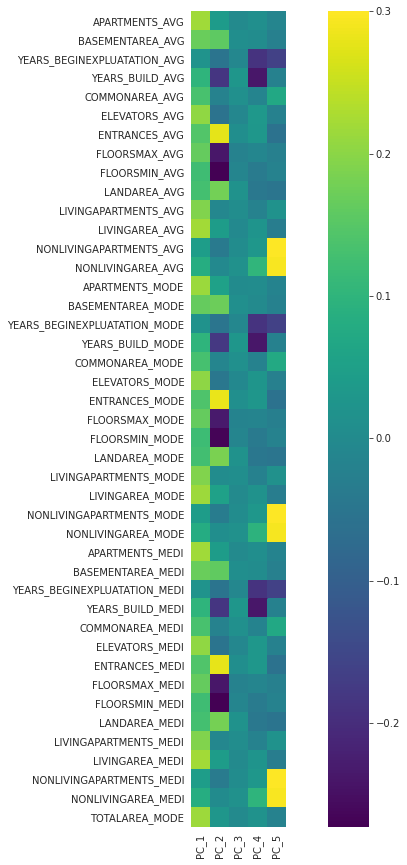
    


```python
df_qn['LIFE_STYLE']=C.PC_1
eng.corrByVarList(df_qn,'LIFE_STYLE' )
```

    
    Variables that are very correlated with LIFE_STYLE


    ['LIVINGAREA_MEDI',
     'LIVINGAREA_AVG',
     'APARTMENTS_AVG',
     'APARTMENTS_MEDI',
     'LIVINGAREA_MODE',
     'TOTALAREA_MODE',
     'APARTMENTS_MODE',
     'ELEVATORS_MEDI',
     'ELEVATORS_AVG',
     'ELEVATORS_MODE',
     'LIVINGAPARTMENTS_MODE',
     'LIVINGAPARTMENTS_MEDI',
     'LIVINGAPARTMENTS_AVG',
     'BASEMENTAREA_MEDI',
     'BASEMENTAREA_AVG',
     'BASEMENTAREA_MODE',
     'FLOORSMAX_AVG',
     'FLOORSMAX_MEDI',
     'FLOORSMAX_MODE',
     'ENTRANCES_AVG',
     'ENTRANCES_MEDI',
     'ENTRANCES_MODE',
     'COMMONAREA_MEDI',
     'COMMONAREA_AVG',
     'COMMONAREA_MODE',
     'LANDAREA_MEDI',
     'LANDAREA_AVG',
     'LANDAREA_MODE',
     'FLOORSMIN_AVG',
     'FLOORSMIN_MEDI',
     'FLOORSMIN_MODE',
     'YEARS_BUILD_AVG',
     'YEARS_BUILD_MODE',
     'YEARS_BUILD_MEDI',
     'NONLIVINGAREA_AVG',
     'NONLIVINGAREA_MEDI',
     'NONLIVINGAREA_MODE']


#### Domain expert features

We are going to use our understanding of the data to choose and create some variables


```python
# let's go from quantitative variables
```


```python
df_qn.head(2)
```


<div>
<style scoped>
    .dataframe tbody tr th:only-of-type {
        vertical-align: middle;
    }

    .dataframe tbody tr th {
        vertical-align: top;
    }

    .dataframe thead th {
        text-align: right;
    }
</style>
<table border="1" class="dataframe">
  <thead>
    <tr style="text-align: right;">
      <th></th>
      <th>TARGET</th>
      <th>CNT_CHILDREN</th>
      <th>AMT_INCOME_TOTAL</th>
      <th>AMT_CREDIT</th>
      <th>AMT_ANNUITY</th>
      <th>AMT_GOODS_PRICE</th>
      <th>REGION_POPULATION_RELATIVE</th>
      <th>DAYS_BIRTH</th>
      <th>DAYS_EMPLOYED</th>
      <th>DAYS_REGISTRATION</th>
      <th>DAYS_ID_PUBLISH</th>
      <th>OWN_CAR_AGE</th>
      <th>FLAG_MOBIL</th>
      <th>FLAG_EMP_PHONE</th>
      <th>FLAG_WORK_PHONE</th>
      <th>FLAG_CONT_MOBILE</th>
      <th>FLAG_PHONE</th>
      <th>FLAG_EMAIL</th>
      <th>CNT_FAM_MEMBERS</th>
      <th>REGION_RATING_CLIENT</th>
      <th>REGION_RATING_CLIENT_W_CITY</th>
      <th>HOUR_APPR_PROCESS_START</th>
      <th>REG_REGION_NOT_LIVE_REGION</th>
      <th>REG_REGION_NOT_WORK_REGION</th>
      <th>LIVE_REGION_NOT_WORK_REGION</th>
      <th>REG_CITY_NOT_LIVE_CITY</th>
      <th>REG_CITY_NOT_WORK_CITY</th>
      <th>LIVE_CITY_NOT_WORK_CITY</th>
      <th>EXT_SOURCE_1</th>
      <th>EXT_SOURCE_2</th>
      <th>EXT_SOURCE_3</th>
      <th>APARTMENTS_AVG</th>
      <th>BASEMENTAREA_AVG</th>
      <th>YEARS_BEGINEXPLUATATION_AVG</th>
      <th>YEARS_BUILD_AVG</th>
      <th>COMMONAREA_AVG</th>
      <th>ELEVATORS_AVG</th>
      <th>ENTRANCES_AVG</th>
      <th>FLOORSMAX_AVG</th>
      <th>FLOORSMIN_AVG</th>
      <th>LANDAREA_AVG</th>
      <th>LIVINGAPARTMENTS_AVG</th>
      <th>LIVINGAREA_AVG</th>
      <th>NONLIVINGAPARTMENTS_AVG</th>
      <th>NONLIVINGAREA_AVG</th>
      <th>APARTMENTS_MODE</th>
      <th>BASEMENTAREA_MODE</th>
      <th>YEARS_BEGINEXPLUATATION_MODE</th>
      <th>YEARS_BUILD_MODE</th>
      <th>COMMONAREA_MODE</th>
      <th>ELEVATORS_MODE</th>
      <th>ENTRANCES_MODE</th>
      <th>FLOORSMAX_MODE</th>
      <th>FLOORSMIN_MODE</th>
      <th>LANDAREA_MODE</th>
      <th>LIVINGAPARTMENTS_MODE</th>
      <th>LIVINGAREA_MODE</th>
      <th>NONLIVINGAPARTMENTS_MODE</th>
      <th>NONLIVINGAREA_MODE</th>
      <th>APARTMENTS_MEDI</th>
      <th>BASEMENTAREA_MEDI</th>
      <th>YEARS_BEGINEXPLUATATION_MEDI</th>
      <th>YEARS_BUILD_MEDI</th>
      <th>COMMONAREA_MEDI</th>
      <th>ELEVATORS_MEDI</th>
      <th>ENTRANCES_MEDI</th>
      <th>FLOORSMAX_MEDI</th>
      <th>FLOORSMIN_MEDI</th>
      <th>LANDAREA_MEDI</th>
      <th>LIVINGAPARTMENTS_MEDI</th>
      <th>LIVINGAREA_MEDI</th>
      <th>NONLIVINGAPARTMENTS_MEDI</th>
      <th>NONLIVINGAREA_MEDI</th>
      <th>TOTALAREA_MODE</th>
      <th>OBS_30_CNT_SOCIAL_CIRCLE</th>
      <th>DEF_30_CNT_SOCIAL_CIRCLE</th>
      <th>OBS_60_CNT_SOCIAL_CIRCLE</th>
      <th>DEF_60_CNT_SOCIAL_CIRCLE</th>
      <th>DAYS_LAST_PHONE_CHANGE</th>
      <th>FLAG_DOCUMENT_2</th>
      <th>FLAG_DOCUMENT_3</th>
      <th>FLAG_DOCUMENT_4</th>
      <th>FLAG_DOCUMENT_5</th>
      <th>FLAG_DOCUMENT_6</th>
      <th>FLAG_DOCUMENT_7</th>
      <th>FLAG_DOCUMENT_8</th>
      <th>FLAG_DOCUMENT_9</th>
      <th>FLAG_DOCUMENT_10</th>
      <th>FLAG_DOCUMENT_11</th>
      <th>FLAG_DOCUMENT_12</th>
      <th>FLAG_DOCUMENT_13</th>
      <th>FLAG_DOCUMENT_14</th>
      <th>FLAG_DOCUMENT_15</th>
      <th>FLAG_DOCUMENT_16</th>
      <th>FLAG_DOCUMENT_17</th>
      <th>FLAG_DOCUMENT_18</th>
      <th>FLAG_DOCUMENT_19</th>
      <th>FLAG_DOCUMENT_20</th>
      <th>FLAG_DOCUMENT_21</th>
      <th>AMT_REQ_CREDIT_BUREAU_HOUR</th>
      <th>AMT_REQ_CREDIT_BUREAU_DAY</th>
      <th>AMT_REQ_CREDIT_BUREAU_WEEK</th>
      <th>AMT_REQ_CREDIT_BUREAU_MON</th>
      <th>AMT_REQ_CREDIT_BUREAU_QRT</th>
      <th>AMT_REQ_CREDIT_BUREAU_YEAR</th>
      <th>LIFE_STYLE</th>
    </tr>
    <tr>
      <th>SK_ID_CURR</th>
      <th></th>
      <th></th>
      <th></th>
      <th></th>
      <th></th>
      <th></th>
      <th></th>
      <th></th>
      <th></th>
      <th></th>
      <th></th>
      <th></th>
      <th></th>
      <th></th>
      <th></th>
      <th></th>
      <th></th>
      <th></th>
      <th></th>
      <th></th>
      <th></th>
      <th></th>
      <th></th>
      <th></th>
      <th></th>
      <th></th>
      <th></th>
      <th></th>
      <th></th>
      <th></th>
      <th></th>
      <th></th>
      <th></th>
      <th></th>
      <th></th>
      <th></th>
      <th></th>
      <th></th>
      <th></th>
      <th></th>
      <th></th>
      <th></th>
      <th></th>
      <th></th>
      <th></th>
      <th></th>
      <th></th>
      <th></th>
      <th></th>
      <th></th>
      <th></th>
      <th></th>
      <th></th>
      <th></th>
      <th></th>
      <th></th>
      <th></th>
      <th></th>
      <th></th>
      <th></th>
      <th></th>
      <th></th>
      <th></th>
      <th></th>
      <th></th>
      <th></th>
      <th></th>
      <th></th>
      <th></th>
      <th></th>
      <th></th>
      <th></th>
      <th></th>
      <th></th>
      <th></th>
      <th></th>
      <th></th>
      <th></th>
      <th></th>
      <th></th>
      <th></th>
      <th></th>
      <th></th>
      <th></th>
      <th></th>
      <th></th>
      <th></th>
      <th></th>
      <th></th>
      <th></th>
      <th></th>
      <th></th>
      <th></th>
      <th></th>
      <th></th>
      <th></th>
      <th></th>
      <th></th>
      <th></th>
      <th></th>
      <th></th>
      <th></th>
      <th></th>
      <th></th>
      <th></th>
      <th></th>
    </tr>
  </thead>
  <tbody>
    <tr>
      <th>419983</th>
      <td>1</td>
      <td>1</td>
      <td>135000.0</td>
      <td>1056636.0</td>
      <td>34083.0</td>
      <td>882000.0</td>
      <td>0.018029</td>
      <td>-15077</td>
      <td>-1936</td>
      <td>-4088.0</td>
      <td>-1653</td>
      <td>22.000000</td>
      <td>1</td>
      <td>1</td>
      <td>0</td>
      <td>1</td>
      <td>0</td>
      <td>0</td>
      <td>3.0</td>
      <td>3</td>
      <td>3</td>
      <td>13</td>
      <td>0</td>
      <td>0</td>
      <td>0</td>
      <td>1</td>
      <td>1</td>
      <td>1</td>
      <td>0.50213</td>
      <td>0.579979</td>
      <td>0.510853</td>
      <td>0.11744</td>
      <td>0.088442</td>
      <td>0.977735</td>
      <td>0.752471</td>
      <td>0.044621</td>
      <td>0.078942</td>
      <td>0.149725</td>
      <td>0.226282</td>
      <td>0.231894</td>
      <td>0.066333</td>
      <td>0.100775</td>
      <td>0.107399</td>
      <td>0.008809</td>
      <td>0.028358</td>
      <td>0.114231</td>
      <td>0.087543</td>
      <td>0.977065</td>
      <td>0.759637</td>
      <td>0.042553</td>
      <td>0.07449</td>
      <td>0.145193</td>
      <td>0.222315</td>
      <td>0.228058</td>
      <td>0.064958</td>
      <td>0.105645</td>
      <td>0.105975</td>
      <td>0.008076</td>
      <td>0.027022</td>
      <td>0.11785</td>
      <td>0.087955</td>
      <td>0.977752</td>
      <td>0.755746</td>
      <td>0.044595</td>
      <td>0.078078</td>
      <td>0.149213</td>
      <td>0.225897</td>
      <td>0.231625</td>
      <td>0.067169</td>
      <td>0.101954</td>
      <td>0.108607</td>
      <td>0.008651</td>
      <td>0.028236</td>
      <td>0.102547</td>
      <td>0.0</td>
      <td>0.0</td>
      <td>0.0</td>
      <td>0.0</td>
      <td>-1376.0</td>
      <td>0</td>
      <td>1</td>
      <td>0</td>
      <td>0</td>
      <td>0</td>
      <td>0</td>
      <td>0</td>
      <td>0</td>
      <td>0</td>
      <td>0</td>
      <td>0</td>
      <td>0</td>
      <td>0</td>
      <td>0</td>
      <td>0</td>
      <td>0</td>
      <td>0</td>
      <td>0</td>
      <td>0</td>
      <td>0</td>
      <td>0.0</td>
      <td>0.0</td>
      <td>0.0</td>
      <td>0.0</td>
      <td>0.0</td>
      <td>3.0</td>
      <td>0.037867</td>
    </tr>
    <tr>
      <th>367724</th>
      <td>1</td>
      <td>0</td>
      <td>99000.0</td>
      <td>225000.0</td>
      <td>13594.5</td>
      <td>225000.0</td>
      <td>0.018850</td>
      <td>-17698</td>
      <td>-2723</td>
      <td>-1263.0</td>
      <td>-1248</td>
      <td>12.061091</td>
      <td>1</td>
      <td>1</td>
      <td>0</td>
      <td>1</td>
      <td>0</td>
      <td>0</td>
      <td>2.0</td>
      <td>2</td>
      <td>2</td>
      <td>14</td>
      <td>0</td>
      <td>0</td>
      <td>0</td>
      <td>0</td>
      <td>0</td>
      <td>0</td>
      <td>0.50213</td>
      <td>0.676639</td>
      <td>0.522697</td>
      <td>0.11744</td>
      <td>0.088442</td>
      <td>0.977735</td>
      <td>0.752471</td>
      <td>0.044621</td>
      <td>0.078942</td>
      <td>0.149725</td>
      <td>0.226282</td>
      <td>0.231894</td>
      <td>0.066333</td>
      <td>0.100775</td>
      <td>0.107399</td>
      <td>0.008809</td>
      <td>0.028358</td>
      <td>0.114231</td>
      <td>0.087543</td>
      <td>0.977065</td>
      <td>0.759637</td>
      <td>0.042553</td>
      <td>0.07449</td>
      <td>0.145193</td>
      <td>0.222315</td>
      <td>0.228058</td>
      <td>0.064958</td>
      <td>0.105645</td>
      <td>0.105975</td>
      <td>0.008076</td>
      <td>0.027022</td>
      <td>0.11785</td>
      <td>0.087955</td>
      <td>0.977752</td>
      <td>0.755746</td>
      <td>0.044595</td>
      <td>0.078078</td>
      <td>0.149213</td>
      <td>0.225897</td>
      <td>0.231625</td>
      <td>0.067169</td>
      <td>0.101954</td>
      <td>0.108607</td>
      <td>0.008651</td>
      <td>0.028236</td>
      <td>0.102547</td>
      <td>0.0</td>
      <td>0.0</td>
      <td>0.0</td>
      <td>0.0</td>
      <td>-1086.0</td>
      <td>0</td>
      <td>1</td>
      <td>0</td>
      <td>0</td>
      <td>0</td>
      <td>0</td>
      <td>0</td>
      <td>0</td>
      <td>0</td>
      <td>0</td>
      <td>0</td>
      <td>0</td>
      <td>0</td>
      <td>0</td>
      <td>0</td>
      <td>0</td>
      <td>0</td>
      <td>0</td>
      <td>0</td>
      <td>0</td>
      <td>0.0</td>
      <td>0.0</td>
      <td>0.0</td>
      <td>0.0</td>
      <td>0.0</td>
      <td>5.0</td>
      <td>0.161014</td>
    </tr>
  </tbody>
</table>
</div>


```python

```


```python
# this variable AMT_INCOME_TOTAL is not significantly correlated with any of the variables in our data set

eng.corrByVarList(dfq, 'AMT_INCOME_TOTAL')
```

    
    Variables that are very correlated with AMT_INCOME_TOTAL


    []


```python
ax=sns.boxplot(data=app_train, x=app_train.TARGET, y=(app_train.AMT_INCOME_TOTAL), showfliers=False)
```


    

    


```python
# But it show some interesting dispersion with respect to the TARGET value
```


```python
ax=sns.boxplot(data=app_train, x=app_train.TARGET, y=(abs(app_train.DAYS_BIRTH)), showfliers=False)
```


    
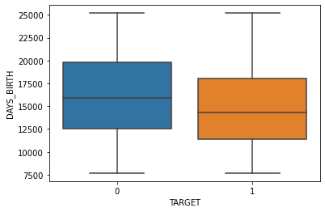
    


```python
# Interesting to see, but obvious the age is a factor to decide whether a give a credit or not
```


```python
k=sns.boxplot(data=app_train, x=app_train.TARGET, y=(abs(app_train.EXT_SOURCE_3)), showfliers=False)
```


    
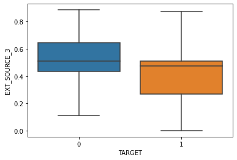
    


## 3. Feature Engineering

Through this step we are going to select features and create new ones 

Some of the 15 most correlated variables with the TARGET variable


```python
corrcoef = df_qn.corr()["TARGET"]

corrcoef.sort_values().dropna().iloc[np.r_[0:15, -5:-1]]
```


    EXT_SOURCE_3                  -0.273241
    EXT_SOURCE_2                  -0.271334
    EXT_SOURCE_1                  -0.180597
    DAYS_EMPLOYED                 -0.087020
    AMT_GOODS_PRICE               -0.079831
    REGION_POPULATION_RELATIVE    -0.070031
    AMT_CREDIT                    -0.061562
    FLAG_DOCUMENT_6               -0.054221
    FLOORSMAX_AVG                 -0.051609
    FLOORSMAX_MEDI                -0.051255
    FLOORSMAX_MODE                -0.050738
    LIFE_STYLE                    -0.048118
    HOUR_APPR_PROCESS_START       -0.046140
    FLAG_PHONE                    -0.043224
    LIVINGAREA_AVG                -0.041062
    DAYS_LAST_PHONE_CHANGE         0.105135
    REGION_RATING_CLIENT           0.112218
    REGION_RATING_CLIENT_W_CITY    0.115207
    DAYS_BIRTH                     0.145222
    Name: TARGET, dtype: float64


```python
df_ql.head()
```


<div>
<style scoped>
    .dataframe tbody tr th:only-of-type {
        vertical-align: middle;
    }

    .dataframe tbody tr th {
        vertical-align: top;
    }

    .dataframe thead th {
        text-align: right;
    }
</style>
<table border="1" class="dataframe">
  <thead>
    <tr style="text-align: right;">
      <th></th>
      <th>NAME_CONTRACT_TYPE</th>
      <th>CODE_GENDER</th>
      <th>FLAG_OWN_CAR</th>
      <th>FLAG_OWN_REALTY</th>
      <th>NAME_TYPE_SUITE</th>
      <th>NAME_INCOME_TYPE</th>
      <th>NAME_EDUCATION_TYPE</th>
      <th>NAME_FAMILY_STATUS</th>
      <th>NAME_HOUSING_TYPE</th>
      <th>OCCUPATION_TYPE</th>
      <th>WEEKDAY_APPR_PROCESS_START</th>
      <th>ORGANIZATION_TYPE</th>
      <th>FONDKAPREMONT_MODE</th>
      <th>HOUSETYPE_MODE</th>
      <th>WALLSMATERIAL_MODE</th>
      <th>EMERGENCYSTATE_MODE</th>
    </tr>
    <tr>
      <th>SK_ID_CURR</th>
      <th></th>
      <th></th>
      <th></th>
      <th></th>
      <th></th>
      <th></th>
      <th></th>
      <th></th>
      <th></th>
      <th></th>
      <th></th>
      <th></th>
      <th></th>
      <th></th>
      <th></th>
      <th></th>
    </tr>
  </thead>
  <tbody>
    <tr>
      <th>419983</th>
      <td>Cash loans</td>
      <td>M</td>
      <td>Y</td>
      <td>Y</td>
      <td>Unaccompanied</td>
      <td>Working</td>
      <td>Secondary / secondary special</td>
      <td>Married</td>
      <td>Rented apartment</td>
      <td>Drivers</td>
      <td>TUESDAY</td>
      <td>Self-employed</td>
      <td>Unknown</td>
      <td>Unknown</td>
      <td>Unknown</td>
      <td>Unknown</td>
    </tr>
    <tr>
      <th>367724</th>
      <td>Cash loans</td>
      <td>F</td>
      <td>N</td>
      <td>N</td>
      <td>Unaccompanied</td>
      <td>Working</td>
      <td>Secondary / secondary special</td>
      <td>Married</td>
      <td>House / apartment</td>
      <td>Sales staff</td>
      <td>FRIDAY</td>
      <td>Business Entity Type 3</td>
      <td>Unknown</td>
      <td>Unknown</td>
      <td>Unknown</td>
      <td>Unknown</td>
    </tr>
    <tr>
      <th>121748</th>
      <td>Cash loans</td>
      <td>F</td>
      <td>N</td>
      <td>Y</td>
      <td>Unaccompanied</td>
      <td>Pensioner</td>
      <td>Secondary / secondary special</td>
      <td>Single / not married</td>
      <td>House / apartment</td>
      <td>Unknown</td>
      <td>FRIDAY</td>
      <td>XNA</td>
      <td>Unknown</td>
      <td>Unknown</td>
      <td>Unknown</td>
      <td>Unknown</td>
    </tr>
    <tr>
      <th>101765</th>
      <td>Cash loans</td>
      <td>M</td>
      <td>Y</td>
      <td>Y</td>
      <td>Unaccompanied</td>
      <td>Commercial associate</td>
      <td>Higher education</td>
      <td>Single / not married</td>
      <td>House / apartment</td>
      <td>Core staff</td>
      <td>WEDNESDAY</td>
      <td>Self-employed</td>
      <td>reg oper account</td>
      <td>block of flats</td>
      <td>Panel</td>
      <td>No</td>
    </tr>
    <tr>
      <th>115321</th>
      <td>Cash loans</td>
      <td>M</td>
      <td>Y</td>
      <td>Y</td>
      <td>Unaccompanied</td>
      <td>Pensioner</td>
      <td>Secondary / secondary special</td>
      <td>Civil marriage</td>
      <td>House / apartment</td>
      <td>Unknown</td>
      <td>THURSDAY</td>
      <td>XNA</td>
      <td>Unknown</td>
      <td>Unknown</td>
      <td>Unknown</td>
      <td>Unknown</td>
    </tr>
  </tbody>
</table>
</div>


```python

df_ql.shape
```


    (49650, 16)


```python
# Intuitively we can choose some variables and see if they matter
df_ql1=df_ql[['CODE_GENDER', 'FLAG_OWN_CAR','FLAG_OWN_REALTY', 'NAME_INCOME_TYPE',
              'NAME_EDUCATION_TYPE', 'NAME_FAMILY_STATUS']]
```


```python
df_ql1['TARGET']=app_train.TARGET
```


```python
df_ql.head()
```


<div>
<style scoped>
    .dataframe tbody tr th:only-of-type {
        vertical-align: middle;
    }

    .dataframe tbody tr th {
        vertical-align: top;
    }

    .dataframe thead th {
        text-align: right;
    }
</style>
<table border="1" class="dataframe">
  <thead>
    <tr style="text-align: right;">
      <th></th>
      <th>NAME_CONTRACT_TYPE</th>
      <th>CODE_GENDER</th>
      <th>FLAG_OWN_CAR</th>
      <th>FLAG_OWN_REALTY</th>
      <th>NAME_TYPE_SUITE</th>
      <th>NAME_INCOME_TYPE</th>
      <th>NAME_EDUCATION_TYPE</th>
      <th>NAME_FAMILY_STATUS</th>
      <th>NAME_HOUSING_TYPE</th>
      <th>OCCUPATION_TYPE</th>
      <th>WEEKDAY_APPR_PROCESS_START</th>
      <th>ORGANIZATION_TYPE</th>
      <th>FONDKAPREMONT_MODE</th>
      <th>HOUSETYPE_MODE</th>
      <th>WALLSMATERIAL_MODE</th>
      <th>EMERGENCYSTATE_MODE</th>
    </tr>
    <tr>
      <th>SK_ID_CURR</th>
      <th></th>
      <th></th>
      <th></th>
      <th></th>
      <th></th>
      <th></th>
      <th></th>
      <th></th>
      <th></th>
      <th></th>
      <th></th>
      <th></th>
      <th></th>
      <th></th>
      <th></th>
      <th></th>
    </tr>
  </thead>
  <tbody>
    <tr>
      <th>419983</th>
      <td>Cash loans</td>
      <td>M</td>
      <td>Y</td>
      <td>Y</td>
      <td>Unaccompanied</td>
      <td>Working</td>
      <td>Secondary / secondary special</td>
      <td>Married</td>
      <td>Rented apartment</td>
      <td>Drivers</td>
      <td>TUESDAY</td>
      <td>Self-employed</td>
      <td>Unknown</td>
      <td>Unknown</td>
      <td>Unknown</td>
      <td>Unknown</td>
    </tr>
    <tr>
      <th>367724</th>
      <td>Cash loans</td>
      <td>F</td>
      <td>N</td>
      <td>N</td>
      <td>Unaccompanied</td>
      <td>Working</td>
      <td>Secondary / secondary special</td>
      <td>Married</td>
      <td>House / apartment</td>
      <td>Sales staff</td>
      <td>FRIDAY</td>
      <td>Business Entity Type 3</td>
      <td>Unknown</td>
      <td>Unknown</td>
      <td>Unknown</td>
      <td>Unknown</td>
    </tr>
    <tr>
      <th>121748</th>
      <td>Cash loans</td>
      <td>F</td>
      <td>N</td>
      <td>Y</td>
      <td>Unaccompanied</td>
      <td>Pensioner</td>
      <td>Secondary / secondary special</td>
      <td>Single / not married</td>
      <td>House / apartment</td>
      <td>Unknown</td>
      <td>FRIDAY</td>
      <td>XNA</td>
      <td>Unknown</td>
      <td>Unknown</td>
      <td>Unknown</td>
      <td>Unknown</td>
    </tr>
    <tr>
      <th>101765</th>
      <td>Cash loans</td>
      <td>M</td>
      <td>Y</td>
      <td>Y</td>
      <td>Unaccompanied</td>
      <td>Commercial associate</td>
      <td>Higher education</td>
      <td>Single / not married</td>
      <td>House / apartment</td>
      <td>Core staff</td>
      <td>WEDNESDAY</td>
      <td>Self-employed</td>
      <td>reg oper account</td>
      <td>block of flats</td>
      <td>Panel</td>
      <td>No</td>
    </tr>
    <tr>
      <th>115321</th>
      <td>Cash loans</td>
      <td>M</td>
      <td>Y</td>
      <td>Y</td>
      <td>Unaccompanied</td>
      <td>Pensioner</td>
      <td>Secondary / secondary special</td>
      <td>Civil marriage</td>
      <td>House / apartment</td>
      <td>Unknown</td>
      <td>THURSDAY</td>
      <td>XNA</td>
      <td>Unknown</td>
      <td>Unknown</td>
      <td>Unknown</td>
      <td>Unknown</td>
    </tr>
  </tbody>
</table>
</div>


```python
df_ql1.head(2)
```


<div>
<style scoped>
    .dataframe tbody tr th:only-of-type {
        vertical-align: middle;
    }

    .dataframe tbody tr th {
        vertical-align: top;
    }

    .dataframe thead th {
        text-align: right;
    }
</style>
<table border="1" class="dataframe">
  <thead>
    <tr style="text-align: right;">
      <th></th>
      <th>CODE_GENDER</th>
      <th>FLAG_OWN_CAR</th>
      <th>FLAG_OWN_REALTY</th>
      <th>NAME_INCOME_TYPE</th>
      <th>NAME_EDUCATION_TYPE</th>
      <th>NAME_FAMILY_STATUS</th>
      <th>TARGET</th>
    </tr>
    <tr>
      <th>SK_ID_CURR</th>
      <th></th>
      <th></th>
      <th></th>
      <th></th>
      <th></th>
      <th></th>
      <th></th>
    </tr>
  </thead>
  <tbody>
    <tr>
      <th>100002</th>
      <td>M</td>
      <td>N</td>
      <td>Y</td>
      <td>Working</td>
      <td>Secondary / secondary special</td>
      <td>Single / not married</td>
      <td>1</td>
    </tr>
    <tr>
      <th>100003</th>
      <td>F</td>
      <td>N</td>
      <td>N</td>
      <td>State servant</td>
      <td>Higher education</td>
      <td>Married</td>
      <td>0</td>
    </tr>
  </tbody>
</table>
</div>


```python
#prep.describeData(df_ql1)
```


```python
df_ql1.NAME_INCOME_TYPE.value_counts()
```


    Working                 28001
    Commercial associate    11077
    Pensioner                7561
    State servant            2997
    Unemployed                 10
    Student                     2
    Maternity leave             2
    Name: NAME_INCOME_TYPE, dtype: int64


```python
#Let's regroup some modalities for NAME_INCOME_TYPE
```


```python
df_ql1['NAME_INCOME_TYPE']= np.where(df_ql1.NAME_INCOME_TYPE=='Pensioner', 
                                                            'Unemployed', df_ql1['NAME_INCOME_TYPE'])

df_ql1['NAME_INCOME_TYPE']= np.where(df_ql1.NAME_INCOME_TYPE=='Student', 
                                                            'Unemployed', df_ql1['NAME_INCOME_TYPE'])

df_ql1['NAME_INCOME_TYPE']= np.where(df_ql1.NAME_INCOME_TYPE=='Maternity leave', 
                                                            'Unemployed', df_ql1['NAME_INCOME_TYPE'])

df_ql1['NAME_INCOME_TYPE']= np.where(df_ql1.NAME_INCOME_TYPE=='Commercial associate', 
                                                            'Businessman', df_ql1['NAME_INCOME_TYPE'])
```


```python
df_ql1.NAME_INCOME_TYPE.value_counts()
```


    Working          28001
    Businessman      11077
    Unemployed        7575
    State servant     2997
    Name: NAME_INCOME_TYPE, dtype: int64


```python

```


```python

```


```python
#prep.describeData(df_ql1)
```

###  3.1. Some Data Explorations


```python
print("The higher the education the less likely the repayment")
ax=sns.countplot(data=df_ql1, x='NAME_EDUCATION_TYPE', hue='TARGET')
ax.tick_params(axis='x', rotation=90)
```

    The higher the education the less likely the repayment


    
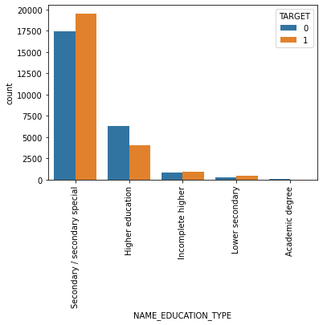
    


```python
print("Married people that have problem of reimbursements")
ax=sns.countplot(data=df_ql1, x='NAME_FAMILY_STATUS', hue='TARGET')
ax.tick_params(axis='x', rotation=90)
```

    Married people that have problem of reimbursements


    
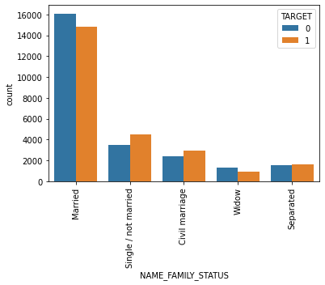
    


```python
print("It looks like gender does matter")
ax=sns.countplot(data=df_ql1, x='CODE_GENDER',  hue='TARGET' )
ax.tick_params(axis='x', rotation=90)
```

    It looks like gender does matter


    
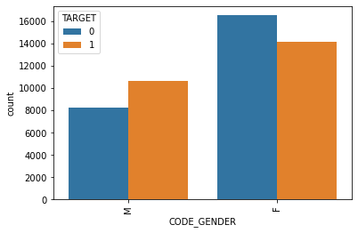
    


```python
print("It looks like INCOME ORIGIN does matter")
ax=sns.countplot(data=df_ql1, x='NAME_INCOME_TYPE',  hue='TARGET' )
ax.tick_params(axis='x', rotation=90)
```

    It looks like INCOME ORIGIN does matter


    
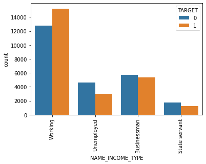
    


```python
# let's see if some one hot encodng can work with those variables
df_ql1.columns
```


    Index(['CODE_GENDER', 'FLAG_OWN_CAR', 'FLAG_OWN_REALTY', 'NAME_INCOME_TYPE',
           'NAME_EDUCATION_TYPE', 'NAME_FAMILY_STATUS', 'TARGET'],
          dtype='object')


```python
# onehot encoding using get_dummies with drop_first option to True
```


```python
df_ql_eng=pd.get_dummies(df_ql1.drop(columns=['TARGET'],axis=1),
                         columns=[ 'FLAG_OWN_CAR', 'FLAG_OWN_REALTY', 'NAME_INCOME_TYPE',
                                  'NAME_EDUCATION_TYPE', 'NAME_FAMILY_STATUS'], drop_first=True)
```


```python
df_ql_eng.head()
```


<div>
<style scoped>
    .dataframe tbody tr th:only-of-type {
        vertical-align: middle;
    }

    .dataframe tbody tr th {
        vertical-align: top;
    }

    .dataframe thead th {
        text-align: right;
    }
</style>
<table border="1" class="dataframe">
  <thead>
    <tr style="text-align: right;">
      <th></th>
      <th>CODE_GENDER</th>
      <th>FLAG_OWN_CAR_Y</th>
      <th>FLAG_OWN_REALTY_Y</th>
      <th>NAME_INCOME_TYPE_State servant</th>
      <th>NAME_INCOME_TYPE_Unemployed</th>
      <th>NAME_INCOME_TYPE_Working</th>
      <th>NAME_EDUCATION_TYPE_Higher education</th>
      <th>NAME_EDUCATION_TYPE_Incomplete higher</th>
      <th>NAME_EDUCATION_TYPE_Lower secondary</th>
      <th>NAME_EDUCATION_TYPE_Secondary / secondary special</th>
      <th>NAME_FAMILY_STATUS_Married</th>
      <th>NAME_FAMILY_STATUS_Separated</th>
      <th>NAME_FAMILY_STATUS_Single / not married</th>
      <th>NAME_FAMILY_STATUS_Widow</th>
    </tr>
    <tr>
      <th>SK_ID_CURR</th>
      <th></th>
      <th></th>
      <th></th>
      <th></th>
      <th></th>
      <th></th>
      <th></th>
      <th></th>
      <th></th>
      <th></th>
      <th></th>
      <th></th>
      <th></th>
      <th></th>
    </tr>
  </thead>
  <tbody>
    <tr>
      <th>419983</th>
      <td>M</td>
      <td>1</td>
      <td>1</td>
      <td>0</td>
      <td>0</td>
      <td>1</td>
      <td>0</td>
      <td>0</td>
      <td>0</td>
      <td>1</td>
      <td>1</td>
      <td>0</td>
      <td>0</td>
      <td>0</td>
    </tr>
    <tr>
      <th>367724</th>
      <td>F</td>
      <td>0</td>
      <td>0</td>
      <td>0</td>
      <td>0</td>
      <td>1</td>
      <td>0</td>
      <td>0</td>
      <td>0</td>
      <td>1</td>
      <td>1</td>
      <td>0</td>
      <td>0</td>
      <td>0</td>
    </tr>
    <tr>
      <th>121748</th>
      <td>F</td>
      <td>0</td>
      <td>1</td>
      <td>0</td>
      <td>1</td>
      <td>0</td>
      <td>0</td>
      <td>0</td>
      <td>0</td>
      <td>1</td>
      <td>0</td>
      <td>0</td>
      <td>1</td>
      <td>0</td>
    </tr>
    <tr>
      <th>101765</th>
      <td>M</td>
      <td>1</td>
      <td>1</td>
      <td>0</td>
      <td>0</td>
      <td>0</td>
      <td>1</td>
      <td>0</td>
      <td>0</td>
      <td>0</td>
      <td>0</td>
      <td>0</td>
      <td>1</td>
      <td>0</td>
    </tr>
    <tr>
      <th>115321</th>
      <td>M</td>
      <td>1</td>
      <td>1</td>
      <td>0</td>
      <td>1</td>
      <td>0</td>
      <td>0</td>
      <td>0</td>
      <td>0</td>
      <td>1</td>
      <td>0</td>
      <td>0</td>
      <td>0</td>
      <td>0</td>
    </tr>
  </tbody>
</table>
</div>


```python
df_ql_eng.shape
```


    (49650, 14)


```python

# Let's  do frequency encoding with NAME_INCOME_TYPE, ORGANIZATION_TYPE, NAME_EDUCATION_TYPE, NAME_FAMILY_STATUS
# we are going to comby them with other variables
```


```python

```


```python
df_ql_eng.head()
```


<div>
<style scoped>
    .dataframe tbody tr th:only-of-type {
        vertical-align: middle;
    }

    .dataframe tbody tr th {
        vertical-align: top;
    }

    .dataframe thead th {
        text-align: right;
    }
</style>
<table border="1" class="dataframe">
  <thead>
    <tr style="text-align: right;">
      <th></th>
      <th>CODE_GENDER</th>
      <th>FLAG_OWN_CAR_Y</th>
      <th>FLAG_OWN_REALTY_Y</th>
      <th>NAME_INCOME_TYPE_State servant</th>
      <th>NAME_INCOME_TYPE_Unemployed</th>
      <th>NAME_INCOME_TYPE_Working</th>
      <th>NAME_EDUCATION_TYPE_Higher education</th>
      <th>NAME_EDUCATION_TYPE_Incomplete higher</th>
      <th>NAME_EDUCATION_TYPE_Lower secondary</th>
      <th>NAME_EDUCATION_TYPE_Secondary / secondary special</th>
      <th>NAME_FAMILY_STATUS_Married</th>
      <th>NAME_FAMILY_STATUS_Separated</th>
      <th>NAME_FAMILY_STATUS_Single / not married</th>
      <th>NAME_FAMILY_STATUS_Widow</th>
    </tr>
    <tr>
      <th>SK_ID_CURR</th>
      <th></th>
      <th></th>
      <th></th>
      <th></th>
      <th></th>
      <th></th>
      <th></th>
      <th></th>
      <th></th>
      <th></th>
      <th></th>
      <th></th>
      <th></th>
      <th></th>
    </tr>
  </thead>
  <tbody>
    <tr>
      <th>419983</th>
      <td>M</td>
      <td>1</td>
      <td>1</td>
      <td>0</td>
      <td>0</td>
      <td>1</td>
      <td>0</td>
      <td>0</td>
      <td>0</td>
      <td>1</td>
      <td>1</td>
      <td>0</td>
      <td>0</td>
      <td>0</td>
    </tr>
    <tr>
      <th>367724</th>
      <td>F</td>
      <td>0</td>
      <td>0</td>
      <td>0</td>
      <td>0</td>
      <td>1</td>
      <td>0</td>
      <td>0</td>
      <td>0</td>
      <td>1</td>
      <td>1</td>
      <td>0</td>
      <td>0</td>
      <td>0</td>
    </tr>
    <tr>
      <th>121748</th>
      <td>F</td>
      <td>0</td>
      <td>1</td>
      <td>0</td>
      <td>1</td>
      <td>0</td>
      <td>0</td>
      <td>0</td>
      <td>0</td>
      <td>1</td>
      <td>0</td>
      <td>0</td>
      <td>1</td>
      <td>0</td>
    </tr>
    <tr>
      <th>101765</th>
      <td>M</td>
      <td>1</td>
      <td>1</td>
      <td>0</td>
      <td>0</td>
      <td>0</td>
      <td>1</td>
      <td>0</td>
      <td>0</td>
      <td>0</td>
      <td>0</td>
      <td>0</td>
      <td>1</td>
      <td>0</td>
    </tr>
    <tr>
      <th>115321</th>
      <td>M</td>
      <td>1</td>
      <td>1</td>
      <td>0</td>
      <td>1</td>
      <td>0</td>
      <td>0</td>
      <td>0</td>
      <td>0</td>
      <td>1</td>
      <td>0</td>
      <td>0</td>
      <td>0</td>
      <td>0</td>
    </tr>
  </tbody>
</table>
</div>


```python
df_ql=df_ql_eng.copy()
```


```python
df_ql_eng.shape
```


    (49650, 14)


```python
# partons d'unedf vide et remplissons là
df_eng=pd.DataFrame(index=df_qn.index)
```


```python
df_ql.columns
```


    Index(['CODE_GENDER', 'FLAG_OWN_CAR_Y', 'FLAG_OWN_REALTY_Y',
           'NAME_INCOME_TYPE_State servant', 'NAME_INCOME_TYPE_Unemployed',
           'NAME_INCOME_TYPE_Working', 'NAME_EDUCATION_TYPE_Higher education',
           'NAME_EDUCATION_TYPE_Incomplete higher',
           'NAME_EDUCATION_TYPE_Lower secondary',
           'NAME_EDUCATION_TYPE_Secondary / secondary special',
           'NAME_FAMILY_STATUS_Married', 'NAME_FAMILY_STATUS_Separated',
           'NAME_FAMILY_STATUS_Single / not married', 'NAME_FAMILY_STATUS_Widow'],
          dtype='object')


### 3.2. Domain expert variables


```python
# some other variables
# EXT_SOURCE_2 EXT_SOURCE_3
df_eng['EXT_SOURCE_1']= df_qn['EXT_SOURCE_1']
df_eng['EXT_SOURCE_2']= df_qn['EXT_SOURCE_2']
df_eng['EXT_SOURCE_3']= df_qn['EXT_SOURCE_3']

df_eng['LIFE_STYLE']=df_qn.LIFE_STYLE 


df_eng['DAYS_BIRTH']=df_qn.DAYS_BIRTH
df_eng['DAYS_EMPLOYED']=df_qn.DAYS_EMPLOYED
df_eng['AMT_GOODS_PRICE']=df_qn.AMT_GOODS_PRICE 
df_eng['DAYS_LAST_PHONE_CHANGE']=df_qn.DAYS_LAST_PHONE_CHANGE 
# DAYS_BIRTH, DAYS_EMPLOYED, AMT_GOODS_PRICE, DAYS_LAST_PHONE_CHANGE,  EXT_SOURCE_1, EXT_SOURCE_2


# Family situation relative income
df_eng['INCOME_FAMILY_IND1']= df_qn.AMT_INCOME_TOTAL*df_ql['NAME_FAMILY_STATUS_Married']/df_qn.CNT_FAM_MEMBERS

df_eng['INCOME_EDUCATION_IND3']= df_qn.AMT_INCOME_TOTAL*df_ql['NAME_EDUCATION_TYPE_Secondary / secondary special']

# poor region with less income ofr may be less good price, if not the case it is good bias
df_eng['INCOME_REGION_IND']= df_qn.AMT_INCOME_TOTAL*df_qn.REGION_RATING_CLIENT/df_qn.AMT_GOODS_PRICE

# the credit amount relative good price in the region. it shows the specificity of the region 
df_eng['CREDIT_REGION_IND']= df_qn.AMT_CREDIT*df_qn.REGION_RATING_CLIENT/df_qn.AMT_GOODS_PRICE

# the same for region with city
df_eng['INCOME_REGION_CITY_IND']= df_qn.AMT_INCOME_TOTAL*df_qn.REGION_RATING_CLIENT_W_CITY/df_qn.AMT_GOODS_PRICE

# the higher the number of annuity with respect to the good price or the credit price 
# the less likely the repayment
df_eng['AMT_GOOD_PRICE_ANNUITY_RATIO']=df_qn.AMT_GOODS_PRICE/df_qn.AMT_ANNUITY

df_eng['AMT_CREDIT_ANNUITY_RATIO']= df_qn.AMT_CREDIT/df_qn.AMT_ANNUITY

# the loaner has may be a side money or is rich
df_eng['AMT_CREDIT_GOODS_PRICE_RATIO']= df_qn.AMT_CREDIT/df_qn.AMT_GOODS_PRICE

# Is he solvable?
df_eng['AMT_CREDIT_INCOME_RATIO']= df_qn.AMT_CREDIT/df_qn.AMT_INCOME_TOTAL
```


```python
# let's combine some variables since I am going to use non linear model, I don't mind having redundant information


# INCOME_FAMILY_IND1, INCOME_EDUCATION_IND3, INCOME_REGION_IND,  CREDIT_REGION_IND, INCOME_REGION_CITY_IND, 
# AMT_GOOD_PRICE_ANNUITY_RATIO, AMT_CREDIT_ANNUITY_RATIO, AMT_CREDIT_GOODS_PRICE_RATIO, AMT_CREDIT_INCOME_RATIO
# INCOME_AGE_RATIO, FAMILY_INCOME_RATIO,  CREDIT_AGE_RATIO, CREDIT_DAYS_REGISTRATION_RATIO,
# CREDIT_DAYS_EMPLOYED_RATIO, INCOME_DAYS_EMPLOYED_RATIO, DAYS_EMPLOYED_BIRTH_RATIO, SOURCE_1_AGE_RATIO,
# SOURCE_1_EMPLOYED_RATIO
```


```python
# older client with respect to income
df_eng['INCOME_AGE_RATIO']=df_qn.AMT_INCOME_TOTAL/np.where(abs(df_qn.DAYS_BIRTH)==0,np.mean(abs(df_qn.DAYS_BIRTH)),
                                                           abs(df_qn.DAYS_BIRTH))
# family effect
df_eng['FAMILY_INCOME_RATIO']=df_qn.AMT_INCOME_TOTAL/np.where(df_qn.CNT_CHILDREN==0,1, df_qn.CNT_CHILDREN)

# the client may be more closer to death
df_eng['CREDIT_AGE_RATIO']=df_qn.AMT_CREDIT/np.where(abs(df_qn.DAYS_BIRTH)==0,np.mean(abs(df_qn.DAYS_BIRTH)),
                                                           abs(df_qn.DAYS_BIRTH))
# the length of study of a client document. doubt effect
df_eng['CREDIT_DAYS_REGISTRATION_RATIO']= df_qn.AMT_CREDIT/np.where(abs(df_qn.DAYS_REGISTRATION)==0,
                                                                    np.mean(abs(df_qn.DAYS_REGISTRATION)),
                                                           abs(df_qn.DAYS_REGISTRATION))
# young employer should aim low. lower amount of credit. If high, more likely to not be repaid
df_eng['CREDIT_DAYS_EMPLOYED_RATIO']= df_qn.AMT_CREDIT/np.where(abs(df_qn.DAYS_EMPLOYED)==0,
                                                                    np.mean(abs(df_qn.DAYS_EMPLOYED)),
                                                           abs(df_qn.DAYS_EMPLOYED))

# the client may be saving his money 
df_eng['INCOME_DAYS_EMPLOYED_RATIO']= df_qn.AMT_INCOME_TOTAL/np.where(abs(df_qn.DAYS_EMPLOYED)==0,
                                                                    np.mean(abs(df_qn.DAYS_EMPLOYED)),
                                                           abs(df_qn.DAYS_EMPLOYED))
# ancienete at work or the ability to keep a job??
df_eng['DAYS_EMPLOYED_BIRTH_RATIO']= np.where(abs(df_qn.DAYS_BIRTH)==0,np.mean(abs(df_qn.DAYS_BIRTH)), 
                                              abs(df_qn.DAYS_BIRTH))/np.where(abs(df_qn.DAYS_EMPLOYED)==0,
                                                                    np.mean(abs(df_qn.DAYS_EMPLOYED)),
                                                           abs(df_qn.DAYS_EMPLOYED))
# since SOURCE1 is correlated with DAYS BIRTH
df_eng['SOURCE_1_AGE_RATIO']=df_qn.EXT_SOURCE_1/np.where(abs(df_qn.DAYS_BIRTH)==0,np.mean(abs(df_qn.DAYS_BIRTH)),
                                                           abs(df_qn.DAYS_BIRTH))

df_eng['SOURCE_1_EMPLOYED_RATIO']=df_qn.EXT_SOURCE_1/np.where(abs(df_qn.DAYS_EMPLOYED)==0,
                                                              np.mean(abs(df_qn.DAYS_EMPLOYED)),
                                                           abs(df_qn.DAYS_EMPLOYED))
```


```python
df_eng['TARGET']=df_qn.TARGET
df_eng.head()
```


<div>
<style scoped>
    .dataframe tbody tr th:only-of-type {
        vertical-align: middle;
    }

    .dataframe tbody tr th {
        vertical-align: top;
    }

    .dataframe thead th {
        text-align: right;
    }
</style>
<table border="1" class="dataframe">
  <thead>
    <tr style="text-align: right;">
      <th></th>
      <th>INCOME_FAMILY_IND1</th>
      <th>INCOME_EDUCATION_IND3</th>
      <th>INCOME_REGION_IND</th>
      <th>CREDIT_REGION_IND</th>
      <th>INCOME_REGION_CITY_IND</th>
      <th>CREDIT_REGION__CITY_IND</th>
      <th>EXT_SOURCE_1</th>
      <th>EXT_SOURCE_2</th>
      <th>EXT_SOURCE_3</th>
      <th>AMT_GOOD_PRICE_ANNUITY_RATIO</th>
      <th>AMT_CREDIT_ANNUITY_RATIO</th>
      <th>AMT_CREDIT_GOODS_PRICE_RATIO</th>
      <th>AMT_CREDIT_INCOME_RATIO</th>
      <th>INCOME_AGE_RATIO</th>
      <th>FAMILY_INCOME_RATIO</th>
      <th>CREDIT_AGE_RATIO</th>
      <th>CREDIT_DAYS_REGISTRATION_RATIO</th>
      <th>CREDIT_DAYS_EMPLOYED_RATIO</th>
      <th>INCOME_DAYS_EMPLOYED_RATIO</th>
      <th>DAYS_EMPLOYED_BIRTH_RATIO</th>
      <th>SOURCE_1_AGE_RATIO</th>
      <th>SOURCE_1_EMPLOYED_RATIO</th>
      <th>DAYS_BIRTH</th>
      <th>DAYS_EMPLOYED</th>
      <th>AMT_GOODS_PRICE</th>
      <th>DAYS_LAST_PHONE_CHANGE</th>
      <th>LIFE_STYLE</th>
      <th>TARGET</th>
    </tr>
    <tr>
      <th>SK_ID_CURR</th>
      <th></th>
      <th></th>
      <th></th>
      <th></th>
      <th></th>
      <th></th>
      <th></th>
      <th></th>
      <th></th>
      <th></th>
      <th></th>
      <th></th>
      <th></th>
      <th></th>
      <th></th>
      <th></th>
      <th></th>
      <th></th>
      <th></th>
      <th></th>
      <th></th>
      <th></th>
      <th></th>
      <th></th>
      <th></th>
      <th></th>
      <th></th>
      <th></th>
    </tr>
  </thead>
  <tbody>
    <tr>
      <th>419983</th>
      <td>45000.0</td>
      <td>135000.0</td>
      <td>0.459184</td>
      <td>3.594</td>
      <td>0.459184</td>
      <td>3.594</td>
      <td>0.50213</td>
      <td>0.579979</td>
      <td>0.510853</td>
      <td>25.878004</td>
      <td>31.001848</td>
      <td>1.198</td>
      <td>7.826933</td>
      <td>8.954036</td>
      <td>135000.0</td>
      <td>70.082642</td>
      <td>258.472603</td>
      <td>545.783058</td>
      <td>69.731405</td>
      <td>7.787707</td>
      <td>0.000033</td>
      <td>0.000259</td>
      <td>-15077</td>
      <td>-1936</td>
      <td>882000.0</td>
      <td>-1376.0</td>
      <td>0.037867</td>
      <td>1</td>
    </tr>
    <tr>
      <th>367724</th>
      <td>49500.0</td>
      <td>99000.0</td>
      <td>0.880000</td>
      <td>2.000</td>
      <td>0.880000</td>
      <td>2.000</td>
      <td>0.50213</td>
      <td>0.676639</td>
      <td>0.522697</td>
      <td>16.550811</td>
      <td>16.550811</td>
      <td>1.000</td>
      <td>2.272727</td>
      <td>5.593852</td>
      <td>99000.0</td>
      <td>12.713301</td>
      <td>178.147268</td>
      <td>82.629453</td>
      <td>36.356959</td>
      <td>6.499449</td>
      <td>0.000028</td>
      <td>0.000184</td>
      <td>-17698</td>
      <td>-2723</td>
      <td>225000.0</td>
      <td>-1086.0</td>
      <td>0.161014</td>
      <td>1</td>
    </tr>
    <tr>
      <th>121748</th>
      <td>0.0</td>
      <td>171000.0</td>
      <td>0.506667</td>
      <td>2.000</td>
      <td>0.506667</td>
      <td>2.000</td>
      <td>0.50213</td>
      <td>0.339910</td>
      <td>0.408359</td>
      <td>20.703934</td>
      <td>20.703934</td>
      <td>1.000</td>
      <td>3.947368</td>
      <td>8.313481</td>
      <td>171000.0</td>
      <td>32.816374</td>
      <td>2136.075949</td>
      <td>1.848085</td>
      <td>0.468181</td>
      <td>0.056316</td>
      <td>0.000024</td>
      <td>0.000001</td>
      <td>-20569</td>
      <td>365243</td>
      <td>675000.0</td>
      <td>-215.0</td>
      <td>0.220001</td>
      <td>1</td>
    </tr>
    <tr>
      <th>101765</th>
      <td>0.0</td>
      <td>0.0</td>
      <td>1.600000</td>
      <td>2.000</td>
      <td>1.600000</td>
      <td>2.000</td>
      <td>0.50213</td>
      <td>0.044790</td>
      <td>0.510853</td>
      <td>36.363636</td>
      <td>36.363636</td>
      <td>1.000</td>
      <td>1.250000</td>
      <td>8.933446</td>
      <td>180000.0</td>
      <td>11.166807</td>
      <td>47.498417</td>
      <td>1051.401869</td>
      <td>841.121495</td>
      <td>94.154206</td>
      <td>0.000025</td>
      <td>0.002346</td>
      <td>-20149</td>
      <td>-214</td>
      <td>225000.0</td>
      <td>0.0</td>
      <td>-3.937461</td>
      <td>0</td>
    </tr>
    <tr>
      <th>115321</th>
      <td>0.0</td>
      <td>112500.0</td>
      <td>0.750000</td>
      <td>3.000</td>
      <td>0.750000</td>
      <td>3.000</td>
      <td>0.50213</td>
      <td>0.190860</td>
      <td>0.283712</td>
      <td>19.098549</td>
      <td>19.098549</td>
      <td>1.000</td>
      <td>4.000000</td>
      <td>5.460370</td>
      <td>112500.0</td>
      <td>21.841479</td>
      <td>226.472068</td>
      <td>1.232056</td>
      <td>0.308014</td>
      <td>0.056409</td>
      <td>0.000024</td>
      <td>0.000001</td>
      <td>-20603</td>
      <td>365243</td>
      <td>450000.0</td>
      <td>-220.0</td>
      <td>-0.053774</td>
      <td>0</td>
    </tr>
  </tbody>
</table>
</div>


```python
from sklearn.ensemble import RandomForestClassifier
# Make the random forest classifier
random_forest = RandomForestClassifier(n_estimators = 10, random_state = 49, n_jobs = -1)
```


```python
X_train=df_eng.drop(columns=['TARGET'], axis=1)
y_train=df_eng.TARGET
```


```python
X=df_eng.drop(columns=['TARGET'], axis=1)
y=df_eng.TARGET
```


```python
# add a column and then verify what it brings in the feature importance list
```


```python
X.shape, y.shape
```


    ((49650, 27), (49650,))


```python

```

### 3.3 Feature importance
We choose to use the feature importance method of the random forest classier to validate in some ways our variable selection process. 

It is important to note that this ranking is only illustrative, because it depends on the hyperparameters of the model. The ranking is not the same (the ranking depends on the hyperparameters of the model). And here we choose them arbitrary.

To explain the method, we have to go from how Random Forest does the prediction and therefore how decision tree models does it. Since Random Forest model is just a bagging of many decision tree models.

Decison Tree build trees. From a root node, it chose features () and in a binary way grow a tree by splitting the root in branches, and to each branche add a node and then select a feature to split that node to two other branches until the end. And the end (nodes became leaves), every examples belong to a class. 

DT is a powerfull ML tool for classification and regression. Its drawback is that it has only one three and has a tendency to overfit the data. How about building many trees and smartly choose variable to grow each tree. Hence the use of  Random Forest.

An important feature is a feature that has great ability of splitting (or to explain) the data. This is caught by the splittng criterion (gini or entropy and mse for regression decision tree). Therefore, features are ranked by their ability to explain the data.


```python
random_forest.fit(X_train, y_train)
# Extract feature importances
features=list(X_train.columns)
feature_importance_values = random_forest.feature_importances_
feature_importances = pd.DataFrame({'feature': features, 'importance': feature_importance_values})
feature_importances_sorted = eng.plot_feature_importances(feature_importances, 90)
```


    
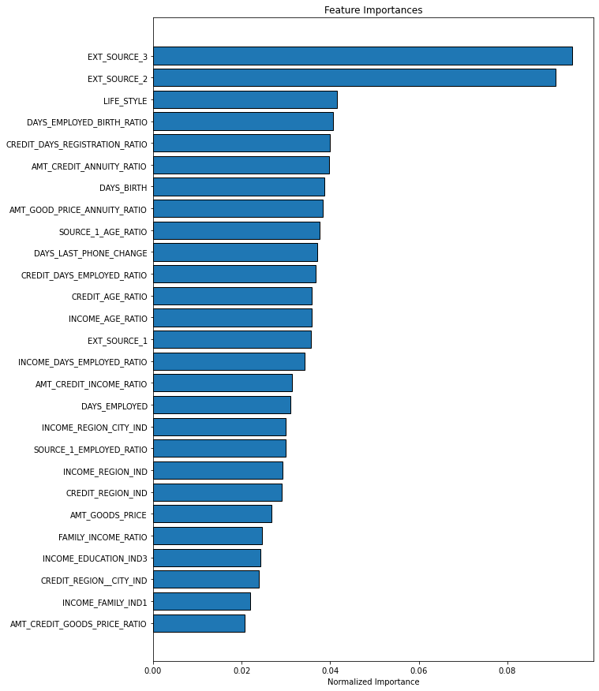
    


### 3.4 Standardization 

It is adviced to put the data in the same scale. It accelerates the training phase.


```python
#help(StandardScaler)
```


```python
# choose to standardize our data set and that to help training algos to reach quickly to optimum
```


```python
from sklearn.preprocessing import StandardScaler
feature_name=X.columns
X_index= X.index
scaler = StandardScaler()
X_Scaled=scaler.fit_transform(X)
Xs=pd.DataFrame(X_Scaled, columns=feature_name, index= X_index)
```


```python
X_train, X_test, y_train, y_test = train_test_split(Xs, y, test_size=0.33, stratify=y.values, random_state=42)
```


```python
X_train.shape, X_test.shape, y_train.shape, y_test.shape
```


    ((33265, 27), (16385, 27), (33265,), (16385,))


## 4. Choix de modèles de classification


Since our data is balanced, at this step of the project, any classification model can be a candidate for training our data set. 

Therefore, we choose five classification models and push them through Bayes Optimization algorithm to find for each the best hyperparameters. 

We end up displaying for each of them, the performance on the training set and the test set. We then choosed the best model.


### 4.1 Why we choose Bayes Optimisation for model tuning

We choose Bayes Optimization over Grid Search and Random Search because it is quicker and helps to reach optimum more efficiently. 

More precisely, grid search is very computer intensive and dispite the fact it has the power to try all combinations possibles in the set of hyper parameters, it will miss intermediary informations. For example, for a hyper parameter C that has value [100, 200], it will not try 102, 103, ...199. We have to explicitly enter those values. 

The Random Search overcomes this drawback and choose for each parameter and distribution between the min and the max values to choose the best hyperparameter that fit better, but does this process blindly. 

Bayes Optimization use prior information to choose hyper space on which to choose the new hyper paremters that fit better the model. It uses a 'surorogate' model build on prior information to wisely choose hyper space on which to choose hyper parameters. Hence its efficiency.


```python
# hyper parameter spaces defintition for each model

from skopt.space import Real, Categorical, Integer

# logistic regression
logreg_spaces = {
    'solver': Categorical(['liblinear']),
    'penalty': Categorical(['l2']),
    'C': Real(0.01, 100)
     }


# k-nearest neighbors
knn_spaces = {
    'n_neighbors': Integer(1, 21),
    'weights': Categorical(['uniform', 'distance']),
    'metric': Categorical(['euclidean', 'manhattan', 'minkowski'] )
     }

# support vector machine for classification
svm_spaces = {
     'kernel': Categorical(['poly', 'rbf', 'sigmoid']),
     'C': Real(0.01, 50),
     'gamma': Categorical(['scale'])
     }

# random forest
rf_spaces = {
    'bootstrap': Categorical([True]),
    'max_depth': Integer(2,12),
    'max_features': Integer(2,20),
    'min_samples_leaf': Integer(3,5),
    'min_samples_split': Integer(8,12),
    'n_estimators': Integer(50,1000) }

# extreme gradient boosting

xgb_spaces ={'gamma': Real(0,0.5), 
                    'learning_rate': Real(0.1,0.5), 
                    'colsample_bylevel': Real(0.5,1), 
                    'colsample_bytree': Real(0.5,1), 
                    'colsample_bynode': Real(0.5, 1), 
                    'max_depth': Integer(1,8), 
                    'n_estimators': Integer(2,600) }

```


```python
# call back function
def status_print(optim_result):
    """Status callback durring bayesian hyperparameter search"""
    
    # Get all the models tested so far in DataFrame format
    all_models = pd.DataFrame(bayes_cv_tuner.cv_results_)    
    
    # Get current parameters and the best parameters    
    best_params = pd.Series(bayes_cv_tuner.best_params_)
    print('Model #{}\nBest SCORE : {}\n'.format(
        len(all_models),
        bayes_cv_tuner.best_score_
    ))
    
```


```python
# for Training we use each model's scoring method. It is likely to be accuracy

from skopt.space import Real, Categorical, Integer
from sklearn.linear_model import LogisticRegression  as LR
from sklearn.neighbors import KNeighborsClassifier  as KNN
from sklearn.svm import SVC as SVM
from sklearn.ensemble import RandomForestClassifier as RF
from xgboost import XGBClassifier as XGB
from sklearn.metrics import precision_score, recall_score, f1_score
```


```python
# bayesOptim fuctions with 15 iterations
def toOptim(MODEL, SPACES):
    return BayesSearchCV(
        estimator = MODEL(),
        search_spaces = SPACES,    
        cv = 3,
        n_iter = 15,   
        verbose = 0,
        refit = True,
        random_state = 42)

def toOptim_xgb(MODEL, SPACES):
    return BayesSearchCV(
        estimator = MODEL,
        search_spaces = SPACES,    
        cv = 3,
        n_iter = 15,   
        verbose = 0,
        refit = True,
        random_state = 42)
```
# loop on each model, choose best HP, build score on test set and produce a dataframe of performances
MODEL=[] # known I should get it from somewhere
PERF_TRAINING_SET=[]
MODEL_ESTIMATE=[]
PERF_TEST_SET=[]

XGB_P=XGBClassifier(booster='gbtree', objective='binary:logistic', random_state=2) # default param
temp_df=pd.DataFrame()

for m, s, n in zip([LR, KNN, SVM, RF, XGB], [logreg_spaces, knn_spaces, svm_spaces, rf_spaces , xgb_spaces],
                   ['LR','KNN','SVM', 'RF','XGB']):
    if m==XGB:
        m=XGB_P
        bayes_cv_tuner=toOptim_xgb(m, s)
        print(n)
        bayes_cv_tuner.fit(X_train.values, y_train.values, callback=status_print)
        MODEL.append(n)
        PERF_TRAINING_SET.append(bayes_cv_tuner.best_score_)
        MODEL_ESTIMATE.append(bayes_cv_tuner.best_estimator_)
    else :
        bayes_cv_tuner=toOptim(m, s)
        print(n)
        bayes_cv_tuner.fit(X_train.values, y_train.values, callback=status_print)
        MODEL.append(n)
        PERF_TRAINING_SET.append(bayes_cv_tuner.best_score_)
        MODEL_ESTIMATE.append(bayes_cv_tuner.best_estimator_)

temp_df['MODEL']=MODEL
temp_df['PERF_TRAINING_SET']= PERF_TRAINING_SET
temp_df['MODEL_ESTIMATE']=MODEL_ESTIMATE

for model in temp_df.MODEL_ESTIMATE:
    PERF_TEST_SET.append(model.score(X_test, y_test))

temp_df['PERF_TEST_SET']= PERF_TEST_SET

temp_df.to_csv("data/result_optim_bayes.csv")


```python

```


```python
# test to include  recall, precision and F1_score
#help(precision_score)
```


```python
# loop on each model, choose best HP, build score on test set and produce a dataframe of performances
MODEL=[] # known I should get it from somewhere
PERF_TRAINING_SET=[]
MODEL_ESTIMATE=[]

MODEL_SCORE_TEST_SET=[]

PRECISION_SCORE_TEST_SET=[]
RECALL_SCORE_TEST_SET=[]
F1_SCORE_TEST_SET=[]

XGB_P=XGBClassifier(booster='gbtree', objective='binary:logistic', random_state=2) # default param
temp_df=pd.DataFrame()


for m, s, n in zip([LR, KNN, SVM, RF, XGB], [logreg_spaces, knn_spaces, svm_spaces, rf_spaces , xgb_spaces],
                   ['LR','KNN','SVM', 'RF','XGB']):
    if m==XGB:
        m=XGB_P
        bayes_cv_tuner=toOptim_xgb(m, s)
        print(n)
        bayes_cv_tuner.fit(X_train.values, y_train.values, callback=status_print)
        MODEL.append(n)
        PERF_TRAINING_SET.append(bayes_cv_tuner.best_score_)
        MODEL_ESTIMATE.append(bayes_cv_tuner.best_estimator_)
    else :
        bayes_cv_tuner=toOptim(m, s)
        print(n)
        bayes_cv_tuner.fit(X_train.values, y_train.values, callback=status_print)
        MODEL.append(n)
        PERF_TRAINING_SET.append(bayes_cv_tuner.best_score_)
        MODEL_ESTIMATE.append(bayes_cv_tuner.best_estimator_)

temp_df['MODEL']=MODEL
temp_df['PERF_TRAINING_SET']= PERF_TRAINING_SET
temp_df['MODEL_ESTIMATE']=MODEL_ESTIMATE

for model in temp_df.MODEL_ESTIMATE:
    y_pred= model.predict(X_test)
    MODEL_SCORE_TEST_SET.append(model.score(X_test, y_test))
    PRECISION_SCORE_TEST_SET.append(precision_score(y_test,y_pred))
    RECALL_SCORE_TEST_SET.append(recall_score(y_test,y_pred))
    F1_SCORE_TEST_SET.append(f1_score(y_test,y_pred))

temp_df['MODEL_SCORE_TEST_SET']= MODEL_SCORE_TEST_SET
temp_df['PRECISION_SCORE_TEST_SET']= PRECISION_SCORE_TEST_SET
temp_df['RECALL_SCORE_TEST_SET']= RECALL_SCORE_TEST_SET
temp_df['F1_SCORE_TEST_SET']= F1_SCORE_TEST_SET

temp_df.to_csv("data/result_optim_bayes.csv")
```

    LR
    Model #1
    Best SCORE : 0.6793025702690516
    
    Model #2
    Best SCORE : 0.6793326318953855
    
    Model #3
    Best SCORE : 0.6793326318953855
    
    Model #4
    Best SCORE : 0.6793326318953855
    
    Model #5
    Best SCORE : 0.6793326318953855
    
    Model #6
    Best SCORE : 0.6793326318953855
    
    Model #7
    Best SCORE : 0.6793326318953855
    
    Model #8
    Best SCORE : 0.6793326318953855
    
    Model #9
    Best SCORE : 0.6793326318953855
    
    Model #10
    Best SCORE : 0.6793326318953855
    
    Model #11
    Best SCORE : 0.6793326318953855
    
    Model #12
    Best SCORE : 0.6793326318953855
    
    Model #13
    Best SCORE : 0.6793326318953855
    
    Model #14
    Best SCORE : 0.6793326318953855
    
    Model #15
    Best SCORE : 0.6793326318953855
    
    KNN
    Model #1
    Best SCORE : 0.6531188937321509
    
    Model #2
    Best SCORE : 0.6577183225612505
    
    Model #3
    Best SCORE : 0.6577183225612505
    
    Model #4
    Best SCORE : 0.6577183225612505
    
    Model #5
    Best SCORE : 0.6577183225612505
    
    Model #6
    Best SCORE : 0.6577183225612505
    
    Model #7
    Best SCORE : 0.6577183225612505
    
    Model #8
    Best SCORE : 0.6577183225612505
    
    Model #9
    Best SCORE : 0.6577183225612505
    
    Model #10
    Best SCORE : 0.6577183225612505
    
    Model #11
    Best SCORE : 0.6577183225612505
    
    Model #12
    Best SCORE : 0.6577183225612505
    
    Model #13
    Best SCORE : 0.6577183225612505
    
    Model #14
    Best SCORE : 0.6577183225612505
    
    Model #15
    Best SCORE : 0.6577183225612505
    
    SVM
    Model #1
    Best SCORE : 0.5758905756801443
    
    Model #2
    Best SCORE : 0.6734104915075906
    
    Model #3
    Best SCORE : 0.6735006763865925
    
    Model #4
    Best SCORE : 0.6735006763865925
    
    Model #5
    Best SCORE : 0.6735006763865925
    
    Model #6
    Best SCORE : 0.6735006763865925
    
    Model #7
    Best SCORE : 0.6742822786712761
    
    Model #8
    Best SCORE : 0.6750037577032918
    
    Model #9
    Best SCORE : 0.6750037577032918
    
    Model #10
    Best SCORE : 0.680264542311739
    
    Model #11
    Best SCORE : 0.680264542311739
    
    Model #12
    Best SCORE : 0.680264542311739
    
    Model #13
    Best SCORE : 0.680264542311739
    
    Model #14
    Best SCORE : 0.680264542311739
    
    Model #15
    Best SCORE : 0.680264542311739
    
    RF
    Model #1
    Best SCORE : 0.6809559597174207
    
    Model #2
    Best SCORE : 0.6844431083721629
    
    Model #3
    Best SCORE : 0.6868781001052157
    
    Model #4
    Best SCORE : 0.6868781001052157
    
    Model #5
    Best SCORE : 0.6868781001052157
    
    Model #6
    Best SCORE : 0.6868781001052157
    
    Model #7
    Best SCORE : 0.6868781001052157
    
    Model #8
    Best SCORE : 0.6868781001052157
    
    Model #9
    Best SCORE : 0.6868781001052157
    
    Model #10
    Best SCORE : 0.6868781001052157
    
    Model #11
    Best SCORE : 0.6868781001052157
    
    Model #12
    Best SCORE : 0.6868781001052157
    
    Model #13
    Best SCORE : 0.6868781001052157
    
    Model #14
    Best SCORE : 0.6868781001052157
    
    Model #15
    Best SCORE : 0.6868781001052157
    
    XGB
    [18:24:35] WARNING: /Users/travis/build/dmlc/xgboost/src/learner.cc:1095: Starting in XGBoost 1.3.0, the default evaluation metric used with the objective 'binary:logistic' was changed from 'error' to 'logloss'. Explicitly set eval_metric if you'd like to restore the old behavior.
    [18:24:37] WARNING: /Users/travis/build/dmlc/xgboost/src/learner.cc:1095: Starting in XGBoost 1.3.0, the default evaluation metric used with the objective 'binary:logistic' was changed from 'error' to 'logloss'. Explicitly set eval_metric if you'd like to restore the old behavior.
    [18:24:39] WARNING: /Users/travis/build/dmlc/xgboost/src/learner.cc:1095: Starting in XGBoost 1.3.0, the default evaluation metric used with the objective 'binary:logistic' was changed from 'error' to 'logloss'. Explicitly set eval_metric if you'd like to restore the old behavior.
    Model #1
    Best SCORE : 0.6799639260483992
    
    [18:24:41] WARNING: /Users/travis/build/dmlc/xgboost/src/learner.cc:1095: Starting in XGBoost 1.3.0, the default evaluation metric used with the objective 'binary:logistic' was changed from 'error' to 'logloss'. Explicitly set eval_metric if you'd like to restore the old behavior.
    [18:24:42] WARNING: /Users/travis/build/dmlc/xgboost/src/learner.cc:1095: Starting in XGBoost 1.3.0, the default evaluation metric used with the objective 'binary:logistic' was changed from 'error' to 'logloss'. Explicitly set eval_metric if you'd like to restore the old behavior.
    [18:24:42] WARNING: /Users/travis/build/dmlc/xgboost/src/learner.cc:1095: Starting in XGBoost 1.3.0, the default evaluation metric used with the objective 'binary:logistic' was changed from 'error' to 'logloss'. Explicitly set eval_metric if you'd like to restore the old behavior.
    Model #2
    Best SCORE : 0.6879302570269051
    
    [18:24:42] WARNING: /Users/travis/build/dmlc/xgboost/src/learner.cc:1095: Starting in XGBoost 1.3.0, the default evaluation metric used with the objective 'binary:logistic' was changed from 'error' to 'logloss'. Explicitly set eval_metric if you'd like to restore the old behavior.
    [18:24:43] WARNING: /Users/travis/build/dmlc/xgboost/src/learner.cc:1095: Starting in XGBoost 1.3.0, the default evaluation metric used with the objective 'binary:logistic' was changed from 'error' to 'logloss'. Explicitly set eval_metric if you'd like to restore the old behavior.
    [18:24:44] WARNING: /Users/travis/build/dmlc/xgboost/src/learner.cc:1095: Starting in XGBoost 1.3.0, the default evaluation metric used with the objective 'binary:logistic' was changed from 'error' to 'logloss'. Explicitly set eval_metric if you'd like to restore the old behavior.
    Model #3
    Best SCORE : 0.6910566661656395
    
    [18:24:45] WARNING: /Users/travis/build/dmlc/xgboost/src/learner.cc:1095: Starting in XGBoost 1.3.0, the default evaluation metric used with the objective 'binary:logistic' was changed from 'error' to 'logloss'. Explicitly set eval_metric if you'd like to restore the old behavior.
    [18:24:47] WARNING: /Users/travis/build/dmlc/xgboost/src/learner.cc:1095: Starting in XGBoost 1.3.0, the default evaluation metric used with the objective 'binary:logistic' was changed from 'error' to 'logloss'. Explicitly set eval_metric if you'd like to restore the old behavior.
    [18:24:49] WARNING: /Users/travis/build/dmlc/xgboost/src/learner.cc:1095: Starting in XGBoost 1.3.0, the default evaluation metric used with the objective 'binary:logistic' was changed from 'error' to 'logloss'. Explicitly set eval_metric if you'd like to restore the old behavior.
    Model #4
    Best SCORE : 0.6916578986923193
    
    [18:24:51] WARNING: /Users/travis/build/dmlc/xgboost/src/learner.cc:1095: Starting in XGBoost 1.3.0, the default evaluation metric used with the objective 'binary:logistic' was changed from 'error' to 'logloss'. Explicitly set eval_metric if you'd like to restore the old behavior.
    [18:24:54] WARNING: /Users/travis/build/dmlc/xgboost/src/learner.cc:1095: Starting in XGBoost 1.3.0, the default evaluation metric used with the objective 'binary:logistic' was changed from 'error' to 'logloss'. Explicitly set eval_metric if you'd like to restore the old behavior.
    [18:24:57] WARNING: /Users/travis/build/dmlc/xgboost/src/learner.cc:1095: Starting in XGBoost 1.3.0, the default evaluation metric used with the objective 'binary:logistic' was changed from 'error' to 'logloss'. Explicitly set eval_metric if you'd like to restore the old behavior.
    Model #5
    Best SCORE : 0.6916578986923193
    
    [18:25:01] WARNING: /Users/travis/build/dmlc/xgboost/src/learner.cc:1095: Starting in XGBoost 1.3.0, the default evaluation metric used with the objective 'binary:logistic' was changed from 'error' to 'logloss'. Explicitly set eval_metric if you'd like to restore the old behavior.
    [18:25:03] WARNING: /Users/travis/build/dmlc/xgboost/src/learner.cc:1095: Starting in XGBoost 1.3.0, the default evaluation metric used with the objective 'binary:logistic' was changed from 'error' to 'logloss'. Explicitly set eval_metric if you'd like to restore the old behavior.
    [18:25:05] WARNING: /Users/travis/build/dmlc/xgboost/src/learner.cc:1095: Starting in XGBoost 1.3.0, the default evaluation metric used with the objective 'binary:logistic' was changed from 'error' to 'logloss'. Explicitly set eval_metric if you'd like to restore the old behavior.
    Model #6
    Best SCORE : 0.6916578986923193
    
    [18:25:08] WARNING: /Users/travis/build/dmlc/xgboost/src/learner.cc:1095: Starting in XGBoost 1.3.0, the default evaluation metric used with the objective 'binary:logistic' was changed from 'error' to 'logloss'. Explicitly set eval_metric if you'd like to restore the old behavior.
    [18:25:12] WARNING: /Users/travis/build/dmlc/xgboost/src/learner.cc:1095: Starting in XGBoost 1.3.0, the default evaluation metric used with the objective 'binary:logistic' was changed from 'error' to 'logloss'. Explicitly set eval_metric if you'd like to restore the old behavior.
    [18:25:16] WARNING: /Users/travis/build/dmlc/xgboost/src/learner.cc:1095: Starting in XGBoost 1.3.0, the default evaluation metric used with the objective 'binary:logistic' was changed from 'error' to 'logloss'. Explicitly set eval_metric if you'd like to restore the old behavior.
    Model #7
    Best SCORE : 0.6916578986923193
    
    [18:25:20] WARNING: /Users/travis/build/dmlc/xgboost/src/learner.cc:1095: Starting in XGBoost 1.3.0, the default evaluation metric used with the objective 'binary:logistic' was changed from 'error' to 'logloss'. Explicitly set eval_metric if you'd like to restore the old behavior.
    [18:25:21] WARNING: /Users/travis/build/dmlc/xgboost/src/learner.cc:1095: Starting in XGBoost 1.3.0, the default evaluation metric used with the objective 'binary:logistic' was changed from 'error' to 'logloss'. Explicitly set eval_metric if you'd like to restore the old behavior.
    [18:25:22] WARNING: /Users/travis/build/dmlc/xgboost/src/learner.cc:1095: Starting in XGBoost 1.3.0, the default evaluation metric used with the objective 'binary:logistic' was changed from 'error' to 'logloss'. Explicitly set eval_metric if you'd like to restore the old behavior.
    Model #8
    Best SCORE : 0.6916578986923193
    
    [18:25:23] WARNING: /Users/travis/build/dmlc/xgboost/src/learner.cc:1095: Starting in XGBoost 1.3.0, the default evaluation metric used with the objective 'binary:logistic' was changed from 'error' to 'logloss'. Explicitly set eval_metric if you'd like to restore the old behavior.
    [18:25:23] WARNING: /Users/travis/build/dmlc/xgboost/src/learner.cc:1095: Starting in XGBoost 1.3.0, the default evaluation metric used with the objective 'binary:logistic' was changed from 'error' to 'logloss'. Explicitly set eval_metric if you'd like to restore the old behavior.
    [18:25:23] WARNING: /Users/travis/build/dmlc/xgboost/src/learner.cc:1095: Starting in XGBoost 1.3.0, the default evaluation metric used with the objective 'binary:logistic' was changed from 'error' to 'logloss'. Explicitly set eval_metric if you'd like to restore the old behavior.
    Model #9
    Best SCORE : 0.6916578986923193
    
    [18:25:23] WARNING: /Users/travis/build/dmlc/xgboost/src/learner.cc:1095: Starting in XGBoost 1.3.0, the default evaluation metric used with the objective 'binary:logistic' was changed from 'error' to 'logloss'. Explicitly set eval_metric if you'd like to restore the old behavior.
    [18:25:24] WARNING: /Users/travis/build/dmlc/xgboost/src/learner.cc:1095: Starting in XGBoost 1.3.0, the default evaluation metric used with the objective 'binary:logistic' was changed from 'error' to 'logloss'. Explicitly set eval_metric if you'd like to restore the old behavior.
    [18:25:25] WARNING: /Users/travis/build/dmlc/xgboost/src/learner.cc:1095: Starting in XGBoost 1.3.0, the default evaluation metric used with the objective 'binary:logistic' was changed from 'error' to 'logloss'. Explicitly set eval_metric if you'd like to restore the old behavior.
    Model #10
    Best SCORE : 0.6916578986923193
    
    [18:25:28] WARNING: /Users/travis/build/dmlc/xgboost/src/learner.cc:1095: Starting in XGBoost 1.3.0, the default evaluation metric used with the objective 'binary:logistic' was changed from 'error' to 'logloss'. Explicitly set eval_metric if you'd like to restore the old behavior.
    [18:25:28] WARNING: /Users/travis/build/dmlc/xgboost/src/learner.cc:1095: Starting in XGBoost 1.3.0, the default evaluation metric used with the objective 'binary:logistic' was changed from 'error' to 'logloss'. Explicitly set eval_metric if you'd like to restore the old behavior.
    [18:25:29] WARNING: /Users/travis/build/dmlc/xgboost/src/learner.cc:1095: Starting in XGBoost 1.3.0, the default evaluation metric used with the objective 'binary:logistic' was changed from 'error' to 'logloss'. Explicitly set eval_metric if you'd like to restore the old behavior.
    Model #11
    Best SCORE : 0.6916578986923193
    
    [18:25:30] WARNING: /Users/travis/build/dmlc/xgboost/src/learner.cc:1095: Starting in XGBoost 1.3.0, the default evaluation metric used with the objective 'binary:logistic' was changed from 'error' to 'logloss'. Explicitly set eval_metric if you'd like to restore the old behavior.
    [18:25:33] WARNING: /Users/travis/build/dmlc/xgboost/src/learner.cc:1095: Starting in XGBoost 1.3.0, the default evaluation metric used with the objective 'binary:logistic' was changed from 'error' to 'logloss'. Explicitly set eval_metric if you'd like to restore the old behavior.
    [18:25:37] WARNING: /Users/travis/build/dmlc/xgboost/src/learner.cc:1095: Starting in XGBoost 1.3.0, the default evaluation metric used with the objective 'binary:logistic' was changed from 'error' to 'logloss'. Explicitly set eval_metric if you'd like to restore the old behavior.
    Model #12
    Best SCORE : 0.6916578986923193
    
    [18:25:42] WARNING: /Users/travis/build/dmlc/xgboost/src/learner.cc:1095: Starting in XGBoost 1.3.0, the default evaluation metric used with the objective 'binary:logistic' was changed from 'error' to 'logloss'. Explicitly set eval_metric if you'd like to restore the old behavior.
    [18:25:43] WARNING: /Users/travis/build/dmlc/xgboost/src/learner.cc:1095: Starting in XGBoost 1.3.0, the default evaluation metric used with the objective 'binary:logistic' was changed from 'error' to 'logloss'. Explicitly set eval_metric if you'd like to restore the old behavior.
    [18:25:44] WARNING: /Users/travis/build/dmlc/xgboost/src/learner.cc:1095: Starting in XGBoost 1.3.0, the default evaluation metric used with the objective 'binary:logistic' was changed from 'error' to 'logloss'. Explicitly set eval_metric if you'd like to restore the old behavior.
    Model #13
    Best SCORE : 0.6916578986923193
    
    [18:25:46] WARNING: /Users/travis/build/dmlc/xgboost/src/learner.cc:1095: Starting in XGBoost 1.3.0, the default evaluation metric used with the objective 'binary:logistic' was changed from 'error' to 'logloss'. Explicitly set eval_metric if you'd like to restore the old behavior.
    [18:25:46] WARNING: /Users/travis/build/dmlc/xgboost/src/learner.cc:1095: Starting in XGBoost 1.3.0, the default evaluation metric used with the objective 'binary:logistic' was changed from 'error' to 'logloss'. Explicitly set eval_metric if you'd like to restore the old behavior.
    [18:25:47] WARNING: /Users/travis/build/dmlc/xgboost/src/learner.cc:1095: Starting in XGBoost 1.3.0, the default evaluation metric used with the objective 'binary:logistic' was changed from 'error' to 'logloss'. Explicitly set eval_metric if you'd like to restore the old behavior.
    Model #14
    Best SCORE : 0.6916578986923193
    
    [18:25:48] WARNING: /Users/travis/build/dmlc/xgboost/src/learner.cc:1095: Starting in XGBoost 1.3.0, the default evaluation metric used with the objective 'binary:logistic' was changed from 'error' to 'logloss'. Explicitly set eval_metric if you'd like to restore the old behavior.
    [18:25:48] WARNING: /Users/travis/build/dmlc/xgboost/src/learner.cc:1095: Starting in XGBoost 1.3.0, the default evaluation metric used with the objective 'binary:logistic' was changed from 'error' to 'logloss'. Explicitly set eval_metric if you'd like to restore the old behavior.
    [18:25:49] WARNING: /Users/travis/build/dmlc/xgboost/src/learner.cc:1095: Starting in XGBoost 1.3.0, the default evaluation metric used with the objective 'binary:logistic' was changed from 'error' to 'logloss'. Explicitly set eval_metric if you'd like to restore the old behavior.
    Model #15
    Best SCORE : 0.6916578986923193
    
    [18:25:50] WARNING: /Users/travis/build/dmlc/xgboost/src/learner.cc:1095: Starting in XGBoost 1.3.0, the default evaluation metric used with the objective 'binary:logistic' was changed from 'error' to 'logloss'. Explicitly set eval_metric if you'd like to restore the old behavior.


```python
temp_df.set_index('MODEL', inplace=True)
```


```python
temp_df[['PERF_TRAINING_SET', 'MODEL_SCORE_TEST_SET', 'PRECISION_SCORE_TEST_SET', 
         'RECALL_SCORE_TEST_SET', 'F1_SCORE_TEST_SET']]*100
```


<div>
<style scoped>
    .dataframe tbody tr th:only-of-type {
        vertical-align: middle;
    }

    .dataframe tbody tr th {
        vertical-align: top;
    }

    .dataframe thead th {
        text-align: right;
    }
</style>
<table border="1" class="dataframe">
  <thead>
    <tr style="text-align: right;">
      <th></th>
      <th>PERF_TRAINING_SET</th>
      <th>MODEL_SCORE_TEST_SET</th>
      <th>PRECISION_SCORE_TEST_SET</th>
      <th>RECALL_SCORE_TEST_SET</th>
      <th>F1_SCORE_TEST_SET</th>
    </tr>
    <tr>
      <th>MODEL</th>
      <th></th>
      <th></th>
      <th></th>
      <th></th>
      <th></th>
    </tr>
  </thead>
  <tbody>
    <tr>
      <th>LR</th>
      <td>67.933263</td>
      <td>66.988099</td>
      <td>67.452653</td>
      <td>65.649414</td>
      <td>66.538818</td>
    </tr>
    <tr>
      <th>KNN</th>
      <td>65.771832</td>
      <td>65.688129</td>
      <td>65.636408</td>
      <td>65.844727</td>
      <td>65.740402</td>
    </tr>
    <tr>
      <th>SVM</th>
      <td>68.026454</td>
      <td>67.671651</td>
      <td>68.082448</td>
      <td>66.528320</td>
      <td>67.296413</td>
    </tr>
    <tr>
      <th>RF</th>
      <td>68.687810</td>
      <td>68.141593</td>
      <td>68.427579</td>
      <td>67.358398</td>
      <td>67.888780</td>
    </tr>
    <tr>
      <th>XGB</th>
      <td>69.165790</td>
      <td>68.654257</td>
      <td>69.080919</td>
      <td>67.529297</td>
      <td>68.296296</td>
    </tr>
  </tbody>
</table>
</div>


```python
def getBestModel(df):
    for i in df.loc[df.PERF_TEST_SET ==max(df.PERF_TEST_SET)].MODEL_ESTIMATE :
        return i
```


```python
model=getBestModel(temp_df)
model
```


```python
# we can use the power XGB by trying early stopping

eval_set = [(X_test, y_test)]
eval_metric="auc"

model.fit(X_train, y_train, eval_metric=eval_metric, eval_set=eval_set, early_stopping_rounds=100, verbose=True)

y_pred = model.predict(X_test)

accuracy = accuracy_score(y_test, y_pred)

print("Accuracy: %.2f%%" % (accuracy * 100.0))
```

    [0]	validation_0-auc:0.64397
    [1]	validation_0-auc:0.67859
    [2]	validation_0-auc:0.70045
    [3]	validation_0-auc:0.70895
    [4]	validation_0-auc:0.71134
    [5]	validation_0-auc:0.71567
    [6]	validation_0-auc:0.72196
    [7]	validation_0-auc:0.72537
    [8]	validation_0-auc:0.72576
    [9]	validation_0-auc:0.72699
    [10]	validation_0-auc:0.72940
    [11]	validation_0-auc:0.73082
    [12]	validation_0-auc:0.73258
    [13]	validation_0-auc:0.73359
    [14]	validation_0-auc:0.73410
    [15]	validation_0-auc:0.73475
    [16]	validation_0-auc:0.73540
    [17]	validation_0-auc:0.73577
    [18]	validation_0-auc:0.73668
    [19]	validation_0-auc:0.73698
    [20]	validation_0-auc:0.73722
    [21]	validation_0-auc:0.73793
    [22]	validation_0-auc:0.73863
    [23]	validation_0-auc:0.73926
    [24]	validation_0-auc:0.73950
    [25]	validation_0-auc:0.73983
    [26]	validation_0-auc:0.74021
    [27]	validation_0-auc:0.74039
    [28]	validation_0-auc:0.74051
    [29]	validation_0-auc:0.74057
    [30]	validation_0-auc:0.74208
    [31]	validation_0-auc:0.74225
    [32]	validation_0-auc:0.74238
    [33]	validation_0-auc:0.74270
    [34]	validation_0-auc:0.74304
    [35]	validation_0-auc:0.74308
    [36]	validation_0-auc:0.74324
    [37]	validation_0-auc:0.74341
    [38]	validation_0-auc:0.74348
    [39]	validation_0-auc:0.74373
    [40]	validation_0-auc:0.74375
    [41]	validation_0-auc:0.74387
    [42]	validation_0-auc:0.74393
    [43]	validation_0-auc:0.74399
    [44]	validation_0-auc:0.74482
    [45]	validation_0-auc:0.74499
    [46]	validation_0-auc:0.74550
    [47]	validation_0-auc:0.74567
    [48]	validation_0-auc:0.74569
    [49]	validation_0-auc:0.74574
    [50]	validation_0-auc:0.74583
    [51]	validation_0-auc:0.74583
    [52]	validation_0-auc:0.74645
    [53]	validation_0-auc:0.74639
    [54]	validation_0-auc:0.74650
    [55]	validation_0-auc:0.74649
    [56]	validation_0-auc:0.74659
    [57]	validation_0-auc:0.74663
    [58]	validation_0-auc:0.74674
    [59]	validation_0-auc:0.74676
    [60]	validation_0-auc:0.74691
    [61]	validation_0-auc:0.74702
    [62]	validation_0-auc:0.74705
    [63]	validation_0-auc:0.74717
    [64]	validation_0-auc:0.74720
    [65]	validation_0-auc:0.74770
    [66]	validation_0-auc:0.74776
    [67]	validation_0-auc:0.74787
    [68]	validation_0-auc:0.74793
    [69]	validation_0-auc:0.74839
    [70]	validation_0-auc:0.74866
    [71]	validation_0-auc:0.74863
    [72]	validation_0-auc:0.74857
    [73]	validation_0-auc:0.74858
    [74]	validation_0-auc:0.74882
    [75]	validation_0-auc:0.74889
    [76]	validation_0-auc:0.74901
    [77]	validation_0-auc:0.74892
    [78]	validation_0-auc:0.74948
    [79]	validation_0-auc:0.74944
    [80]	validation_0-auc:0.74958
    [81]	validation_0-auc:0.74941
    [82]	validation_0-auc:0.74946
    [83]	validation_0-auc:0.74936
    [84]	validation_0-auc:0.74945
    [85]	validation_0-auc:0.74965
    [86]	validation_0-auc:0.74981
    [87]	validation_0-auc:0.74983
    [88]	validation_0-auc:0.74982
    [89]	validation_0-auc:0.74981
    [90]	validation_0-auc:0.74986
    [91]	validation_0-auc:0.74992
    [92]	validation_0-auc:0.74992
    [93]	validation_0-auc:0.74993
    [94]	validation_0-auc:0.74998
    [95]	validation_0-auc:0.75065
    [96]	validation_0-auc:0.75082
    [97]	validation_0-auc:0.75084
    [98]	validation_0-auc:0.75074
    [99]	validation_0-auc:0.75078
    [100]	validation_0-auc:0.75079
    [101]	validation_0-auc:0.75085
    [102]	validation_0-auc:0.75082
    [103]	validation_0-auc:0.75074
    [104]	validation_0-auc:0.75072
    [105]	validation_0-auc:0.75066
    [106]	validation_0-auc:0.75064
    [107]	validation_0-auc:0.75071
    [108]	validation_0-auc:0.75102
    [109]	validation_0-auc:0.75102
    [110]	validation_0-auc:0.75101
    [111]	validation_0-auc:0.75104
    [112]	validation_0-auc:0.75132
    [113]	validation_0-auc:0.75129
    [114]	validation_0-auc:0.75112
    [115]	validation_0-auc:0.75111
    [116]	validation_0-auc:0.75117
    [117]	validation_0-auc:0.75113
    [118]	validation_0-auc:0.75115
    [119]	validation_0-auc:0.75122
    [120]	validation_0-auc:0.75120
    [121]	validation_0-auc:0.75142
    [122]	validation_0-auc:0.75154
    [123]	validation_0-auc:0.75154
    [124]	validation_0-auc:0.75158
    [125]	validation_0-auc:0.75153
    [126]	validation_0-auc:0.75148
    [127]	validation_0-auc:0.75150
    [128]	validation_0-auc:0.75155
    [129]	validation_0-auc:0.75155
    [130]	validation_0-auc:0.75171
    [131]	validation_0-auc:0.75172
    [132]	validation_0-auc:0.75179
    [133]	validation_0-auc:0.75194
    [134]	validation_0-auc:0.75196
    [135]	validation_0-auc:0.75204
    [136]	validation_0-auc:0.75206
    [137]	validation_0-auc:0.75203
    [138]	validation_0-auc:0.75201
    [139]	validation_0-auc:0.75210
    [140]	validation_0-auc:0.75211
    [141]	validation_0-auc:0.75209
    [142]	validation_0-auc:0.75209
    [143]	validation_0-auc:0.75203
    [144]	validation_0-auc:0.75202
    [145]	validation_0-auc:0.75200
    [146]	validation_0-auc:0.75201
    [147]	validation_0-auc:0.75201
    [148]	validation_0-auc:0.75198
    [149]	validation_0-auc:0.75215
    [150]	validation_0-auc:0.75206
    [151]	validation_0-auc:0.75208
    [152]	validation_0-auc:0.75210
    [153]	validation_0-auc:0.75212
    [154]	validation_0-auc:0.75204
    [155]	validation_0-auc:0.75208
    [156]	validation_0-auc:0.75205
    [157]	validation_0-auc:0.75201
    [158]	validation_0-auc:0.75199
    [159]	validation_0-auc:0.75189
    [160]	validation_0-auc:0.75191
    [161]	validation_0-auc:0.75185
    [162]	validation_0-auc:0.75183
    [163]	validation_0-auc:0.75184
    [164]	validation_0-auc:0.75184
    [165]	validation_0-auc:0.75201
    [166]	validation_0-auc:0.75188
    [167]	validation_0-auc:0.75208
    [168]	validation_0-auc:0.75209
    [169]	validation_0-auc:0.75208
    [170]	validation_0-auc:0.75206
    [171]	validation_0-auc:0.75213
    [172]	validation_0-auc:0.75216
    [173]	validation_0-auc:0.75218
    [174]	validation_0-auc:0.75219
    [175]	validation_0-auc:0.75212
    [176]	validation_0-auc:0.75198
    [177]	validation_0-auc:0.75201
    [178]	validation_0-auc:0.75201
    [179]	validation_0-auc:0.75202
    [180]	validation_0-auc:0.75203
    [181]	validation_0-auc:0.75206
    [182]	validation_0-auc:0.75211
    [183]	validation_0-auc:0.75219
    [184]	validation_0-auc:0.75225
    [185]	validation_0-auc:0.75234
    [186]	validation_0-auc:0.75249
    [187]	validation_0-auc:0.75248
    [188]	validation_0-auc:0.75272
    [189]	validation_0-auc:0.75269
    [190]	validation_0-auc:0.75269
    [191]	validation_0-auc:0.75286
    [192]	validation_0-auc:0.75280
    [193]	validation_0-auc:0.75282
    [194]	validation_0-auc:0.75277
    [195]	validation_0-auc:0.75274
    [196]	validation_0-auc:0.75275
    [197]	validation_0-auc:0.75268
    [198]	validation_0-auc:0.75267
    [199]	validation_0-auc:0.75265
    [200]	validation_0-auc:0.75260
    [201]	validation_0-auc:0.75258
    [202]	validation_0-auc:0.75274
    [203]	validation_0-auc:0.75298
    [204]	validation_0-auc:0.75292
    [205]	validation_0-auc:0.75292
    [206]	validation_0-auc:0.75291
    [207]	validation_0-auc:0.75294
    [208]	validation_0-auc:0.75298
    [209]	validation_0-auc:0.75296
    [210]	validation_0-auc:0.75298
    [211]	validation_0-auc:0.75295
    [212]	validation_0-auc:0.75299
    [213]	validation_0-auc:0.75296
    [214]	validation_0-auc:0.75297
    [215]	validation_0-auc:0.75298
    [216]	validation_0-auc:0.75323
    [217]	validation_0-auc:0.75316
    [218]	validation_0-auc:0.75318
    [219]	validation_0-auc:0.75323
    [220]	validation_0-auc:0.75323
    [221]	validation_0-auc:0.75321
    [222]	validation_0-auc:0.75323
    [223]	validation_0-auc:0.75320
    [224]	validation_0-auc:0.75329
    [225]	validation_0-auc:0.75330
    [226]	validation_0-auc:0.75329
    [227]	validation_0-auc:0.75325
    [228]	validation_0-auc:0.75320
    [229]	validation_0-auc:0.75317
    [230]	validation_0-auc:0.75321
    [231]	validation_0-auc:0.75318
    [232]	validation_0-auc:0.75316
    [233]	validation_0-auc:0.75316
    [234]	validation_0-auc:0.75313
    [235]	validation_0-auc:0.75316
    [236]	validation_0-auc:0.75323
    [237]	validation_0-auc:0.75317
    [238]	validation_0-auc:0.75311
    [239]	validation_0-auc:0.75304
    [240]	validation_0-auc:0.75298
    [241]	validation_0-auc:0.75300
    [242]	validation_0-auc:0.75303
    [243]	validation_0-auc:0.75291
    [244]	validation_0-auc:0.75286
    [245]	validation_0-auc:0.75287
    [246]	validation_0-auc:0.75285
    [247]	validation_0-auc:0.75281
    [248]	validation_0-auc:0.75291
    [249]	validation_0-auc:0.75287
    [250]	validation_0-auc:0.75281
    [251]	validation_0-auc:0.75279
    [252]	validation_0-auc:0.75278
    [253]	validation_0-auc:0.75278
    [254]	validation_0-auc:0.75275
    [255]	validation_0-auc:0.75270
    [256]	validation_0-auc:0.75272
    [257]	validation_0-auc:0.75272
    [258]	validation_0-auc:0.75271
    [259]	validation_0-auc:0.75263
    [260]	validation_0-auc:0.75266
    [261]	validation_0-auc:0.75272
    [262]	validation_0-auc:0.75268
    [263]	validation_0-auc:0.75268
    [264]	validation_0-auc:0.75269
    [265]	validation_0-auc:0.75267
    [266]	validation_0-auc:0.75260
    [267]	validation_0-auc:0.75257
    [268]	validation_0-auc:0.75248
    [269]	validation_0-auc:0.75259
    [270]	validation_0-auc:0.75249
    [271]	validation_0-auc:0.75245
    [272]	validation_0-auc:0.75266
    [273]	validation_0-auc:0.75266
    [274]	validation_0-auc:0.75266
    [275]	validation_0-auc:0.75261
    [276]	validation_0-auc:0.75262
    [277]	validation_0-auc:0.75265
    [278]	validation_0-auc:0.75270
    [279]	validation_0-auc:0.75271
    [280]	validation_0-auc:0.75329
    [281]	validation_0-auc:0.75330
    [282]	validation_0-auc:0.75325
    [283]	validation_0-auc:0.75326
    [284]	validation_0-auc:0.75327
    [285]	validation_0-auc:0.75325
    [286]	validation_0-auc:0.75330
    [287]	validation_0-auc:0.75332
    [288]	validation_0-auc:0.75330
    [289]	validation_0-auc:0.75324
    [290]	validation_0-auc:0.75324
    [291]	validation_0-auc:0.75319
    [292]	validation_0-auc:0.75312
    [293]	validation_0-auc:0.75316
    [294]	validation_0-auc:0.75311
    [295]	validation_0-auc:0.75310
    [296]	validation_0-auc:0.75293
    [297]	validation_0-auc:0.75291
    [298]	validation_0-auc:0.75293
    [299]	validation_0-auc:0.75284
    [300]	validation_0-auc:0.75276
    [301]	validation_0-auc:0.75269
    [302]	validation_0-auc:0.75263
    [303]	validation_0-auc:0.75260
    [304]	validation_0-auc:0.75259
    [305]	validation_0-auc:0.75270
    [306]	validation_0-auc:0.75268
    [307]	validation_0-auc:0.75275
    [308]	validation_0-auc:0.75275
    [309]	validation_0-auc:0.75271
    [310]	validation_0-auc:0.75268
    [311]	validation_0-auc:0.75279
    [312]	validation_0-auc:0.75284
    [313]	validation_0-auc:0.75281
    [314]	validation_0-auc:0.75287
    [315]	validation_0-auc:0.75286
    [316]	validation_0-auc:0.75281
    [317]	validation_0-auc:0.75290
    [318]	validation_0-auc:0.75282
    [319]	validation_0-auc:0.75273
    [320]	validation_0-auc:0.75278
    [321]	validation_0-auc:0.75275
    [322]	validation_0-auc:0.75283
    [323]	validation_0-auc:0.75281
    [324]	validation_0-auc:0.75283
    [325]	validation_0-auc:0.75292
    [326]	validation_0-auc:0.75277
    [327]	validation_0-auc:0.75281
    [328]	validation_0-auc:0.75280
    [329]	validation_0-auc:0.75280
    [330]	validation_0-auc:0.75279
    [331]	validation_0-auc:0.75278
    [332]	validation_0-auc:0.75268
    [333]	validation_0-auc:0.75275
    [334]	validation_0-auc:0.75265
    [335]	validation_0-auc:0.75251
    [336]	validation_0-auc:0.75256
    [337]	validation_0-auc:0.75252
    [338]	validation_0-auc:0.75249
    [339]	validation_0-auc:0.75249
    [340]	validation_0-auc:0.75245
    [341]	validation_0-auc:0.75241
    [342]	validation_0-auc:0.75240
    [343]	validation_0-auc:0.75243
    [344]	validation_0-auc:0.75243
    [345]	validation_0-auc:0.75249
    [346]	validation_0-auc:0.75242
    [347]	validation_0-auc:0.75247
    [348]	validation_0-auc:0.75246
    [349]	validation_0-auc:0.75245
    [350]	validation_0-auc:0.75251
    [351]	validation_0-auc:0.75248
    [352]	validation_0-auc:0.75251
    [353]	validation_0-auc:0.75251
    [354]	validation_0-auc:0.75249
    [355]	validation_0-auc:0.75241
    [356]	validation_0-auc:0.75235
    [357]	validation_0-auc:0.75239
    [358]	validation_0-auc:0.75235
    [359]	validation_0-auc:0.75231
    [360]	validation_0-auc:0.75230
    [361]	validation_0-auc:0.75262
    [362]	validation_0-auc:0.75255
    [363]	validation_0-auc:0.75253
    [364]	validation_0-auc:0.75253
    [365]	validation_0-auc:0.75250
    [366]	validation_0-auc:0.75250
    [367]	validation_0-auc:0.75243
    [368]	validation_0-auc:0.75237
    [369]	validation_0-auc:0.75237
    [370]	validation_0-auc:0.75237
    [371]	validation_0-auc:0.75227
    [372]	validation_0-auc:0.75236
    [373]	validation_0-auc:0.75262
    [374]	validation_0-auc:0.75253
    [375]	validation_0-auc:0.75261
    [376]	validation_0-auc:0.75262
    [377]	validation_0-auc:0.75253
    [378]	validation_0-auc:0.75250
    [379]	validation_0-auc:0.75248
    [380]	validation_0-auc:0.75250
    [381]	validation_0-auc:0.75248
    [382]	validation_0-auc:0.75243
    [383]	validation_0-auc:0.75245
    [384]	validation_0-auc:0.75239
    [385]	validation_0-auc:0.75237
    [386]	validation_0-auc:0.75237
    Accuracy: 68.57%


## 5. Explanability of the model

We are going to try to explain the impact of our explaining variables on our response variable. To do so, we are going to use SHAP, an AI Explanabilty library. The explanations are made through Shap Values, but what is shap value?

From the library home site (), we can read that SHAP (SHapley Additive exPlanations) is a game-theoretic approach to explain the output of any machine learning model. *It connects optimal credit allocation with local explanations using the classic Shapley values from game theory and their related extensions.*

To put it simple, Shapley values are measures of contributions of each predictor (feature) has in the ML model.

We are going to build a summary and a waterfall of Shap values.


```python
# It is on test data 
# But still no bad
```


```python
import shap

shap.initjs()

X_5 = X_train.sample(50, random_state=10)

explainer = shap.TreeExplainer(model)
shap_values = explainer(X_50)

```

### 5.1 Summary of Shap Values

We an see for instance that DAYS_EMPLOYED's positive values have high effect on the prediction quality.


INCOME_DAYS_EMPLOYED RATIO's low values have high effect on the prediction quality.

...


```python
shap.summary_plot(shap_values, Xs[:100])
```


    
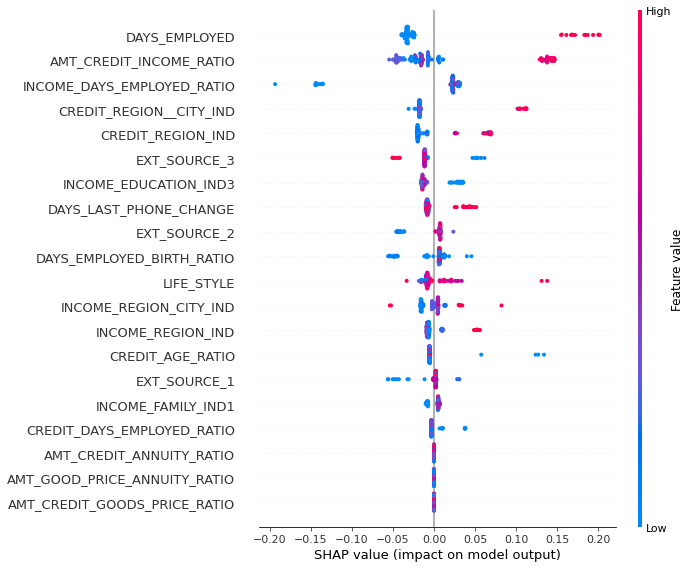
    


### 5.2  The Waterfall


```python
# it is good to know these graphics are built on top of JavaScript
background = shap.maskers.Partition(Xs, max_samples=100)

def f(x):
    return shap.links.identity(model.predict_proba(x)[:,1])

explainer = shap.Explainer(f, background, link=shap.links.logit)

shap_values = explainer(Xs[:100])

# visualize the first prediction's explanation
shap.plots.waterfall(shap_values[0])
```


    
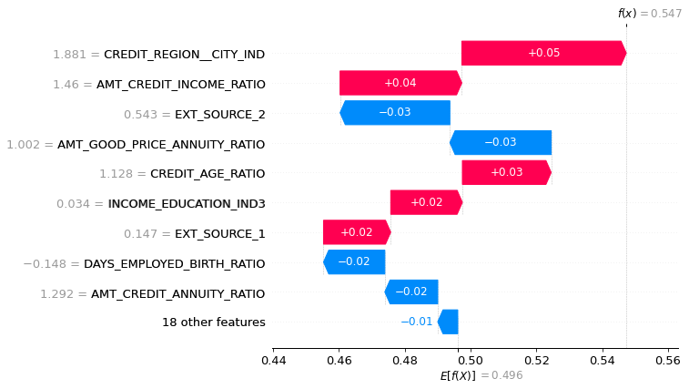
    


We are drawing the waterfall for both outcomes: 0 repayment and 1 no repayment. 

For good clients, clients that repay their debt/credit, we can say that :

- CREDIT_REGION_CITY_IND has positive impact on client repayment. it means, the higher this indicator the more likely the client reimburse its credit. We can notice above that the same feature positive values have high effect on the prediction quality.

- AMT_CREDIT RATIO INCOME : the measure of a client capacity of repayment is good indicator to choose good clients. the higher this feature, the more likely, the repayment.

- and so on ...


```python
# visualize the first prediction's explanation
shap.plots.waterfall(shap_values[1])
```


    
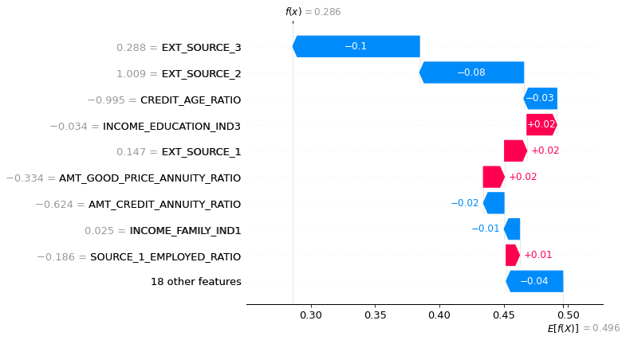
    


```python
# FEATURE IMPORTANCE WITH SHAP VALUES

shap.summary_plot(shap_values, Xs[:100], plot_type="bar")
```


    
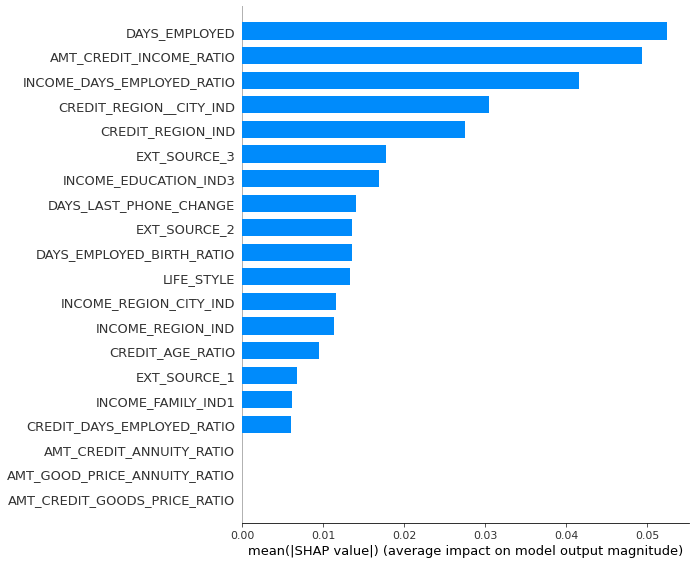
    

